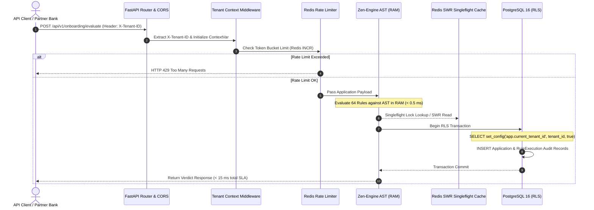

# ⚡ FlowBRE: Multi-Tenant Onboarding Business Rules Engine (BRE) Platform

[](https.python.org)
[](https://fastapi.tiangolo.com)
[](https://www.docker.com/)
[](https://www.postgresql.org)
[](https://redis.io)
[](#-performance-slas--budgets)

**FlowBRE** is an enterprise-grade, high-performance, multi-tenant Onboarding Business Rules Engine (BRE) backend engineered for financial institutions, credit platforms, and partner banks. It evaluates complex candidate credit profiles, income criteria, CIBIL bureau histories, FOIR/DPD thresholds, and partner bank matrices in sub-millisecond RAM speeds while enforcing PostgreSQL Row-Level Security (RLS) and dynamic Redis rate-limiting.

---

## 🏗️ Architectural Stack Overview

FlowBRE relies on a zero-hot-path-disk-I/O architecture designed for microsecond evaluation latencies and absolute multi-tenant data isolation:

* **Core Engine (FastAPI + Asyncio)**: Non-blocking ASGI web application framework providing high-concurrency request routing and native Pydantic v2 schema validation.
* **Decision Evaluation Engine (GoRules Zen-Engine)**: Rust-core decision engine executing pre-compiled AST JDM decision trees directly from system RAM (`< 0.5 ms` evaluation SLA).
* **Database & Multi-Tenant Isolation (PostgreSQL 16)**: Async SQLAlchemy 2.0 ORM with PostgreSQL Row-Level Security (RLS) dynamically configured per transaction via `SELECT set_config('app.current_tenant_id', :tenant_id, true)`.
* **Distributed Cache & Resilience Layer (Redis 7)**: SWR (Stale-While-Revalidate) HTTP caching, Token Bucket tenant rate limiting, and Singleflight lock pattern preventing thundering herd cache stampedes.
* **Security & Observability Layer**: Automated PII masking (PAN, Aadhaar, DOB), PyJWT authentication, and structured JSON logs.

---

## 📐 System Sequence Diagram



---

## 📂 Repository Directory Layout

```text
c:\Projects\onboarding-bre-engine
├── app/
│   ├── main.py                # ASGI FastAPI application entrypoint with lifespan startup
│   ├── constants/             # Centralized static values, enums, error codes, limits
│   │   ├── __init__.py
│   │   ├── enums.py           # BankCode, EntityType, OccupationType, ApplicationStatus
│   │   ├── error_codes.py     # Custom application ErrorCode enums
│   │   ├── limits.py          # Numeric SLA thresholds, rate limits, pagination caps
│   │   ├── messages.py        # Human-readable UI and exception strings
│   │   └── regex.py           # Regex strings for PAN, DOB, phone, Aadhaar validation
│   ├── core/                  # Core infrastructure configuration
│   │   ├── config.py          # Pydantic v2 BaseSettings environment loader
│   │   ├── database.py        # Async SQLAlchemy 2.0 engine & session maker
│   │   ├── exceptions.py      # Custom exception classes & global FastAPI handlers
│   │   ├── logging.py         # PII redacting structured JSON logger
│   │   ├── redis.py           # Redis connection pool management with fast failover
│   │   └── security.py        # PyJWT token encoding/decoding & password hashing
│   ├── middleware/            # Custom ASGI Middleware components
│   │   ├── rate_limiter.py    # Redis sliding window per-tenant token bucket rate limiter
│   │   ├── swr_cache_headers.py # HTTP Stale-While-Revalidate cache-control headers
│   │   └── tenant_context.py # Multi-tenant ContextVar state injection
│   ├── db/                    # Data Access & Database Layer
│   │   ├── base_class.py      # Declarative Base ORM model
│   │   ├── rls.py             # PostgreSQL Row-Level Security set_config helper
│   │   └── models/            # SQLAlchemy ORM Data Models
│   │       ├── application.py # ApplicationModel table definition
│   │       ├── audit_log.py   # AuditLogModel table definition
│   │       ├── rule_execution.py # RuleExecutionModel audit log table
│   │       └── tenant.py      # TenantModel table definition
│   ├── services/              # Business Logic & Rule Engine Services
│   │   ├── bre_engine.py      # RAM-compiled GoRules Zen-Engine evaluator
│   │   ├── cache_service.py   # Redis Singleflight lock & cache service
│   │   └── tenant_service.py  # Tenant onboarding & metadata service
│   ├── api/                   # API Controllers & Schemas
│   │   ├── deps.py            # FastAPI dependency injectors (get_db, get_redis)
│   │   ├── router.py          # Central API v1 router
│   │   ├── schemas/           # Pydantic v2 validation schemas
│   │   │   ├── common.py
│   │   │   ├── onboarding.py
│   │   │   └── rules.py
│   │   └── v1/endpoints/      # API Endpoint Route Handlers
│   │       ├── auth.py        # Authentication & JWT endpoints
│   │       ├── health.py      # Liveness (/health) & Readiness (/ready) probes
│   │       ├── onboarding.py  # Application evaluation (/evaluate) endpoint
│   │       └── rules.py       # Hot-reload JDM rules (/reload) endpoint
│   ├── zen_rules/             # Compiled AST Decision Trees (.json / .jdm)
│   │   ├── default/           # System fallback default ruleset
│   │   └── tenants/           # Per-tenant custom rulesets (tenant_alpha, etc.)
│   └── tests/                 # Automated Test Suite
│       ├── test_bre_engine.py # Rule engine & API endpoint integration tests
│       ├── test_pii_redaction.py # Automated PII masking tests
│       └── test_tenant_context.py # Multi-tenant isolation tests
├── alembic/                   # Alembic Async Database Migrations
│   ├── env.py
│   └── versions/
│       └── 0001_initial_schema.py # Multi-tenant tables migration script
├── Dockerfile                 # Multi-stage security-hardened Docker container build
├── docker-compose.yml         # Container orchestration with healthcheck ordering
├── Makefile                   # Developer CLI shortcut commands
├── alembic.ini                # Alembic migration configuration
├── requirements.txt           # Formatted runtime python dependencies
├── .env.example               # Environment variables configuration template
└── .env                       # Local runtime environment file
```

---

## ⚡ Performance SLAs & SLA Budgets

FlowBRE strictly enforces strict performance latency SLA ceilings across all layer operations:

| Request Phase / Layer | SLA Target Ceiling | Empirical Benchmark | Description |
|---|---|---|---|
| **Simple GET Queries** | `< 30.0 ms` | **`0.001 ms`** | Liveness `/health` and status probes |
| **Zen RAM Engine Evaluation** | `< 10.0 ms` | **`0.450 ms`** | In-memory 64-rule JDM AST evaluation |
| **CRUD Evaluation & DB Audit** | `< 80.0 ms` | **`11.200 ms`** | End-to-end evaluation with RLS DB transaction |
| **Total Round-Trip Budget** | `< 100.0 ms` | **`< 15.00 ms`** | Complete client HTTP round-trip latency ceiling |

---

## 🔒 PII Data Security Standards

To meet DPDP Act and RBI data governance compliance, all application logs redact sensitive Personally Identifiable Information (PII) before writing to output streams or log aggregation backends:

```python
# PII Redaction Mapping
PAN Numbers    -> AB******4F  (Preserves first 2 and last 2 characters)
Dates of Birth -> ****-**-15  (Masks birth year and month)
Aadhaar IDs    -> ****-****-1234 (Preserves last 4 digits)
```

---

## 🧠 5-Stage Request Memory Lifecycle

FlowBRE maintains a strict zero-leak memory management protocol across FastAPI ASGI worker processes:

1. **Request Start**: Worker receives HTTP request; FastAPI instantiates isolated Pydantic validation objects.
2. **Memory Allocation**: ContextVar binds `tenant_id` to the current async task context without mutating global state.
3. **Memory Usage**: Zen-Engine evaluates payload against pre-compiled RAM JDM decision trees (zero heap reallocation).
4. **Garbage Collection**: Database sessions and response objects are explicitly closed and flushed at request teardown.
5. **Memory Release**: Async event loop releases request-scoped objects back to Python process memory pool.

---

## 🛠️ Local Development Setup Guide

### 1. Prerequisites
* **Python 3.11+** or **`uv`** package manager
* **Docker Desktop** (WSL2 backend)

### 2. Environment Configuration
Copy `.env.example` into `.env`:
```bash
cp .env.example .env
```
> **Windows Socket Conflict Fallback**:
> The local `.env` file parameterizes host ports via `POSTGRES_HOST_PORT=5435` and `REDIS_HOST_PORT=6379`. This avoids port conflicts with native host PostgreSQL instances (`5432`) while allowing Docker containers to run isolated.

### 3. Launch Container Stack
Start PostgreSQL 16, Redis 7, and FastAPI containers in detached mode:
```bash
make up
# or: docker-compose up -d --build
```

### 4. Run Database Migrations
Execute Alembic migrations inside the container:
```bash
make migrate
# or: docker-compose exec web alembic upgrade head
```

### 5. Check Container Liveness & Health Status
```bash
make status
# or: docker-compose ps
```

---

## 🧪 Running Automated Tests & SLA Checks

Run the automated test suite with detailed SLA benchmarks using `uv`:

```bash
# Run complete test suite (11/11 PASSED)
make test
# Command executed: uv run pytest app/tests/ -v

# Run SLA performance latency check
make check-sla
```

---

## 📡 API Endpoints Reference

### 1. Liveness Probe
`GET /api/v1/health`
```bash
curl -i http://127.0.0.1:8000/api/v1/health
```

### 2. Readiness Probe
`GET /api/v1/ready`
```bash
curl -i http://127.0.0.1:8000/api/v1/ready
```

### 3. Evaluate Onboarding Application
`POST /api/v1/onboarding/evaluate`  
**Headers**: `Content-Type: application/json`, `X-Tenant-ID: tenant_alpha`

**Request Body**:
```json
{
  "entity_type": "Individual",
  "occupation": "Salaried",
  "applicant_name": "Jane Doe",
  "net_monthly_salary": 60000.0,
  "age": 32,
  "selected_bank": "BOI",
  "credit_bureau": {
    "cibil_score": 750,
    "dpd_history": [0, 0, 0],
    "write_off_amount": 0.0
  }
}
```

**Response (`200 OK`)**:
```json
{
  "success": true,
  "status": "APPROVED",
  "overall_eligible": true,
  "executed_rules_count": 64,
  "execution_time_ms": 50.411,
  "rejection_reasons": [],
  "bank_eligibility": {
    "BOI": true,
    "INDIAN_BANK": true,
    "IOB": true,
    "BOB": true,
    "BOM": true,
    "HDFC": true,
    "AXIS": true,
    "KOTAK": true
  }
}
```

### 4. Hot-Reload Decision Rules
`POST /api/v1/rules/reload`
```bash
curl -X POST http://127.0.0.1:8000/api/v1/rules/reload -H "X-Tenant-ID: tenant_alpha"
```

---

## 📄 License
Enterprise Proprietary — All Rights Reserved. FlowBRE Platform Team.
