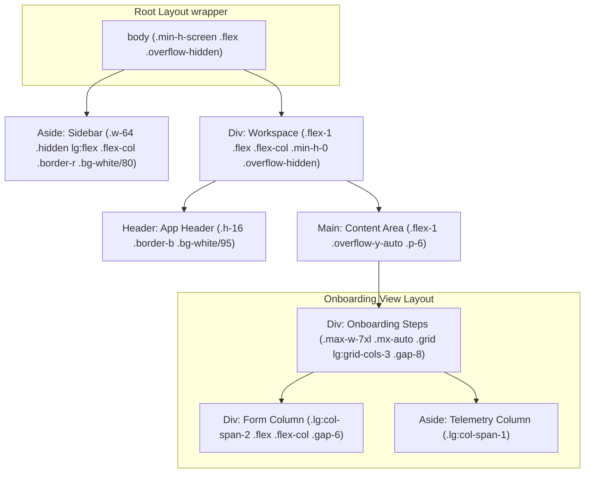

# Sidebar Architecture: Key Components & Onboarding Layout

This document outlines the design and visibility rules for the navigation sidebar in the Multi-Bank Onboarding and Credit Rule Engine (CRE) portal. The sidebar is structured around 5 core functional components.

---

## 1. Unified Sidebar Component Structure

The sidebar displays a static list of **5 main components**:

1.  **Dashboard:** Main portal dashboard showing overview metrics, active evaluation counts, and status charts.
2.  **Onboarding Wizard:** The core 6-step form wizard (as currently implemented) for inputting applicant profile details.
3.  **User Management:** Administrative settings for configuring access controls, creating users, and assigning roles (e.g. Sales Managers, Agents).
4.  **Analytics:** In-depth telemetry displaying rules evaluation pass rates, rejection distributions, and bank API response SLAs.
5.  **Settings:** Global configurations for adjusting system variables and engine properties.

---


---

## 5. UI Layout Integration & CSS Grid Architecture

To integrate the sidebar while keeping the core layout clean, responsive, and aligned with `globals.css` guidelines, follow this layout hierarchy:

### DOM Nesting Hierarchy & Grid Structure



### CSS Implementation Directives

1. **Sidebar CSS Variables**
   Add these layout tokens to `globals.css` `:root`:
   ```css
   --sidebar-width: 260px;
   --header-height: 64px;
   ```

2. **Root Container Alignment**
   Modify the main application shell inside `frontend/app/layout.tsx` to handle the grid structure:
   ```tsx
   // layout.tsx structure
   <div className="flex h-screen w-screen overflow-hidden bg-bg-deep">
     <Sidebar />
     <div className="flex flex-1 flex-col overflow-hidden">
       <Header />
       <main className="flex-1 overflow-y-auto">
         {children}
       </main>
     </div>
   </div>
   ```

---

## 6. UX Design Integration Laws & Form Optimization

When integrating the sidebar with the onboarding steps (Steps 1 to 6), follow these UX Laws to keep the layout smart and clean:

### Jakob's Law (Mental Models)
*   **Directive:** Keep the sidebar on the left side of the screen, which matches standard industry dashboards (like CRM and loan management systems).
*   **Mobile Adaptability:** On mobile viewports (`< 1024px`), collapse the sidebar into an overlay drawer triggered by a top-left hamburger menu. Do not squish the onboarding wizard.

### Fitts's Law (Click Target & Ergonomics)
*   **Directive:** All sidebar links and action buttons must have a target size of at least `48px` height/width with padding. 
*   **Visual Hover Zones:** Apply transition states (`transition-all duration-200`) and a slight scale-up on hover (`hover:scale-[1.01]`) to create clear click indicators.

### Miller's Law (Information Chunking)
*   **Directive:** The onboarding form uses progressive disclosure. Do not display all fields at once. 
*   **Smart State Summary:** Use the sidebar to show a collapsed, read-only "Summary Badge" of prior steps. The user can see at a glance what they inputted in Step 1 (e.g. `Individual | CIBIL: 750`) without switching tabs.

### Aesthetic-Usability Effect
*   **Directive:** The sidebar should match the existing premium light-mode visual design.
*   **Styling Specs:**
    *   Use the HSL glassmorphic token `background: hsl(var(--hsl-bg-glass))` with `-webkit-backdrop-filter: blur(20px)`.
    *   Use `border-right: 1px solid hsl(var(--hsl-line))`.
    *   Active navigation items should be highlighted with `bg-gradient-to-r from-brand-500/10 to-brand-indigo/5 text-brand-600` and a left border matching `hsl(var(--hsl-brand-primary))`.

---

## 7. Layout Guardrails & Overlap Prevention (Anti-Collision Rules)

To prevent visual overlapping, layout breaking, or form element squishing when the sidebar is mounted, implement the following styling rules:

1. **Flex Shrink Guarding:**
   - The sidebar wrapper *must* include `shrink-0` (or `flex-shrink-0`) and a fixed width (e.g., `w-[260px]`). This prevents flexbox from squishing the sidebar's navigation items when viewport widths decrease.

2. **Min-Width Layout Guarding:**
   - The main workspace panel wrapper (which contains the header and view area) *must* include `min-w-0 flex-1`. The `min-w-0` class is crucial to prevent the flex container from expanding beyond the boundaries of the screen when text elements or tables overflow.

3. **Breakpoints & Layout Adaptability:**
   - Due to the three-column layout (Sidebar + Form Column + Telemetry Column), the combined desktop width requirement is high. 
   - **Rule:** Do not show the sidebar as a fixed desktop column at `lg` (`1024px`). Instead, keep the sidebar as a collapsible/slide-out drawer up to `xl` (`1280px`). Only render it as a fixed left-hand column on `xl` and larger displays (`xl:flex`).
   - For viewports between `1024px` and `1280px`, the telemetry column (`var(--telemetry-col)`) and form column (`var(--form-col)`) should take full horizontal space or flex vertically if needed to avoid horizontal scrollbars.

---

## 8. Bank Eligibility Telemetry Redesign (Space Optimization)

To free up substantial horizontal space for the central onboarding form area, the **Bank Eligibility Telemetry** panel (`BankMatrix`) must be redesigned from a double-column grid to a slim, vertical single-column layout.

### Layout Optimization Rules

1. **Width Variables Tuning:**
   - Update `globals.css` variables to decrease the width of the telemetry sidebar and increase the main form area:
     ```css
     --form-col: 820px;       /* Increased from 720px */
     --telemetry-col: 320px;  /* Decreased from 480px */
     ```

2. **Ultra-Compact Header Layout:**
   - Redesign the header component to take up minimal vertical space:
     - Combine the title ("Bank Eligibility") and the partner count badge into a single, clean horizontal row.
     - Move the subtext/paragraphs to tooltip overlays or remove them entirely to prevent vertical bloat.
     - For the evaluation outcomes, display the "Rules Evaluated" and "SLA Verdict Time" as inline metadata details directly underneath the title.

3. **Single-Column Bank Cards:**
   - Instead of a double-column grid layout (`grid-cols-2`), render the 8 partner banks as a single-column vertical stack (`flex flex-col gap-1.5` or `grid grid-cols-1 gap-1.5`).
   - **Slim Rows:** Make each bank card a single-line horizontal card with high-density spacing:
     - **Left Side:** Bank name and bank code inline (e.g., `Bank of India (BOI)`), accompanied by a miniature `Primary` badge if it is the selected bank.
     - **Right Side:** High-visibility state indicator (Pending dot, Green check, or Red cross badge).
     - Keep the card height compact (`min-h-[38px]`) to display all 8 banks on desktop screens without requiring page scrolling.

---

## 9. Stepper Component Redesign (De-cluttering & Space Saving)

To optimize vertical space and improve usability, the **Stepper** component must be redesigned to eliminate visual noise, redundant indicators, and text truncation issues.

### De-cluttering Rules

1. **Remove Unwanted/Redundant Elements:**
   - **Circular SVG Progress Gauge:** Delete this. It takes up too much height and conflicts with the horizontal progress bar.
   - **Target Evaluation SLA Subtitle:** Remove the duplicate `< 30 ms Instant Verdict` text from the stepper wrapper (this information is already highlighted in the application header and telemetry outcomes).
   - **Interactive Step Pills:** Remove the grid of 6 rounded-xl navigation buttons. Because of their fixed widths, their text titles get severely truncated (e.g., `01 Abo...`, `02 Whe...`), which looks unprofessional.

2. **Ultra-Sleek Linear Layout:**
   - **Header Row:** Render a clean, single flex row:
     - **Left:** The current active step title in bold font (e.g., `About you`) next to a compact step count label (e.g., `Step 1 of 5`).
     - **Right:** The engine badge (`Individual Engine` or `Corporate Engine`) in a compact pill format.
   - **Segmented Horizontal Tracker:** Replace the progress bar and navigation pills with a single **Segmented Progress Track**:
     - Divide the progress track horizontally into equal segments based on the number of steps in the active plan (5 segments for Individuals, 3 for Companies, plus a final segment for Results).
     - **States:**
       - **Completed Segments:** Filled with the brand gradient (`from-brand-500 via-brand-indigo to-brand-violet`).
       - **Active Segment:** Highlighted with a bright teal border or subtle breathing glow.
       - **Upcoming Segments:** Muted gray background.
     - **Interactive Hover Tooltips:** Hovering over any segment reveals a tooltip with the step title (e.g., `Step 2: Where you live`). Clicking a segment triggers `onJump(id)` to allow seamless navigation without text clutter.

---

## 10. COI Upload Re-routing & Modal Integration (UI Space Saving)

To save form area inside the onboarding steps, the **Computation of Income (COI)** PDF upload component (`CoiUpload`) is removed from its default inline rendering in Step 3 and re-routed to an overlay modal triggered by a button placed above the Bank Eligibility matrix.

### Integration Directives

1. **Wizard Step 3 Modification:**
   - **File:** [Steps.tsx](file:///c:/Users/DELL/Desktop/breflow/BRE-Flow-Engine/frontend/components/steps/Steps.tsx)
   - **Change:** Remove `<CoiUpload />` (around line 785) from the Salaried occupation rendering. Keep `<PayslipUpload />` inline.

2. **Trigger Button Placement:**
   - **File:** [page.tsx](file:///c:/Users/DELL/Desktop/breflow/BRE-Flow-Engine/frontend/app/page.tsx)
   - **Change:** In the sidebar/telemetry column (`<aside className="... lg:max-w-[var(--telemetry-col)]">`), add a high-density primary trigger button labeled `Upload COI` directly above `<BankMatrix result={null} />`.
   - **Styling:** Style the button using the day-mode guidelines: rounded-xl, height of `38px` to `44px`, slate border, and clear icon (`Upload` or `FileText`), utilizing the whitespace above the telemetry card.

3. **COI Extraction Modal:**
   - **File:** [page.tsx](file:///c:/Users/DELL/Desktop/breflow/BRE-Flow-Engine/frontend/app/page.tsx)
   - **Change:** Introduce a local state `showCoiModal` (boolean). When the trigger button is clicked, set `showCoiModal = true`.
   - **Rendering:** When `showCoiModal` is active, display a centered, backdrop-blurred glassmorphic modal overlay containing:
     - The `<CoiUpload />` component.
     - A close button (using Lucide `X` icon) that sets `showCoiModal = false`.
   - **State Persistence:** Ensure the Zustand extraction logic (`coiVerified`, `clearCoiExtraction`, etc. in `useOnboardingStore`) continues to run exactly as it did before. The modal serves purely as a UX presentation wrapper.
