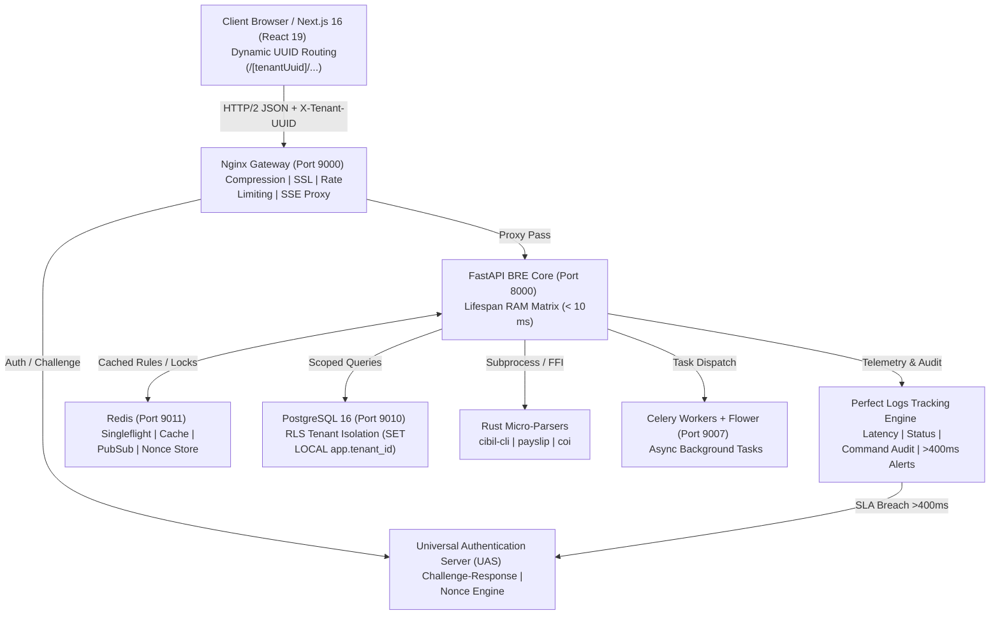
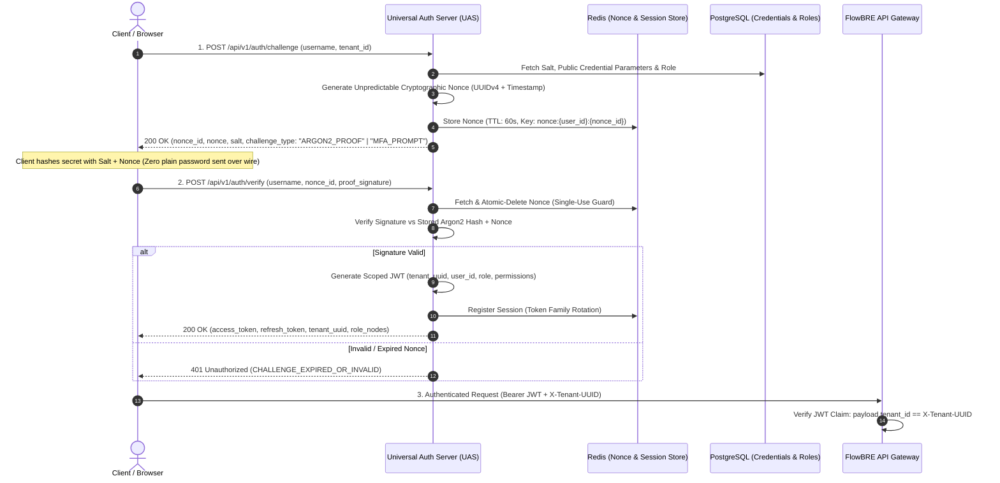
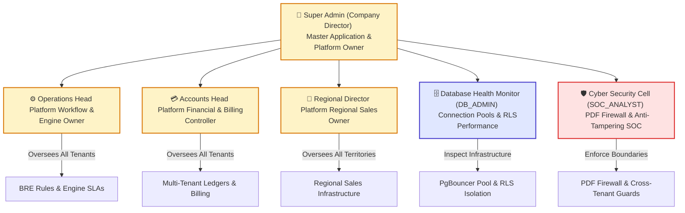
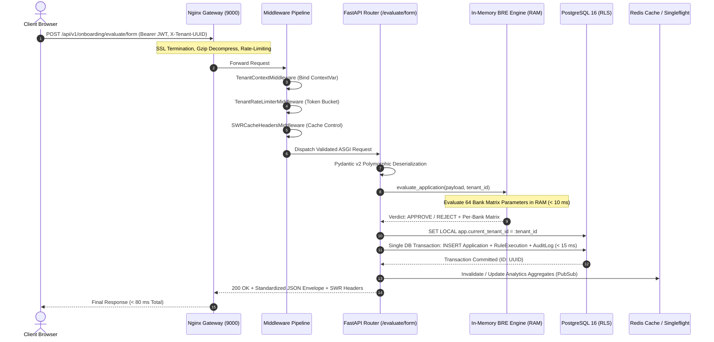
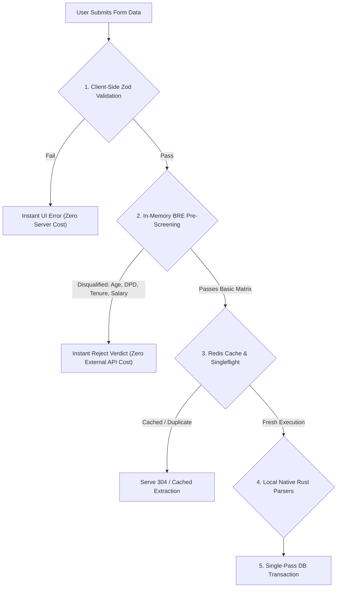
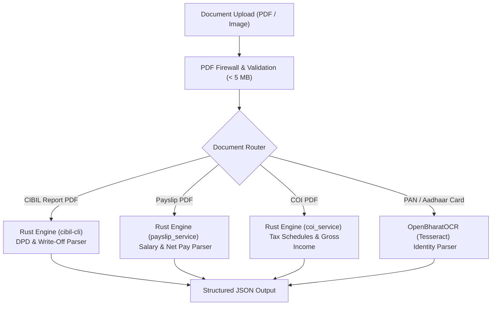
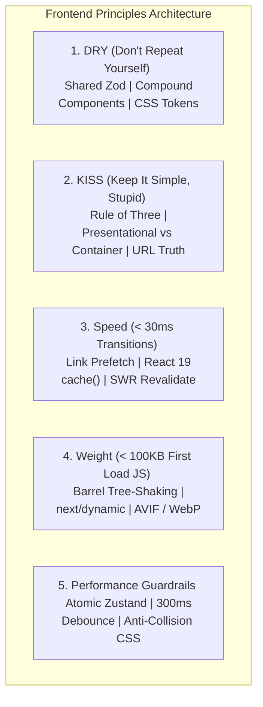
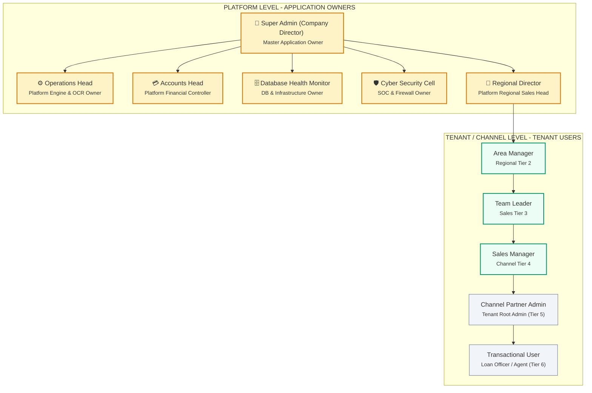
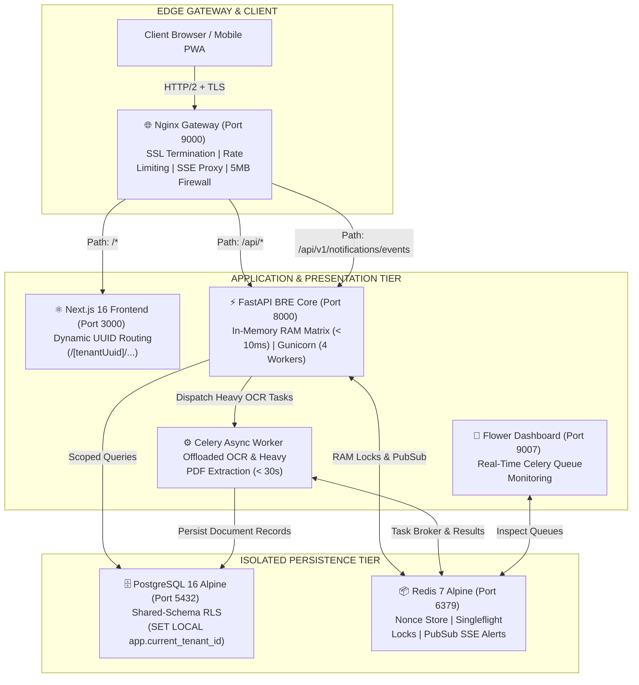

# 🌐 FlowBRE Enterprise Workflow & Technical Specification
 
Comprehensive specification and operational playbook for the **FlowBRE (Flow Business Rules Engine)**: Multi-Tenant Architecture, Dynamic UUID Routing, Role-Based Navigation Engine, Universal Authentication Server (UAS) Challenge-Response System, Perfect Logs Tracking & Alerting, Platform Ownership Model, Production Cost Reduction Rules, Business Decision Matrix, Document Extraction Pipelines, and Engineering Principles.
 
---
 
## 1. System Architecture & Performance SLAs
 
FlowBRE is engineered for high-throughput, low-latency credit decisioning, loan onboarding, and real-time multi-tenant telemetry across partner banks (**BOI, Indian Bank, IOB, BOB, BOM, HDFC, AXIS, Kotak**).
 

 
### 1.1 Performance SLAs & Latency Budgets
 
| Operation | SLA Budget | Scope & Optimization Strategy |
|---|---|---|
| **Simple GET / Metadata** | **< 30 ms** | Health checks (`/health`), pincode lookup, bank policy metadata served directly from RAM / Redis. |
| **In-Memory Rules Evaluation** | **< 10 ms** | Zero hot-path disk I/O; `BANK_MATRIX_RULES` evaluated in RAM against Pydantic models. |
| **CRUD Evaluation + Audit Log** | **< 80 ms** | Single async DB transaction (Application insert + `RuleExecutionModel` + `AuditLogModel`). |
| **Total End-to-End Roundtrip** | **< 100 ms** | Full network path including Nginx proxying, auth validation, and JSON serialization. |
| **Critical SLA Degradation Alert** | **> 400 ms** | Triggers automated real-time SSE notification + urgent email alert to `SUPER_ADMIN`. |
| **Document OCR / Bureau Extraction** | **< 30 s** | Off-loaded to background worker threads / Rust binaries (`cibil-cli`, `openbharatocr`). |
 
### 1.2 Five-Stage Request Memory Lifecycle
 
```
Memory Lifetime
Request Starts
      ↓
Allocate Memory (ContextVar & Pydantic validation)
      ↓
  Use Memory (RAM matrix evaluation against compiled AST)
      ↓
Garbage Collection (Async session close & DB flush)
      ↓
Memory Released (CPython arena allocators recycled)
```
 
1. **Request Starts**: ASGI event loop dispatches connection to the endpoint handler.
2. **Allocate Memory**: Transient Pydantic v2 models, request contexts, and tenant ContextVars bind to the async task.
3. **Use Memory**: Python decision handlers evaluate metrics against RAM-resident rules (`BANK_MATRIX_RULES`).
4. **Garbage Collection**: Database sessions flush in single transaction; scope terminates.
5. **Memory Released**: Reference counts drop to zero, returning memory pools to CPython arenas without memory leaks.
 
### 1.3 Protected Core Invariant: `POST /api/v1/onboarding/evaluate/form` (Zero-Touch Rule)
 
> [!IMPORTANT]
> **CRITICAL ARCHITECTURAL RULE — PROTECTED ZERO-TOUCH API**:
> The `POST /api/v1/onboarding/evaluate/form` endpoint (located in `app/api/v1/endpoints/onboarding.py`) is verified, production-stable, and working optimally. **Developers and autonomous agents MUST NOT alter, refactor, or rewrite its internal logic.**
>
> **Protected Internal Logic Invariants:**
> - **Input Transformation**: `engine_payload = form.to_engine_payload()` polymorphically flattens Individual, Company, and HUF form models into the RAM rule vocabulary.
> - **PII Sanitization**: `redact_pii(engine_payload)` scrubs sensitive identity parameters before logging and audit insertion.
> - **In-Memory Rule Execution**: Direct execution of `bre_engine_service.evaluate_application(engine_payload, tenant_id=tenant_id)` against the 8-bank `BANK_MATRIX_RULES` in RAM (< 10 ms).
> - **Atomic Single-Pass Persistence**: `_persist_form_evaluation()` writes `ApplicationModel`, `RuleExecutionModel`, and `AuditLogModel` within a single database transaction under PostgreSQL Row-Level Security (`SET LOCAL app.current_tenant_id = :tenant_id`).
> - **Standardized Envelope**: Retains `OnboardingFormEvaluationResponse` structure including per-bank `evaluation_report` audit breakdown and `application_id`.
>
> **Integration Constraint**: All new observability metrics, telemetry hooks, or middleware must wrap or listen around this endpoint (via ASGI middlewares or event listeners). **The internal execution flow of `evaluate_onboarding_form` remains strictly untouched.**
 
---
 
## 2. Universal Authentication Server (UAS) & Challenge-Response System
 
The Universal Authentication Server (UAS) eliminates password-based replay attacks and plain-text transmission by verifying user identity through dynamic cryptographic challenge-response tests before granting scoped tenant access.
 

 
### 2.1 How Challenge-Response Works in UAS
 
1. **Initiation**: The user enters their username/identifier and tenant identifier on the login portal.
2. **The Challenge**: The UAS generates a unique, unpredictable, time-bound challenge (cryptographic nonce, MFA challenge prompt, or WebAuthn assertion). Nonces are registered in Redis with a 60-second time-to-live (TTL).
3. **The Response**: The client-side runtime signs/hashes the challenge using its derived key or user MFA token without ever sending raw passwords over the network.
4. **Verification & Single-Use Enforcement**: The UAS performs an atomic check-and-delete on the nonce in Redis (preventing replay attacks) and verifies the cryptographic proof.
5. **Scoped JWT Issuance**: Upon successful verification, the UAS issues a JWT containing:
   - `sub`: User ID
   - `tenant_uuid`: Bound channel tenant UUID
   - `role`: Assigned RBAC role
   - `permissions`: Granular permission flags
 
### 2.2 Security Benefits
 
- **Zero Replay Attacks**: Every authentication attempt uses a one-time cryptographic nonce consumed atomically.
- **Zero Plain-Text Transmission**: Passwords and master credentials never cross the wire in raw format.
- **Strict Cross-Tenant Isolation**: Tokens are cryptographically tied to a specific `tenant_uuid`, rejecting cross-channel header spoofing (`TENANT_CROSS_ACCESS_VIOLATION`).
 
---
 
## 3. Dynamic UUID Routing System (Frontend & Gateway)
 
To eliminate data overlapping between channel tenants, enable tenant-scoped live Server-Sent Events (SSE), and maintain isolated audit log tracking per tenant, the frontend employs a **Dynamic UUID Routing Strategy** (`/[tenantUuid]/...`).
 
```mermaid
graph LR
    subgraph Global Public Routes
        Login["/auth/login <br/> (UAS Challenge-Response)"]
        NewChannel["/new-channel <br/> (Tenant Self-Serve Signup)"]
        HealthGlobal["/health <br/> (System Diagnostics)"]
    end
 
    subgraph Tenant-Scoped Dynamic Routes (/[tenantUuid]/...)
        Dash["/[tenantUuid]/dashboard <br/> (Tenant Overview)"]
        Wizard["/[tenantUuid]/ <br/> (6-Step Onboarding Form)"]
        Users["/[tenantUuid]/assignments <br/> (User Management)"]
        Telemetry["/[tenantUuid]/telemetry <br/> (Analytics & SLAs)"]
        Config["/[tenantUuid]/configurator <br/> (Engine Settings)"]
        Pipe["/[tenantUuid]/pipeline <br/> (Lead Tracking)"]
        Appr["/[tenantUuid]/approvals <br/> (Underwriting Queue)"]
        Comm["/[tenantUuid]/commissions <br/> (Disbursement Ledgers)"]
        Reg["/[tenantUuid]/regional <br/> (Regional Hierarchy)"]
        Logs["/[tenantUuid]/logs <br/> (Tenant Audit & API Traces)"]
    end
 
    subgraph Platform Oversight Routes (Platform Owners)
        PlatDash["/platform/dashboard <br/> (All-Tenant Global View)"]
        PlatDb["/platform/db-health <br/> (DB Connection & Pool Health)"]
        PlatSoc["/platform/cyber-cell <br/> (SOC & PDF Firewall Monitor)"]
        PlatBill["/platform/billing <br/> (Multi-Tenant Billing)"]
    end
 
    Login -->|Redirect on Auth| Dash
    NewChannel -->|Provision Tenant| Wizard
```
 
### 3.1 Complete Frontend Dynamic Route Specification
 
| Route Path | Page Component | Scope & Purpose | Authorized Roles |
|---|---|---|---|
| **`/auth/login`** | `LoginPage` | UAS Challenge-Response portal, passwordless & MFA login. | Public |
| **`/new-channel`** | `NewChannelPage` | Channel partner self-serve signup & tenant registration. | Public |
| **`/[tenantUuid]/`** | `OnboardingWizard` | Core 6-step loan onboarding wizard (Steps 1–6). | `SUPER_ADMIN`, `CHANNEL_ADMIN`, `TRANSACTIONAL_USER` |
| **`/[tenantUuid]/dashboard`** | `DashboardPage` | Main portal dashboard, tenant evaluation counts, live status. | All Authenticated Tenant Roles |
| **`/[tenantUuid]/assignments`** | `UserManagementPage` | Role assignment, user creation, agent access management. | `SUPER_ADMIN`, `CHANNEL_ADMIN`, `TEAM_LEADER`, `SALES_MANAGER` |
| **`/[tenantUuid]/telemetry`** | `AnalyticsPage` | In-depth rule pass rates, bank API latency, rejection charts. | `SUPER_ADMIN`, `REGIONAL_DIRECTOR`, `OPERATIONS_HEAD`, `ACCOUNTS_HEAD` |
| **`/[tenantUuid]/configurator`** | `SettingsPage` | Tenant rule parameter adjustments, SLA thresholds, engine properties. | `SUPER_ADMIN`, `OPERATIONS_HEAD`, `CHANNEL_ADMIN` |
| **`/[tenantUuid]/pipeline`** | `PipelinePage` | Lead origination pipeline, stage tracking, workflow queues. | `SUPER_ADMIN`, `REGIONAL_DIRECTOR`, `AREA_MANAGER`, `TEAM_LEADER`, `SALES_MANAGER` |
| **`/[tenantUuid]/approvals`** | `ApprovalsPage` | Underwriting credit review, manual exceptions, sign-off. | `SUPER_ADMIN`, `REGIONAL_DIRECTOR`, `OPERATIONS_HEAD` |
| **`/[tenantUuid]/commissions`** | `CommissionsPage` | Financial ledgers, disbursements, partner commission audit. | `SUPER_ADMIN`, `ACCOUNTS_HEAD`, `CHANNEL_ADMIN` |
| **`/[tenantUuid]/regional`** | `RegionalPage` | Multi-region branch performance and sales hierarchy. | `SUPER_ADMIN`, `REGIONAL_DIRECTOR`, `AREA_MANAGER` |
| **`/[tenantUuid]/logs`** | `TenantLogsPage` | Live stream of tenant API calls, user actions, and error traces. | `SUPER_ADMIN`, `OPERATIONS_HEAD`, `CHANNEL_ADMIN` |
| **`/platform/dashboard`** | `PlatformOverview` | Global cross-tenant overview: tenant counts, user creation totals. | `SUPER_ADMIN`, `OPERATIONS_HEAD` |
| **`/platform/db-health`** | `DbHealthMonitor` | Real-time connection pool metrics, query latencies, table bloat. | `SUPER_ADMIN`, `DB_ADMIN` |
| **`/platform/cyber-cell`** | `CyberSecurityCell` | Security Operations Center (SOC), PDF firewall, rate limit breaches. | `SUPER_ADMIN`, `SOC_ANALYST` |
| **`/platform/billing`** | `BillingOverview` | Global billing ledgers, SaaS tier subscription status. | `SUPER_ADMIN`, `ACCOUNTS_HEAD` |
 
---
 
## 4. Dynamic Role-Based Navigation Engine
 
The navigation engine automatically generates and filters sidebar navigation items in real-time based on the authenticated user's active RBAC role.
 
### 4.1 Navigation Schema & Role Filtering Implementation
 
```typescript
import {
  LayoutDashboard,
  FileText,
  Users,
  BarChart3,
  Sliders,
  GitPullRequest,
  CheckCircle,
  CreditCard,
  MapPin,
  ShieldAlert,
  Activity,
  DollarSign,
  LucideIcon
} from "lucide-react";
 
export type RoleKey =
  | "SUPER_ADMIN"
  | "REGIONAL_DIRECTOR"
  | "OPERATIONS_HEAD"
  | "ACCOUNTS_HEAD"
  | "AREA_MANAGER"
  | "TEAM_LEADER"
  | "SALES_MANAGER"
  | "CHANNEL_ADMIN"
  | "TRANSACTIONAL_USER"
  | "DB_ADMIN"
  | "SOC_ANALYST";
 
export interface NavItem {
  name: string;
  href: (tenantUuid: string) => string;
  icon: LucideIcon;
  badge?: string;
  badgeType?: "brand" | "emerald" | "amber" | "rose";
  roles: RoleKey[];
}
 
export interface NavGroup {
  title: string;
  items: NavItem[];
}
 
export const PORTAL_NAVIGATION_SCHEMA: NavGroup[] = [
  {
    title: "Portal Navigation",
    items: [
      {
        name: "Dashboard",
        href: (uuid) => `/${uuid}/dashboard`,
        icon: LayoutDashboard,
        roles: [
          "SUPER_ADMIN", "REGIONAL_DIRECTOR", "OPERATIONS_HEAD", "ACCOUNTS_HEAD",
          "AREA_MANAGER", "TEAM_LEADER", "SALES_MANAGER", "CHANNEL_ADMIN", "TRANSACTIONAL_USER"
        ],
      },
      {
        name: "Onboarding Wizard",
        href: (uuid) => `/${uuid}`,
        icon: FileText,
        badge: "Steps 1–6",
        badgeType: "brand",
        roles: ["SUPER_ADMIN", "CHANNEL_ADMIN", "TRANSACTIONAL_USER"],
      },
      {
        name: "User Management",
        href: (uuid) => `/${uuid}/assignments`,
        icon: Users,
        roles: ["SUPER_ADMIN", "CHANNEL_ADMIN", "TEAM_LEADER", "SALES_MANAGER"],
      },
      {
        name: "Analytics",
        href: (uuid) => `/${uuid}/telemetry`,
        icon: BarChart3,
        roles: ["SUPER_ADMIN", "REGIONAL_DIRECTOR", "OPERATIONS_HEAD", "ACCOUNTS_HEAD"],
      },
      {
        name: "Settings",
        href: (uuid) => `/${uuid}/configurator`,
        icon: Sliders,
        roles: ["SUPER_ADMIN", "OPERATIONS_HEAD", "CHANNEL_ADMIN"],
      },
    ],
  },
  {
    title: "Operations & Sales",
    items: [
      {
        name: "Pipeline",
        href: (uuid) => `/${uuid}/pipeline`,
        icon: GitPullRequest,
        roles: ["SUPER_ADMIN", "REGIONAL_DIRECTOR", "AREA_MANAGER", "TEAM_LEADER", "SALES_MANAGER"],
      },
      {
        name: "Approvals",
        href: (uuid) => `/${uuid}/approvals`,
        icon: CheckCircle,
        badge: "Underwriting",
        badgeType: "emerald",
        roles: ["SUPER_ADMIN", "REGIONAL_DIRECTOR", "OPERATIONS_HEAD"],
      },
      {
        name: "Commissions",
        href: (uuid) => `/${uuid}/commissions`,
        icon: CreditCard,
        roles: ["SUPER_ADMIN", "ACCOUNTS_HEAD", "CHANNEL_ADMIN"],
      },
      {
        name: "Regional Hierarchy",
        href: (uuid) => `/${uuid}/regional`,
        icon: MapPin,
        roles: ["SUPER_ADMIN", "REGIONAL_DIRECTOR", "AREA_MANAGER"],
      },
    ],
  },
  {
    title: "Platform Oversight (Application Owners)",
    items: [
      {
        name: "Live Logs & Audit",
        href: (uuid) => `/${uuid}/logs`,
        icon: Activity,
        badge: "Live",
        badgeType: "amber",
        roles: ["SUPER_ADMIN", "OPERATIONS_HEAD", "CHANNEL_ADMIN"],
      },
      {
        name: "Database Health",
        href: () => `/platform/db-health`,
        icon: Activity,
        roles: ["SUPER_ADMIN", "DB_ADMIN"],
      },
      {
        name: "Cyber Security Cell",
        href: () => `/platform/cyber-cell`,
        icon: ShieldAlert,
        badge: "SOC",
        badgeType: "rose",
        roles: ["SUPER_ADMIN", "SOC_ANALYST"],
      },
      {
        name: "Platform Billing",
        href: () => `/platform/billing`,
        icon: DollarSign,
        roles: ["SUPER_ADMIN", "ACCOUNTS_HEAD"],
      },
    ],
  },
];
 
/** Filters navigation items dynamically based on the active user role */
export function getAuthorizedNavigation(role: RoleKey, tenantUuid: string): NavGroup[] {
  return PORTAL_NAVIGATION_SCHEMA.map((group) => ({
    title: group.title,
    items: group.items.filter((item) => item.roles.includes(role)),
  })).filter((group) => group.items.length > 0);
}
```
 
---
 
## 5. Perfect Logs Tracking System & Real-Time Alerting Engine
 
The telemetry engine tracks every single API invocation across all tenants to capture latency, HTTP status, actor identity, and mutating commands.
 
```mermaid
graph TD
    Request["Incoming API Request"] --> LogInterceptor["1. Log Interceptor Middleware"]
    LogInterceptor --> TelemetryCapture["2. Capture Metrics <br/> Latency | Status | Actor | Command | Payload Hash"]
    TelemetryCapture --> LatencyCheck{"3. Latency Check: <br/> Response Time > 400 ms?"}
   
    LatencyCheck -->|No (Normal)| StreamLogs["4. Stream to Tenant Log Queue (Redis PubSub)"]
    LatencyCheck -->|YES (SLA Breach)| UrgentAlert["5. CRITICAL ALERT DISPATCH"]
   
    UrgentAlert --> LiveSSE["Live Real-Time SSE Notification to SUPER_ADMIN"]
    UrgentAlert --> UrgentEmail["Automated Email Alert via notification-service"]
   
    StreamLogs --> TenantDashboard["Tenant Logs View (/[tenantUuid]/logs)"]
    StreamLogs --> PlatformDashboard["Platform SOC Console (/platform/cyber-cell)"]
```
 
### 5.1 Telemetry Data Model
 
Every API invocation generates an immutable telemetry record:
 
```json
{
  "trace_id": "req-98f1c8b3-e29f-4318-8f17-d28f80459812",
  "timestamp": "2026-08-18T11:45:12.304Z",
  "tenant_uuid": "tenant-boi-channel-north",
  "actor": {
    "user_id": "usr-88127391",
    "username": "rajesh.sharma@finsol.in",
    "role": "SALES_MANAGER",
    "ip_address": "103.21.124.5",
    "user_agent": "Mozilla/5.0 ... Chrome/128"
  },
  "api": {
    "method": "POST",
    "endpoint": "/api/v1/onboarding/evaluate/form",
    "status_code": 200,
    "latency_ms": 78.4,
    "sla_threshold_ms": 80.0,
    "sla_breach": false
  },
  "command": {
    "action": "EVALUATE_APPLICATION",
    "resource_type": "APPLICATION",
    "resource_id": "app-44129841-bfe4-4b51-86e2-2a781b0a1122",
    "payload_hash": "sha256:e3b0c44298fc1c149afbf4c8996fb92427ae41e4649b934ca495991b7852b855",
    "behavior_summary": "Evaluated Individual salaried profile against BOI, HDFC, BOB. Output: APPROVED."
  }
}
```
 
### 5.2 Critical SLA Breach Alerting (> 400ms)
 
When any API route exceeds **400 ms** response latency:
1. **Real-Time Live SSE Dispatch**: The system publishes an event to Redis channel `alerts:super_admin:sla_breach`. All connected Super Admin sessions receive an instant visual alert overlay.
2. **Automated Urgent Email Dispatch**: `notification-service` generates and sends an urgent email alert to the Corporate Super Admin team detailing:
   - Endpoint Path & Method
   - Exact Latency (e.g. `620 ms`)
   - Responsible Tenant UUID & Caller
   - Root-cause telemetry (Slow SQL query, external OCR timeout, Redis lock contention)
 
---
 
## 6. Platform Roles (Application Owners & Global Governance)
 
**Platform Roles are the owners and administrators of the FlowBRE Application and SaaS Infrastructure.** Unlike tenant-scoped channel users, Platform Roles have unrestricted omni-tenant visibility, root architectural control, security oversight, database administration rights, and global business rule configuration.
 

 
### 6.1 Platform Owner Responsibilities & Omni-Tenant Directives
 
| Platform Role (Owner) | Domain & Authority | Ownership Scope & Governance | Key Diagnostic Views |
|---|---|---|---|
| **Super Admin (`SUPER_ADMIN`)** | **Master Platform Owner / Director** | Root ownership of the application, tenant onboarding approvals/suspensions, global bank policy rule overrides, system-wide analytics, and audit logs. | `/platform/dashboard`, `/platform/approvals` |
| **Operations Head (`OPERATIONS_HEAD`)** | **Platform Operations Owner** | Platform-level management of OCR engines (`openbharatocr`, `cibil-cli`), workflow state machines, bank matrix deployments, and operational SLAs (< 80 ms). | `/platform/dashboard`, `/[tenantUuid]/configurator` |
| **Accounts Head (`ACCOUNTS_HEAD`)** | **Platform Financial Controller** | Multi-tenant billing, aggregate ledgers, platform fee collection, channel partner commission approval, and financial audit trails. | `/[tenantUuid]/commissions`, `/platform/billing` |
| **Regional Director (`REGIONAL_DIRECTOR`)** | **Platform Regional Sales Owner** | High-level sales strategy, regional quotas, supervision of Area Managers, and cross-channel partner scaling across all regional territories. | `/[tenantUuid]/regional`, `/[tenantUuid]/pipeline` |
| **Database Admin (`DB_ADMIN`)** | **Platform Infrastructure & DB Owner** | PgBouncer transaction pooling (`pool_size=20`, `max_overflow=10`), shared PostgreSQL RLS performance, Redis cluster uptime, and low-latency SLA (< 80 ms CRUD) enforcement. | `/platform/db-health` |
| **Cyber Security Cell (`SOC_ANALYST`)** | **Platform Security & SOC Owner** | PDF upload firewall monitoring, brute-force login mitigation, rate-limiting enforcement, cross-tenant tampering prevention (`TENANT_CROSS_ACCESS_VIOLATION`), and PII protection. | `/platform/cyber-cell` |
 
---
 
## 7. End-to-End API Flow & Execution Pipeline
 

 
### 7.1 Detailed 8-Step API Execution Lifecycle
 
1. **Client Dispatch**: The Next.js frontend dispatches an HTTP/2 JSON request with `Authorization: Bearer <token>`, `X-Tenant-UUID`, and `X-Request-ID`.
2. **Gateway Processing**: Nginx terminates SSL, applies rate limits, inspects headers, and proxies to the upstream FastAPI instance.
3. **Middleware Pipeline**:
   - `TenantContextMiddleware` extracts `tenant_id` and binds it to the async task's `ContextVar`.
   - `TenantRateLimiterMiddleware` validates request allowances against Redis tokens.
   - `SWRCacheHeadersMiddleware` attaches downstream cache directives.
4. **Request Validation**: Pydantic v2 validates discriminated union payloads (`IndividualIdentity`, `CompanyIdentity`, `HUFIdentity`) and normalizes data types.
5. **RAM Rule Evaluation**: `bre_engine_service.evaluate_application` scores the applicant against the 8-bank matrix in `< 10 ms` in RAM.
6. **RLS Database Persistence**:
   - An async connection executes `SET LOCAL app.current_tenant_id = :tenant_id`.
   - `ApplicationModel`, `RuleExecutionModel`, and `AuditLogModel` are inserted in a single atomic transaction.
7. **Document / Heavy Extraction (Async Branch)**:
   - File uploads (`/documents/*/extract`) execute outside the main CRUD loop via worker threads / Rust binaries (`cibil-cli`, `openbharatocr`).
8. **Client Envelope Return**: The API returns a standardized `OnboardingFormEvaluationResponse` with execution metrics, eligibility verdicts, and audit logs.
 
### 7.2 Complete Backend API Endpoints Reference Matrix
 
| Path | Method | Purpose & Guard | SLA Budget |
|---|---|---|---|
| `/api/v1/health` | GET | System health, Redis status, memory SLA check. | < 30 ms |
| `/api/v1/auth/challenge` | POST | Generates cryptographic nonce challenge for login. | < 30 ms |
| `/api/v1/auth/verify` | POST | Verifies proof signature, issues scoped JWT. | < 50 ms |
| `/api/v1/onboarding/evaluate` | POST | Evaluates flat application payload against RAM matrix. | < 80 ms |
| `/api/v1/onboarding/evaluate/form` | POST | **PROTECTED ZERO-TOUCH**: Polymorphic 6-step form evaluation. | < 80 ms |
| `/api/v1/onboarding/documents/cibil/extract` | POST | Rust native CLI parsing of CIBIL PDF consumer report. | < 30 s |
| `/api/v1/onboarding/documents/payslip/extract`| POST | Rust native parser for payslip salary and deductions. | < 30 s |
| `/api/v1/onboarding/documents/coi/extract` | POST | Rust parser for Computation of Income (COI) schedules. | < 30 s |
| `/api/v1/onboarding/documents/{type}/extract` | POST | OpenBharatOCR extraction for PAN & Aadhaar cards. | < 30 s |
| `/api/v1/onboarding/verification/otp/send` | POST | Issues OTP challenge via email or SMS. | < 50 ms |
| `/api/v1/onboarding/verification/otp/verify` | POST | Verifies OTP code against challenge ID. | < 30 ms |
| `/api/v1/onboarding/applications/{id}/export` | GET | Streams generated PDF or Excel eligibility report. | < 100 ms |
| `/api/v1/tenants/signup` | POST | Provisions new channel partner tenant & admin account. | < 80 ms |
| `/api/v1/notifications/events` | GET | Long-lived Server-Sent Events (SSE) notification stream. | Streaming |
 
---
 
## 8. Production Cost Reduction Rules (API & Server Cost Cutting)
 
External third-party API invocations (CIBIL pulls, PAN verifications, Aadhaar OTPs, Cloud OCR) cost real financial resources per call (₹ / call) and introduce latency. FlowBRE enforces a strict **Zero-Waste Cost Optimization Architecture**.
 

 
### 8.1 Production Cost Reduction Directives
 
1. **Client-Side Fail-Fast Pre-Validation (Zero Network Cost)**:
   - Perform strict schema validation via Zod on the client before triggering network requests.
   - Immediate rejection on invalid PAN syntax (`[A-Z]{5}[0-9]{4}[A-Z]{1}`), phone numbers, age boundaries (< 21), or negative financial figures without pinging backend APIs.
2. **Tiered Pre-Screening Before External Paid Services (Save External API Fees)**:
   - **Never call paid third-party APIs (CIBIL bureau pull, PAN NSDL verification, Aadhaar OTP, Cloud Vision) before in-memory eligibility evaluation.**
   - If an applicant fails demographic rules (e.g. Age 19, or Cash Salary mode on Salaried), immediately generate a rejection verdict. Discontinue the pipeline and prevent downstream paid API calls.
3. **Deterministic Caching & Singleflight Deduplication (Redis + SWR Headers)**:
   - Use Redis Singleflight locks (`SET key NX EX`) to prevent stampedes and duplicate concurrent rule evaluations for the same applicant.
   - Cache static bank matrices, pincode-to-city databases, and tenant configuration in Redis with `stale-while-revalidate` HTTP cache headers.
   - Hash document payloads (SHA-256) to eliminate redundant extraction runs on identical files.
4. **Native Local Rust Micro-Parsers Over Cloud OCR (100% Cloud Savings)**:
   - Use compiled local Rust binaries (`cibil-cli`, custom pdf-scrappers, local Tesseract via `openbharatocr`) instead of cloud-managed OCR endpoints (AWS Textract, Google Document AI) to cut per-page SaaS cloud expenses.
5. **Single-Pass DB Transaction Batching (Save Database CPU)**:
   - Persist Application records, Rule Execution audit trails, and Audit Log records in a **single database transaction** (`db.flush()` + `commit`) rather than multiple round trips.
6. **Payload Minimization & Compression**:
   - Strip redundant NULL fields into polymorphic JSON (`entity_detail_json`).
   - Enable Gzip / Brotli compression on Nginx for JSON payloads exceeding 1 KB.
 
---
 
## 9. Business Rule Engine (BRE) Policy Specification
 
Derived from `Bank_Eligibility_Matrix_v1.xlsx` and `app/services/bre_engine.py`. Evaluated across partner banks: **BOI, Indian Bank, IOB, BOB, BOM, HDFC, AXIS, Kotak**.
 
### 9.1 Demographics & Entity Rules (`DEM-###`)
 
| Rule ID | Parameter | Operator / Logic | Threshold | Action | Status | Rejection Reason / Note |
|---|---|---|---|---|---|---|
| **DEM-101** | `age` | `<` | `min_age` (21 years across all banks) | REJECT | ✅ Active | Applicant age is below minimum requirement (21 years). |
| **DEM-102** | `age_at_last_emi_salaried` | `>` | `max_age_emi_salaried` (60–75 per bank matrix) | REJECT | ✅ Active | Age at final EMI maturity exceeds salaried limit for selected bank. |
| **DEM-103** | `age_at_last_emi_self_employed` | `>` | `max_age_emi_self_employed` (65–75 per bank) | REJECT | ✅ Active | Age at final EMI maturity exceeds self-employed limit. |
| **DEM-104** | `is_nri && !bank.allow_nri` | `==` | `true` (e.g. BOI disallows NRI) | REJECT | ✅ Active | Selected bank does not onboard NRI/PIO applicants. |
| **DEM-105** | `minimum_stay_period_nri` | `<` | `min_nri_stay_years` (BOI: 0, Others: 2 yrs) | REJECT | ✅ Active | NRI applicant does not meet minimum in-country stay. |
| **DEM-106** | `marital_status` | `==` | `"UNMARRIED"` | FLAG | 🕓 Catalogued | Informational flag used for underwriting risk weighting. |
 
### 9.2 Residence, Premises & Guarantor Rules (`RES-###`)
 
| Rule ID | Parameter | Logic Expression | Action | Status | Rejection Reason / Note |
|---|---|---|---|---|---|
| **RES-201** | `rented_house_salaried` | `property_status == "RENTED" && occupation == "SALARIED"` | FLAG | 🕓 Catalogued | Informational — standard salaried profile. |
| **RES-202** | `resi_cum_office_one_owned` | `property_status == "RESI_CUM_OFFICE_OWNED"` | PASS | 🕓 Catalogued | Owned premises satisfies collateral comfort. |
| **RES-203** | `resi_cum_office_both_rented` | `property_status == "RESI_CUM_OFFICE_RENTED"` | REQUIRE_GUARANTOR | ✅ Active | Triggers mandatory guarantor verification. |
| **RES-204** | `resi_office_separate_both_rented`| `property_status == "SEPARATE_BOTH_RENTED"` | REQUIRE_GUARANTOR | ✅ Active | Triggers guarantor check (BOB waives; BOM waives). |
| **RES-205** | `without_guarantor` | `property_status ∈ {RENTED} && !guarantor_provided && bank != BOM` | REJECT | ✅ Active | Guarantor is mandatory for this property configuration (BOM waives). |
| **RES-206** | `with_guarantor` | `guarantor_provided == true` | PASS | ✅ Active | Guarantor condition satisfied (suppresses RES-205). |
 
### 9.3 Salaried Employment Profile Rules (`EMP-SAL-###`)
 
| Rule ID | Parameter | Operator / Logic | Threshold | Action | Status | Rejection Reason / Note |
|---|---|---|---|---|---|---|
| **EMP-SAL-202** | `net_monthly_salary` | `<` | `min_salary` (₹25,000 all banks) | REJECT | ✅ Active | Monthly net salary is below minimum parameter (₹25,000). |
| **EMP-SAL-203** | `salary_payment_mode` | `==` | `"CASH"` | REJECT | ✅ Active | Cash salary mode is ineligible; direct bank credit required. |
| **EMP-SAL-204** | `minimum_work_experience_years` | `<` | `min_total_experience_years` (2.0 yrs) | REJECT | ✅ Active | Total work experience is below the bank's minimum. |
| **EMP-SAL-205** | `current_company_tenure_months` | `<` | `min_current_company_tenure_years` (0.5–2.0 yrs) | REJECT | ✅ Active | Current company tenure is below bank requirement. |
| **EMP-SAL-206** | `employer_type` | `∈` | `[GOVT, PSU, PUBLIC_LTD, PVT_LTD, FIRM]` | PASS | 🕓 Catalogued | Employer risk weighting category. |
| **EMP-SAL-207** | `no_income_proof_segment` | `== true && !bank.allow_no_income_proof` | REJECT | ✅ Active | Selected bank requires standard income proof documents. |
| **EMP-SAL-208** | `form_16_years` | `<` | `form16_years_required` (BOB: 1, Rest: 2 yrs) | REJECT | ✅ Active | Form-16 history is below requirement. |
 
### 9.4 Affordability & FOIR Rules (`EMP-SAL-3##`)
 
| Rule ID | Parameter | Condition / Logic | Action | Status | Rejection Reason / Note |
|---|---|---|---|---|---|
| **EMP-SAL-301** | `emi_income_ratio_foir` | `> bank.max_foir_ratio` | REJECT | 🕓 Catalogued | EMI-to-income ratio (FOIR) exceeds bank limit. |
| **EMP-SAL-302** | `rental_income_no_itr_not_in_bank` | `agreement && !itr_filed && !bank_reflected` | DISCOUNT_50PCT | 🕓 Catalogued | Rental income haircut applied (50% value counted). |
| **EMP-SAL-303** | `rental_income_itr_not_in_bank` | `agreement && itr_filed && !bank_reflected` | DISCOUNT_25PCT | 🕓 Catalogued | Rental income haircut applied (75% value counted). |
| **EMP-SAL-304** | `rental_income_no_itr_in_bank` | `agreement && !itr_filed && bank_reflected` | DISCOUNT_25PCT | 🕓 Catalogued | Rental income haircut applied (75% value counted). |
 
### 9.5 Self-Employed Applicants (`EMP-SE-###`)
 
| Rule ID | Parameter | Condition / Logic | Action | Status | Rejection Reason / Note |
|---|---|---|---|---|---|
| **EMP-SE-301** | `business_experience_years` | `< min_total_experience_years` (2 yrs) | REJECT | ✅ Active | Minimum 2 years of business vintage required. |
| **EMP-SE-302** | `current_itr` | `< se_min_current_itr` (₹1L–₹3L per bank) | REJECT | ✅ Active | Current-year ITR is below bank minimum. |
| **EMP-SE-303** | `previous_itr` or `combined_itr` | `< se_min_prev_itr` (BOB: `current+prev < ₹600k`) | REJECT | ✅ Active | Previous-year ITR below floor (BOB uses combined rule). |
| **EMP-SE-304** | `itr_filed` | `== false` | REJECT | ✅ Active | Active ITR filing proof is required for self-employed. |
| **EMP-SE-305** | `requested_loan_amount` | `< 100000` | REJECT | 🕓 Catalogued | Minimum loan ticket size constraint. |
| **EMP-SE-306** | `business_entity_type` | `∈ [PROPRIETORSHIP, PARTNERSHIP, PVT_LTD]` | PASS | 🕓 Catalogued | Entity routing classification. |
| **EMP-SE-307** | `business_proof` | `== false` | REJECT | ✅ Active | Valid business registration proof is mandatory. |
 
### 9.6 Credit Bureau (CIBIL) & DPD Parsing (`BUR-###`)
 
Bureau DPD cells are normalized: `"STD"`, `"XXX"`, `""`, `"*"`, `"-"` map to `0`. Non-numeric tokens fail closed (`InvalidPayloadError` / HTTP 422).
 
| Rule ID | Condition / Logic | Action | Status | Rejection Reason / Note |
|---|---|---|---|---|
| **BUR-401** | `write_off_amount > 0 && !bank.allow_<type>_write_off` | REJECT | ✅ Active | `<TYPE>` write-offs are not permitted by selected bank. |
| **BUR-401B** | `write_off_type == "CC" && write_off_amount >= bank.max_cc_write_off_amount` | REJECT | ✅ Active | Credit-card write-off exceeds ceiling (BOI/IOB: ₹5k, BOM: ₹10k). |
| **BUR-401D** | `write_off_amount > 0 && write_off_type unrecognized` | REJECT | ✅ Active | Unclassified write-off (fails closed). |
| **BUR-402** | `max(dpd_history) > bank.max_dpd` | REJECT | ✅ Active | DPD history exceeds bank tolerance (<=0 banks reject DPD > 0; <90 banks reject DPD >= 90). |
| **BUR-403** | `selected_bank == "INDIAN_BANK" && max(dpd_history) > 0` | REJECT | ✅ Active | Indian Bank requires strict zero past DPD across all accounts. |
| **BUR-404** | `credit_bureau.currently_overdue == true` | REJECT | ✅ Active | Active overdue balances outstanding on credit bureau. |
| **BUR-405** | `credit_bureau.cibil_score < bank.min_cibil` | REJECT | ✅ Active | CIBIL score is below selected bank's minimum threshold (650–730). |
| **BUR-406** | `credit_bureau.cibil_pl_score < 650` | FLAG | 🕓 Catalogued | Low PL bureau score — marked for underwriting review. |
| **BUR-407** | `credit_bureau.loan_enquiry_count_last_6m > 5` | FLAG | 🕓 Catalogued | High recent loan enquiry frequency. |
 
### 9.7 Entity Compliance, Co-Applicants & Relationships (`ENT`, `COAPP`, `EXB`)
 
| Rule ID | Parameter | Condition | Action | Status | Description |
|---|---|---|---|---|---|
| **ENT-501** | `entity_type` | Valid corporate registered entity | PASS | 🕓 Catalogued | Standard entity types accepted by partner banks. |
| **ENT-502** | `huf_status` | `entity_type == "HUF" && !bank.allow_huf` | REJECT | ✅ Active | HUF entity onboarding disallowed by bank policy. |
| **COAPP-601** | `sibling_coapplicant` | `sibling_present && !bank.allow_sibling_coapplicant` | REJECT | 🕓 Catalogued | Sibling co-applicants disallowed by bank policy. |
| **COAPP-602** | `co_applicant_income` | Co-applicant income below threshold | DISCOUNT_50PCT | 🕓 Catalogued | Reduced weightage on secondary co-applicant income. |
| **EXB-701** | `existing_account` | `account_status == "ACTIVE"` | PASS | 🕓 Catalogued | Fast-track eligibility for existing bank customers. |
| **EXB-702** | `existing_car_loan` | `has_car_loan && bank ∈ {IOB, BOB}` | REJECT | ✅ Active | Selected bank disallows existing auto loans on same applicant. |
 
---
 
## 10. Document Extraction, OCR & Verification Stack
 

 
### 10.1 Local Rust Micro-Parsers & OCR Stack
 
1. **CIBIL PDF Scrapper (`cibil-cli`)**: Compiled Rust release binary parsing active and historical loan accounts, DPD histories, and write-off codes.
2. **Computation of Income (`coi_service.py`)**: Parses tax audit schedules, business income streams, and depreciation add-backs.
3. **Payslip Parser (`payslip_service.py`)**: Extracts basic pay, DA, HRA, PF deductions, and gross monthly salary.
4. **OpenBharatOCR (`openbharatocr`)**: Local Python wrapper around Tesseract for PAN card (`AB******4F`) and Aadhaar (`****-****-1234`) card OCR.
   - Run `scripts/check_ocr_stack.py` to verify local Tesseract bindings.
   - Set `OCR_REQUIRE_REAL=true` in production to reject simulated fallback readings.
 
---
 
## 11. Frontend & Backend Engineering Principles
 
### 11.1 Frontend Principles (Next.js 16 App Router & React 19)
 
FlowBRE enforces strict frontend engineering principles (**DRY**, **KISS**, **Speed**, **Weight**, and **Performance**) to guarantee sub-30ms transitions, minimal bundle footprint (< 100 KB first-load JS), and zero visual layout shift.
 

 
#### A. DRY (Don't Repeat Yourself) Directives
1. **Single Source of Truth for Validation**:
   - Share runtime **Zod schemas** (`frontend/lib/form-schema.ts`) across form steps, wizard validation, and API serialization. Infer TypeScript types directly from Zod (`z.infer<typeof schema>`) rather than declaring duplicate interfaces.
2. **Reusable Headless & Compound UI Primitives**:
   - Build compound components (`<Modal.Header/Body/Footer>`, `<Stepper>`, `<FormField>`, `<BankCard>`) rather than passing monolithic 30-prop config objects.
3. **Centralized Design Tokens (Zero Magic Numbers)**:
   - All colors, margins, and borders derive strictly from CSS variables (`:root` HSL tokens) in `globals.css` and Tailwind v4 theme variables. **Zero hardcoded raw hex strings or ad-hoc pixel values (`padding: 17px`) are permitted.**
4. **Unified API Client & Error Handling**:
   - Centralize network requests in `frontend/lib/api.ts` with typed error classes (`FormValidationError`, `ApiError`). All endpoints pass through single-point PII scrubbing (`redactPii()`).
5. **Shared Utility Hooks**:
   - Extract stateful patterns into generic hooks (`useDebouncedCallback`, `useMediaQuery`, `useLocalStorage`).
 
#### B. KISS (Keep It Simple, Stupid) Directives
1. **Rule of Three Abstraction**:
   - Duplicate twice before abstracting. Never construct premature, speculative abstractions or add props for hypothetical designs that do not exist today.
2. **Presentational vs. Container Segregation**:
   - Components either **render UI** or **orchestrate data/state**, never both in a single monolithic file.
3. **Tailwind Utilities Over CSS-in-JS**:
   - Use standard Tailwind utility classes instead of dynamic JS style computations, runtime CSS-in-JS style injection, or nested template literals.
4. **URL as the Single Source of Truth**:
   - Step navigation, search queries, active tabs, and pagination state live in URL search parameters (`useSearchParams()`, `useRouter()`). This ensures back-button correctness, zero redundant store synchronization, and shareable deep links.
5. **Atomic State Subscriptions**:
   - Prefer simple local `useState` for ephemeral component states (dropdown open, tooltip hover). When using Zustand, subscribe atomically (`useStore(s => s.activeStep)`), never subscribing to the entire store object.
 
#### C. Speed Optimization (< 30ms Transitions)
1. **Viewport Prefetching**:
   - Use `<Link prefetch>` on all navigation links. RSC payloads are preloaded into browser memory when links enter the viewport, eliminating network roundtrips on click.
2. **Deduped Render Pipelines**:
   - Wrap fetch requests in React 19 `cache()` to deduplicate identical calls within the same render pass.
3. **SWR Hydration (`stale-while-revalidate`)**:
   - Hydrate UI instantaneously from local SWR / TanStack cache, revalidating in the background with zero loading spinners on page transitions.
4. **TypeScript 7 Native Compiler (`tsgo`)**:
   - Development type-checking driven by the native Go compiler port (`experimental.useTypeScriptCli: true`), delivering ~10x faster type checking and CI turnaround.
 
#### D. Weight & Bundle Size Optimization (< 100 KB First-Load JS)
1. **Package Import Optimization & Tree-Shaking**:
   - Configure `next.config.ts` with `experimental.optimizePackageImports: ['lucide-react', 'lodash-es', 'date-fns']` to prevent pulling full barrel-file libraries into client chunks. Prefer direct submodule imports (`import debounce from 'lodash/debounce'`).
2. **Dynamic Code Splitting (`next/dynamic`)**:
   - Lazy-load heavy client widgets with `ssr: false` (e.g. `CoiUpload` modal, telemetry charts, PDF viewers), preventing them from bloating the initial route bundle.
3. **Asset & Font Optimization**:
   - Load fonts natively with `font-display: swap` and character subsetting.
   - Use `next/image` with AVIF/WebP formats, explicit dimensions (`width`/`height`), and lazy loading to prevent Cumulative Layout Shift (CLS = 0).
4. **Zero Heavyweight Dependencies**:
   - Ban bloated legacy libraries (Moment.js, Redux, full Lodash, jQuery). Use lightweight alternatives (date-fns, Zustand, native Web APIs).
 
#### E. Performance & Rendering Guardrails
1. **Request Throttling & Input Debounce**:
   - Debounce all text inputs by **300ms** (`useDebouncedCallback`) before dispatching state or API mutations.
   - Throttle continuous high-frequency events (scroll, window resize) to 60fps.
2. **Anti-Collision Layout Guardrails**:
   - Sidebar wrapper *must* include `shrink-0` and fixed width (`w-[260px]`).
   - Main workspace panel *must* include `min-w-0 flex-1` to prevent overflow text or wide tables from breaking the viewport grid.
   - Breakpoint adaptation: Slide-over drawer on `< xl` (< 1280px); fixed left column on `>= xl`. Form column locked to `var(--form-col: 820px)` and telemetry column to `var(--telemetry-col: 320px)`.
3. **Strict Client-Side PII Masking**:
   - Scrub all console logs, telemetry payloads, and error displays via `redactPii()` (PAN masked to `AB******4F`, Aadhaar to `****-****-1234`, DOB to `****-**-15`).
 
### 11.2 Backend Principles & Senior Architect Directory Structure (FastAPI & Async PostgreSQL)
 
FlowBRE follows a strict **Clean Domain-Driven Layered Architecture (DDD)** engineered for sub-10ms RAM execution, PostgreSQL Row-Level Security isolation, and clear separation of concerns across presentation, domain evaluation, repository DAL, and async workers.
 
```mermaid
graph TD
    subgraph Presentation Layer [1. Presentation & API Gateway Layer (app/api/)]
        Routers["HTTP Routers (/v1/endpoints/) <br/> auth | onboarding | documents | pipeline | telemetry"]
        Schemas["Pydantic v2 Schemas (app/api/schemas/) <br/> Strict Polymorphic Serialization & Redaction"]
        Deps["Dependency Injections (app/api/deps.py) <br/> DB Session | UAS Auth Context | RBAC Guard"]
    end

    subgraph Middleware Pipeline [2. ASGI Middleware Interceptors (app/middleware/)]
        TenantMW["TenantContextMiddleware <br/> Binds ContextVar(tenant_id)"]
        RateLimitMW["TenantRateLimiterMiddleware <br/> Redis Token Bucket"]
        TelemetryMW["TelemetryInterceptorMiddleware <br/> Latency & Command Hashing"]
        SlaGuardMW["SlaAlertGuardMiddleware <br/> >400ms Breach SSE Trigger"]
    end

    subgraph Domain & BRE Layer [3. Business Domain & Decision Core (app/bre/ & app/services/)]
        BREEngine["In-Memory BRE Orchestrator (< 10ms) <br/> app/bre/engine.py"]
        Evaluators["Specialized Evaluators (app/bre/evaluators/) <br/> Demographics | Bureau | Salaried | Self-Employed"]
        RustWrappers["Subprocess Rust Micro-Parsers <br/> cibil-cli | payslip-cli | coi-cli"]
        UasCore["UAS Challenge-Response Engine <br/> app/services/uas_service.py"]
    end

    subgraph Repository & Persistence [4. Data Access Layer & RLS (app/db/repositories/ & app/db/models/)]
        DAL["Typed Repositories (app/db/repositories/) <br/> ApplicationRepo | PipelineRepo | TelemetryRepo"]
        ORM["SQLAlchemy 2.0 Models (app/db/models/) <br/> 19 Enterprise Entity Tables"]
        RLS["PostgreSQL 16 RLS Context <br/> SET LOCAL app.current_tenant_id = :tenant_id"]
    end

    subgraph Asynchronous Worker Tier [5. Background Task Engine (app/worker/)]
        CeleryWorker["Celery Worker (app/worker/tasks/) <br/> Async OCR | Batch Exports | SLA Email Alerting"]
    end

    Routers --> Deps
    Routers --> Schemas
    Routers --> MiddlewarePipeline
    MiddlewarePipeline --> BREEngine
    BREEngine --> Evaluators
    Routers --> RustWrappers
    Routers --> UasCore
    Routers --> DAL
    DAL --> ORM
    ORM --> RLS
    Routers --> CeleryWorker
```
 
---
 
#### 11.2.1 Canonical Senior Enterprise Principal Architect Directory Layout
 
```
app/
├── api/                                # Presentation & API Gateway Layer
│   ├── deps.py                         # FastAPI dependency injections (DB session, Auth user, RBAC guard)
│   ├── router.py                       # Root APIRouter aggregating all versioned sub-routers
│   ├── schemas/                        # Pydantic v2 validation & response contracts
│   │   ├── __init__.py
│   │   ├── auth.py                     # UAS challenge, verify, token schemas
│   │   ├── common.py                   # Envelopes, pagination, metadata, error response schemas
│   │   ├── documents.py                # OCR, CIBIL, Payslip, COI extraction payloads
│   │   ├── onboarding.py               # Step 1-6 Polymorphic wizard request/response contracts
│   │   ├── pipeline.py                 # Lead creation, stage transitions, assignment schemas
│   │   ├── approvals.py                # Underwriting decision, exception waiver schemas
│   │   ├── commissions.py              # Disbursement calculation & payout audit schemas
│   │   ├── regional.py                 # Regional hierarchy & branch target schemas
│   │   └── telemetry.py                # Telemetry search, trace filter, SLA alert schemas
│   └── v1/                             # API Version 1 sub-routes
│       ├── __init__.py
│       ├── router.py                   # V1 Aggregator mounting all domain endpoint modules
│       └── endpoints/                  # Domain-segregated HTTP endpoint controllers
│           ├── __init__.py
│           ├── auth.py                 # UAS challenge-response & session lifecycle
│           ├── onboarding.py           # [PROTECTED ZERO-TOUCH] Core form evaluation
│           ├── documents.py            # CIBIL, Payslip, COI, PAN, Aadhaar upload & OCR
│           ├── verification.py         # OTP challenge generation & validation
│           ├── applications.py         # Application lookup & PDF/Excel eligibility export
│           ├── tenants.py              # Tenant self-serve signup & lifecycle management
│           ├── pipeline.py             # Lead origination & workflow stage tracking
│           ├── approvals.py            # Underwriting queue review & exception sign-off
│           ├── commissions.py          # Financial ledgers & partner payout approvals
│           ├── regional.py             # Multi-region sales hierarchy & branch management
│           ├── telemetry.py            # Perfect logs telemetry query & SLA breach logs
│           ├── notifications.py        # Real-time SSE event stream (/notifications/events)
│           └── health.py               # Liveness, readiness, DB pool & Redis probes
│
├── bre/                                # Core Business Rules Engine Domain (Zero Disk I/O)
│   ├── __init__.py
│   ├── engine.py                       # High-throughput RAM rule execution orchestrator
│   ├── matrix_rules.py                 # Canonical 62-column bank eligibility matrices
│   ├── evaluators/                     # Domain-specific rule evaluators
│   │   ├── __init__.py
│   │   ├── demographics.py             # Age, NRI, stay period, marital status (DEM-###)
│   │   ├── residence.py                # Rented/owned status, guarantor rules (RES-###)
│   │   ├── employment_salaried.py      # Salary floor, cash mode, tenure, Form-16 (EMP-SAL-###)
│   │   ├── employment_self_employed.py # ITR floors, vintage, entity proofs (EMP-SE-###)
│   │   ├── credit_bureau.py            # CIBIL, DPD token parsing, write-offs (BUR-###)
│   │   ├── entity_compliance.py        # Corporate & HUF rules (ENT-###)
│   │   └── co_applicant.py             # Age/Income pooling & sibling gates (COA-###)
│   ├── discretizer.py                  # 2-stage static domain policy discretization (< 10µs)
│   └── report_generator.py             # Per-bank passed/failed audit report compiler
│
├── constants/                          # System Constants, Enums & Frozen Edge Vectors
│   ├── __init__.py
│   ├── enums.py                        # Domain enums (EntityType, ProfileType, BankCode, etc.)
│   ├── error_codes.py                  # Standardized business error & violation codes
│   ├── form_mappings.py                # Polymorphic field mapping dictionaries
│   ├── limits.py                       # SLA budgets, file size ceilings, age/income floors
│   ├── messages.py                     # Human-readable policy rejection & alert copy
│   └── regex.py                        # PAN, Aadhaar, GSTIN, Pincode regex patterns
│
├── core/                               # Cross-Cutting Infrastructure & Runtime Core
│   ├── __init__.py
│   ├── config.py                       # Pydantic v2 Settings (env vars, SLA budgets, pool size)
│   ├── database.py                     # SQLAlchemy 2.0 AsyncEngine & sessionmaker factory
│   ├── redis.py                        # Async Redis connection pool & singleflight client
│   ├── exceptions.py                   # Custom domain & HTTPException hierarchy
│   ├── logging.py                      # Structured JSON logging & context filter
│   └── security.py                     # UAS cryptographic hashing (Argon2, PBKDF2) & JWT
│
├── db/                                 # Persistence & Data Access Layer (PostgreSQL 16 RLS)
│   ├── __init__.py
│   ├── base_class.py                   # Declarative Base with UUIDv4 PK & timezone timestamps
│   ├── rls.py                          # PostgreSQL RLS session context (SET LOCAL app.current_tenant_id)
│   ├── models/                         # SQLAlchemy 2.0 Mapped ORM Models (19 Tables)
│   │   ├── __init__.py                 # Clean model re-exports
│   │   ├── tenant.py                   # TenantModel & TenantStatusHistoryModel
│   │   ├── user.py                     # UserModel & UserSessionModel
│   │   ├── role.py                     # RoleModel, PermissionModel, RolePermission, UserRole
│   │   ├── application.py              # [PROTECTED] ApplicationModel (with JSONB document)
│   │   ├── rule_execution.py           # RuleExecutionModel (per-evaluation audit)
│   │   ├── audit_log.py                # AuditLogModel (PII-redacted administrative trail)
│   │   ├── telemetry.py                # TelemetryLogModel & SlaAlertModel
│   │   ├── pipeline.py                 # PipelineLeadModel & ApprovalQueueModel
│   │   ├── commission.py               # CommissionLedgerModel
│   │   ├── regional.py                 # RegionalBranchModel
│   │   └── document_record.py          # DocumentRecordModel (SHA-256 deduplication)
│   └── repositories/                   # Typed Data Access Repositories (Clean Architecture)
│       ├── __init__.py
│       ├── base_repository.py          # Generic CRUD repository interface
│       ├── application_repository.py   # Atomic application & evaluation persistence
│       ├── tenant_repository.py        # Tenant lifecycle & status queries
│       ├── user_repository.py          # User lookups & UAS credential verification
│       ├── pipeline_repository.py      # Lead origination & stage progression DAL
│       ├── approval_repository.py      # Underwriting queue & exception DAL
│       ├── commission_repository.py    # Disbursement & partner ledger DAL
│       ├── telemetry_repository.py     # High-throughput telemetry & SLA alert logger
│       └── document_repository.py      # Document metadata & extraction cache DAL
│
├── middleware/                         # ASGI Request/Response Interceptor Pipeline
│   ├── __init__.py
│   ├── tenant_context.py               # ContextVar binding of X-Tenant-UUID header
│   ├── tenant_rate_limiter.py          # Redis token bucket rate-limiting middleware
│   ├── telemetry_interceptor.py        # Perfect Logs latency measurement & command hashing
│   ├── sla_alert_guard.py              # > 400ms SLA breach detection & real-time SSE trigger
│   ├── swr_cache_headers.py            # Downstream SWR HTTP caching headers
│   └── pii_masking.py                  # Fail-closed PII scrubbing on all outgoing traces
│
├── services/                           # Domain Business Services Orchestration
│   ├── __init__.py
│   ├── bre_engine_service.py           # In-memory RAM BRE execution facade (< 10ms)
│   ├── uas_service.py                  # UAS Challenge-Response & MFA verification service
│   ├── cibil_service.py                # Rust cibil-cli subprocess wrapper & DPD parser
│   ├── payslip_service.py              # Rust payslip-cli subprocess wrapper
│   ├── coi_service.py                  # Rust coi-cli tax computation extractor
│   ├── ocr_service.py                  # OpenBharatOCR (Tesseract) PAN/Aadhaar extractor
│   ├── pdf_firewall.py                 # 5 MB ceiling & malicious payload firewall
│   ├── verification_service.py         # OTP challenge generation & rate-limited verification
│   ├── export_service.py               # PDF/Excel eligibility document generation
│   ├── notification_service.py         # SSE event broadcaster & alert email dispatcher
│   └── tenant_service.py               # Tenant provisioning & state machine transitions
│
├── telemetry/                          # Observability, SSE Streaming & SLA Monitoring
│   ├── __init__.py
│   ├── tracker.py                      # Distributed trace context & latency timers
│   ├── sse_manager.py                  # Redis PubSub SSE event hub (/notifications/events)
│   └── alert_dispatcher.py             # Emergency >400ms SLA breach email & SSE dispatcher
│
├── worker/                             # Asynchronous Celery Task Execution
│   ├── __init__.py
│   ├── celery_app.py                   # Celery broker & result backend initialization
│   └── tasks/                          # Asynchronous worker tasks
│       ├── __init__.py
│       ├── document_tasks.py           # Async heavy OCR & batch PDF parsing
│       ├── export_tasks.py             # Async large report compilation
│       └── alert_tasks.py              # Async email dispatch for SLA breaches
│
├── zen_rules/                          # Rule matrix templates & ZenEngine compatibility
├── main.py                             # FastAPI lifespan setup, middleware registration & app boot
└── tests/                              # Comprehensive Pytest Test Suite
```
 
---
 
#### 11.2.2 Senior Architect Layering Guidelines
 
1. **Separation of Presentation & Business Logic**:
   - HTTP endpoint handlers in `app/api/v1/endpoints/` only validate request formats, unpack `tenant_id` from ContextVar dependencies, and delegate business execution to domain services.
   - Zero scoring, DPD calculation, or database persistence queries exist directly inside endpoint functions.
 
2. **Zero Hot-Path Disk I/O Invariant**:
   - All decision rules (`BANK_MATRIX_RULES`) and threshold arrays reside 100% in RAM memory. Lifespan boot initializes caches so zero disk or network reads occur during rule scoring (< 10 ms).
 
3. **Repository Pattern for Strict RLS Isolation**:
   - Database operations are encapsulated inside `app/db/repositories/`. Every repository ensures `SET LOCAL app.current_tenant_id = :tenant_id` is executed before running queries, preventing cross-tenant data leakage (`TENANT_CROSS_ACCESS_VIOLATION`).
 
4. **Asynchronous Heavy Task Offloading (Celery Tier)**:
   - Synchronous API threads never block on heavy document OCR (> 5s). Tasks requiring CPU OCR or batch PDF generation are dispatched to `app/worker/tasks/` via Redis message brokers.
 
5. **Protected Zero-Touch Endpoint Invariant**:
   - `POST /api/v1/onboarding/evaluate/form` is working optimally and its internal evaluation/persistence logic is locked. All new telemetry and monitoring features wrap around it via middlewares.
 
6. **Single-Line Comment Standard**:
   - Every comment in the codebase must be a concise, single-line explanation of the non-obvious *why* (constraint, rule ID, bug prevention).
 
---
 
## 12. Tenant Lifecycle & Multi-Tenant Management
 
### 12.1 Lifecycle State Machine
 
```
signup (POST /api/v1/tenants/signup)
  └─► pending
        └─► under_review  (Super Admin action)
              ├─► approved → active  (Provisions roles, MinIO prefix, ES space)
              └─► rejected
active
  └─► suspended  (Super Admin action)
        └─► active  (Reinstate)
```
 
Every lifecycle transition records an entry in `tenant_status_history`. The tenant admin account is created in an inactive state and activates automatically when the tenant transitions to `active`.
 
---
 
## 13. Role-Based Access Control (RBAC) & Ownership Hierarchy
 
The governance structure is divided into two distinct levels:
1. **Platform Level (Application Owners)**: Corporate directors, platform operators, database admins, and SOC analysts who own and govern the entire multi-tenant system.
2. **Tenant / Channel Level (Tenant-Scoped Users)**: Channel partners, loan officers, and field agents operating strictly within their assigned `tenant_uuid`.
 

 
### 13.1 Role Ownership & Permission Matrix
 
| Role Key | Governance Level | Scope & Authority | Responsibilities | Target View |
|---|---|---|---|---|
| **`SUPER_ADMIN`** | **Platform Owner** | Master / Omni-Tenant | Root ownership of application, tenant approvals, global policy matrix, cross-tenant audit logs. | `/platform/dashboard`, `/[tenantUuid]/dashboard` |
| **`OPERATIONS_HEAD`** | **Platform Owner** | Platform-Wide | Platform rule engine configuration, OCR engines, operational SLAs (< 80 ms). | `/platform/dashboard`, `/[tenantUuid]/configurator` |
| **`ACCOUNTS_HEAD`** | **Platform Owner** | Platform-Wide | Multi-tenant billing, aggregate ledgers, platform fee collection, commission approval. | `/[tenantUuid]/commissions`, `/platform/billing` |
| **`DB_ADMIN`** | **Platform Owner** | Infrastructure | PgBouncer pool health, slow queries (> 50ms), PostgreSQL RLS isolation, Redis cache. | `/platform/db-health` |
| **`SOC_ANALYST`** | **Platform Owner** | Security (SOC) | PDF upload firewall, anti-tampering guards, brute-force mitigation, PII audit. | `/platform/cyber-cell` |
| **`REGIONAL_DIRECTOR`**| **Platform Owner**| Regional / Platform | Regional sales quotas, channel manager escalations, regional territory performance. | `/[tenantUuid]/regional`, `/[tenantUuid]/pipeline` |
| **`AREA_MANAGER`** | Tenant / Regional | Area Scoped | Regional team leader supervision, localized origination targets. | `/[tenantUuid]/regional`, `/[tenantUuid]/pipeline` |
| **`TEAM_LEADER`** | Tenant / Regional | Team Scoped | Team review pipelines, application queue allocation. | `/[tenantUuid]/pipeline`, `/[tenantUuid]/assignments` |
| **`SALES_MANAGER`** | Tenant / Regional | Channel Scoped | Channel partner onboarding support, relationship management. | `/[tenantUuid]/pipeline`, `/new-channel` |
| **`CHANNEL_ADMIN`** | Tenant / Channel | Tenant Root | Local channel admin, user management, channel rule preferences. | `/[tenantUuid]/dashboard`, `/[tenantUuid]/` |
| **`TRANSACTIONAL_USER`**| Tenant / Channel | Tenant Leaf | End-user loan officer, applicant data entry, document upload. | `/[tenantUuid]/` (Onboarding Form) |
 
---
 
## 14. Enterprise Database Architecture & Comprehensive Table Schemas
 
FlowBRE utilizes PostgreSQL 16 with native Row-Level Security (RLS), connection pooling via PgBouncer (`pool_size=20`, `max_overflow=10`), and JSONB polymorphic storage for entity-specific onboarding payloads.

```mermaid
erDiagram
    TENANT ||--o{ TENANT_STATUS_HISTORY : "tracks lifecycle"
    TENANT ||--o{ USER_ACCOUNT : "owns"
    TENANT ||--o{ APPLICATION : "RLS scoped"
    TENANT ||--o{ TELEMETRY_LOG : "monitors"
    TENANT ||--o{ SLA_ALERT : "records"
    TENANT ||--o{ PIPELINE_LEAD : "manages"
    TENANT ||--o{ APPROVAL_QUEUE : "reviews"
    TENANT ||--o{ COMMISSION_LEDGER : "disburses"
    TENANT ||--o{ REGIONAL_BRANCH : "operates"
    TENANT ||--o{ DOCUMENT_RECORD : "deduplicates"
    TENANT ||--o{ USER_ROLE : "scopes"
    TENANT ||--o{ USER_ROLE_ASSIGNMENT : "audits"

    USER_ACCOUNT ||--o{ USER_SESSION : "authenticates"
    USER_ACCOUNT ||--o{ USER_ROLE : "assigned"
    USER_ACCOUNT ||--o{ USER_ROLE_ASSIGNMENT : "audit subject"
    USER_ACCOUNT ||--o{ PIPELINE_LEAD : "assigned"
    USER_ACCOUNT ||--o{ APPROVAL_QUEUE : "reviews"
    USER_ACCOUNT ||--o{ COMMISSION_LEDGER : "earns"
    USER_ACCOUNT ||--o{ REGIONAL_BRANCH : "manages"

    ROLE ||--o{ ROLE_PERMISSION : "contains"
    ROLE ||--o{ USER_ROLE : "granted"
    PERMISSION ||--o{ ROLE_PERMISSION : "mapped"

    APPLICATION ||--o{ RULE_EXECUTION : "evaluates"
    APPLICATION ||--o{ AUDIT_LOG : "audits"
    APPLICATION ||--o{ PIPELINE_LEAD : "originates"
    APPLICATION ||--o{ APPROVAL_QUEUE : "underwrites"
    APPLICATION ||--o{ COMMISSION_LEDGER : "calculates"
    APPLICATION ||--o{ DOCUMENT_RECORD : "attaches"
```
 

 
### 14.1 Complete Database Tables Master Dictionary
 
#### 1. `tenant` (Enhanced Tenant Model)
Manages channel partner tenants, dynamic routing UUIDs (`/[tenantUuid]/...`), status state machines, and bureau overlay rules.
 
| Column Name | Data Type | Constraints & Defaults | Description & Workflow Role |
|---|---|---|---|
| `id` | `VARCHAR(64)` | PRIMARY KEY, Default: UUIDv4 | Primary identifier for tenant. |
| `name` | `VARCHAR(128)` | NOT NULL | Registered trade name of channel partner. |
| `code` | `VARCHAR(64)` | UNIQUE, NOT NULL, INDEX | Human-readable tenant code (e.g. `tenant-boi-north`). |
| `tenant_uuid` | `VARCHAR(64)` | UNIQUE, NULLABLE, INDEX | Dynamic routing UUID for `/[tenantUuid]/...` paths. |
| `status` | `VARCHAR(32)` | NOT NULL, DEFAULT: `'pending'`, INDEX | Lifecycle status: `pending`, `under_review`, `approved`, `active`, `rejected`, `suspended`. |
| `channel_type` | `VARCHAR(64)` | NULLABLE | Category: `DIRECT`, `DSA`, `FINTECH`, `BANK_BRANCH`. |
| `cibil_overlay` | `INTEGER` | NOT NULL, DEFAULT: `0` | Dynamic score penalty/boost applied on bank minimums. |
| `contact_email` | `VARCHAR(254)`| NULLABLE | Primary operational notification email. |
| `contact_phone` | `VARCHAR(16)` | NULLABLE | Primary operational contact phone number. |
| `is_active` | `BOOLEAN` | NOT NULL, DEFAULT: `TRUE` | Master kill-switch for tenant access. |
| `created_at` | `TIMESTAMPTZ` | NOT NULL, DEFAULT: `NOW()` | Registration timestamp. |
| `updated_at` | `TIMESTAMPTZ` | NOT NULL, DEFAULT: `NOW()` | Last modification timestamp. |
 
#### 2. `tenant_status_history` (Tenant Lifecycle Audit)
Immutable audit trail tracking all lifecycle transitions for partner tenants.
 
| Column Name | Data Type | Constraints & Defaults | Description & Workflow Role |
|---|---|---|---|
| `id` | `VARCHAR(64)` | PRIMARY KEY, Default: UUIDv4 | Record identifier. |
| `tenant_id` | `VARCHAR(64)` | FOREIGN KEY (`tenant.id`), NOT NULL, INDEX | Bound tenant reference. |
| `previous_status` | `VARCHAR(32)` | NOT NULL | State before transition. |
| `new_status` | `VARCHAR(32)` | NOT NULL | State after transition. |
| `changed_by` | `VARCHAR(128)`| NULLABLE | User ID or Super Admin who authorized transition. |
| `reason` | `TEXT` | NULLABLE | Operational justification for approval/suspension. |
| `created_at` | `TIMESTAMPTZ` | NOT NULL, DEFAULT: `NOW()` | Timestamp of state transition. |
 
#### 3. `user_account` (Universal Authentication Server & User Master)
Stores user credentials, Argon2/PBKDF2 password hashes, salts, MFA configurations, and primary role references.
 
| Column Name | Data Type | Constraints & Defaults | Description & Workflow Role |
|---|---|---|---|
| `id` | `VARCHAR(64)` | PRIMARY KEY, Default: UUIDv4 | Primary user account identifier. |
| `tenant_id` | `VARCHAR(64)` | FOREIGN KEY (`tenant.id`), NULLABLE, INDEX | Bound tenant UUID. NULL for Platform Owner roles. |
| `username` | `VARCHAR(128)` | UNIQUE, NOT NULL, INDEX | Login identifier for UAS challenge-response. |
| `email` | `VARCHAR(254)` | UNIQUE, NOT NULL, INDEX | Verified email address. |
| `phone` | `VARCHAR(16)` | NULLABLE | Contact mobile phone number. |
| `full_name` | `VARCHAR(180)` | NULLABLE | Legal name of user. |
| `password_hash` | `VARCHAR(256)`| NULLABLE | Cryptographic hash for challenge verification. |
| `salt` | `VARCHAR(128)`| NULLABLE | Per-user cryptographic salt. |
| `role` | `VARCHAR(64)` | NOT NULL, DEFAULT: `'TRANSACTIONAL_USER'`, INDEX | Primary active role key. |
| `is_active` | `BOOLEAN` | NOT NULL, DEFAULT: `TRUE` | User activation status. |
| `is_mfa_enabled`| `BOOLEAN` | NOT NULL, DEFAULT: `FALSE` | MFA requirement flag. |
| `mfa_secret` | `VARCHAR(128)`| NULLABLE | Encrypted TOTP MFA seed secret. |
| `last_login_at` | `TIMESTAMPTZ` | NULLABLE | Timestamp of most recent UAS authentication. |
| `created_at` | `TIMESTAMPTZ` | NOT NULL, DEFAULT: `NOW()` | Account creation timestamp. |
| `updated_at` | `TIMESTAMPTZ` | NOT NULL, DEFAULT: `NOW()` | Account update timestamp. |
 
#### 4. `user_session` (UAS Session Tokens & Rotation)
Tracks active JWT token families, client nonces, IP addresses, and session revocation.
 
| Column Name | Data Type | Constraints & Defaults | Description & Workflow Role |
|---|---|---|---|
| `id` | `VARCHAR(64)` | PRIMARY KEY, Default: UUIDv4 | Session identifier. |
| `user_id` | `VARCHAR(64)` | FOREIGN KEY (`user_account.id`), NOT NULL, INDEX | Authenticated user account reference. |
| `tenant_id` | `VARCHAR(64)` | FOREIGN KEY (`tenant.id`), NULLABLE, INDEX | Bound tenant context. |
| `session_token_hash` | `VARCHAR(128)` | UNIQUE, NOT NULL, INDEX | SHA-256 hash of active session/refresh token. |
| `ip_address` | `VARCHAR(64)` | NULLABLE | Client IP address at login. |
| `user_agent` | `VARCHAR(256)`| NULLABLE | Client User-Agent string. |
| `is_revoked` | `BOOLEAN` | NOT NULL, DEFAULT: `FALSE` | Revocation flag for instant logout / token blacklisting. |
| `expires_at` | `TIMESTAMPTZ` | NOT NULL | Absolute token expiration time. |
| `created_at` | `TIMESTAMPTZ` | NOT NULL, DEFAULT: `NOW()` | Session establishment timestamp. |

#### 5. `role` (Role-Based Access Control Master)
Defines platform and tenant governance roles, display names, and hierarchical tiers.
 
| Column Name | Data Type | Constraints & Defaults | Description & Workflow Role |
|---|---|---|---|
| `id` | `VARCHAR(64)` | PRIMARY KEY, Default: UUIDv4 | Role identifier. |
| `name` | `VARCHAR(64)` | UNIQUE, NOT NULL, INDEX | Role enum key (e.g. `SUPER_ADMIN`, `REGIONAL_DIRECTOR`, `SALES_MANAGER`). |
| `display_name` | `VARCHAR(128)`| NOT NULL | Human-readable role label (e.g. `Platform Super Admin`). |
| `description` | `TEXT` | NULLABLE | Role scope description. |
| `governance_level`| `VARCHAR(32)`| NOT NULL, DEFAULT: `'TENANT'` | Authority tier: `PLATFORM`, `TENANT`. |
| `hierarchy_tier` | `INTEGER` | NOT NULL, DEFAULT: `6` | Priority hierarchy level (Tier 1 to Tier 6). |
| `is_system_role` | `BOOLEAN` | NOT NULL, DEFAULT: `TRUE` | Protected system role flag. |
| `created_at` | `TIMESTAMPTZ` | NOT NULL, DEFAULT: `NOW()` | Creation timestamp. |
| `updated_at` | `TIMESTAMPTZ` | NOT NULL, DEFAULT: `NOW()` | Last update timestamp. |

#### 6. `permission` (Granular Functional Permissions)
Stores individual permission capability tokens categorized by application modules.
 
| Column Name | Data Type | Constraints & Defaults | Description & Workflow Role |
|---|---|---|---|
| `id` | `VARCHAR(64)` | PRIMARY KEY, Default: UUIDv4 | Permission identifier. |
| `code` | `VARCHAR(64)` | UNIQUE, NOT NULL, INDEX | Permission code (e.g. `applications:evaluate`, `approvals:sign_off`). |
| `name` | `VARCHAR(128)`| NOT NULL | Descriptive permission name. |
| `module` | `VARCHAR(64)` | NOT NULL, INDEX | Functional module (`ONBOARDING`, `UNDERWRITING`, `PIPELINE`, `SETTINGS`). |
| `description` | `TEXT` | NULLABLE | Detailed description of privilege. |
| `created_at` | `TIMESTAMPTZ` | NOT NULL, DEFAULT: `NOW()` | Creation timestamp. |
| `updated_at` | `TIMESTAMPTZ` | NOT NULL, DEFAULT: `NOW()` | Last update timestamp. |

#### 7. `role_permission` (Role-to-Permission Mapping)
Cross-reference table granting specific permissions to roles.
 
| Column Name | Data Type | Constraints & Defaults | Description & Workflow Role |
|---|---|---|---|
| `id` | `VARCHAR(64)` | PRIMARY KEY, Default: UUIDv4 | Mapping record identifier. |
| `role_id` | `VARCHAR(64)` | FOREIGN KEY (`role.id`), NOT NULL, INDEX | Bound role reference. |
| `permission_id`| `VARCHAR(64)` | FOREIGN KEY (`permission.id`), NOT NULL, INDEX | Granted permission reference. |
| `created_at` | `TIMESTAMPTZ` | NOT NULL, DEFAULT: `NOW()` | Mapping creation timestamp. |
| `updated_at` | `TIMESTAMPTZ` | NOT NULL, DEFAULT: `NOW()` | Last modification timestamp. |

#### 8. `user_role` (User-to-Role Assignment)
Grants single or multiple roles to users with optional tenant scoping.
 
| Column Name | Data Type | Constraints & Defaults | Description & Workflow Role |
|---|---|---|---|
| `id` | `VARCHAR(64)` | PRIMARY KEY, Default: UUIDv4 | Assignment identifier. |
| `user_id` | `VARCHAR(64)` | FOREIGN KEY (`user_account.id`), NOT NULL, INDEX | Target user reference. |
| `role_id` | `VARCHAR(64)` | FOREIGN KEY (`role.id`), NOT NULL, INDEX | Assigned role reference. |
| `tenant_id` | `VARCHAR(64)` | FOREIGN KEY (`tenant.id`), NULLABLE, INDEX | Tenant scope for channel roles. |
| `is_primary` | `BOOLEAN` | NOT NULL, DEFAULT: `TRUE` | Indicates user's default active role. |
| `assigned_by` | `VARCHAR(128)`| NULLABLE | Actor who granted the role. |
| `created_at` | `TIMESTAMPTZ` | NOT NULL, DEFAULT: `NOW()` | Grant timestamp. |
| `updated_at` | `TIMESTAMPTZ` | NOT NULL, DEFAULT: `NOW()` | Last modification timestamp. |

#### 9. `user_role_assignment` (User Management & Role Audit Trail)
Audits role assignments, transfers, and revocations performed in User Management (`/[tenantUuid]/assignments`).
 
| Column Name | Data Type | Constraints & Defaults | Description & Workflow Role |
|---|---|---|---|
| `id` | `VARCHAR(64)` | PRIMARY KEY, Default: UUIDv4 | Audit record identifier. |
| `tenant_id` | `VARCHAR(64)` | FOREIGN KEY (`tenant.id`), NULLABLE, INDEX | Tenant context. |
| `target_user_id` | `VARCHAR(64)` | FOREIGN KEY (`user_account.id`), NOT NULL, INDEX | Affected user account ID. |
| `action` | `VARCHAR(32)` | NOT NULL | Action: `ASSIGNED`, `REVOKED`, `TRANSFERRED`. |
| `role_name` | `VARCHAR(64)` | NOT NULL | Assigned or revoked role enum key. |
| `assigned_by_user_id`| `VARCHAR(64)`| FOREIGN KEY (`user_account.id`), NULLABLE | Authorizing admin user ID. |
| `reason` | `TEXT` | NULLABLE | Operational justification for assignment change. |
| `created_at` | `TIMESTAMPTZ` | NOT NULL, DEFAULT: `NOW()` | Timestamp of assignment action. |
| `updated_at` | `TIMESTAMPTZ` | NOT NULL, DEFAULT: `NOW()` | Last modification timestamp. |
 
#### 10. `application` (Protected Zero-Touch Core Application Model)
Stores submitted onboarding applications, demographic parameters, financial inputs, credit bureau metrics, and polymorphic entity payloads.
 
| Column Name | Data Type | Constraints & Defaults | Description & Workflow Role |
|---|---|---|---|
| `id` | `VARCHAR(64)` | PRIMARY KEY, Default: UUIDv4 | Unique application identifier (`application_id`). |
| `tenant_id` | `VARCHAR(64)` | FOREIGN KEY (`tenant.id`), NOT NULL, INDEX | Bound tenant UUID under PostgreSQL RLS isolation. |
| `entity_type` | `VARCHAR(32)` | NOT NULL, INDEX | Legal entity: `Individual`, `Company`, `HUF`. |
| `applicant_name` | `VARCHAR(180)`| NULLABLE | Full applicant legal name. |
| `pan_masked` | `VARCHAR(16)` | NULLABLE | Masked PAN (`AB******4F`). Raw PAN never stored! |
| `contact_email` | `VARCHAR(254)`| NULLABLE | Applicant email address. |
| `contact_phone` | `VARCHAR(16)` | NULLABLE | Applicant contact mobile. |
| `is_nri` | `BOOLEAN` | NOT NULL, DEFAULT: `FALSE` | NRI citizenship flag (`DEM-104`). |
| `pincode` | `VARCHAR(6)` | NULLABLE | 6-digit residential / operating postal code. |
| `city_name` | `VARCHAR(128)`| NULLABLE | Residential / operating city. |
| `state_name` | `VARCHAR(128)`| NULLABLE | Residential / operating state. |
| `resident_details` | `VARCHAR(32)` | NULLABLE | Property classification (`Owned House`, `Rented House`). |
| `profile_type` | `VARCHAR(32)` | NULLABLE, INDEX | Step-3 profile: `Salaried`, `Self-Employed`, `Rental Income`, `Company`, `HUF`. |
| `occupation` | `VARCHAR(32)` | NULLABLE | Employment category string. |
| `property_status` | `VARCHAR(48)`| NULLABLE | Office & residence property matrix status. |
| `guarantor_provided` | `BOOLEAN` | NOT NULL, DEFAULT: `FALSE` | Guarantor availability status (`RES-205`, `RES-206`). |
| `business_establishment_date` | `VARCHAR(10)` | NULLABLE | Inception date string (`YYYY-MM-DD`). |
| `current_itr_amount` | `FLOAT` | NULLABLE | Current-year filed ITR amount in ₹. |
| `business_itr_years` | `INTEGER` | NULLABLE | Number of consecutive filed ITR years (`EMP-SE-301`). |
| `prev_itr_amount` | `FLOAT` | NULLABLE | Previous-year filed ITR amount in ₹. |
| `selected_bank` | `VARCHAR(32)` | NOT NULL | Primary target bank (`BOI`, `INDIAN_BANK`, `IOB`, `BOB`, `BOM`, `HDFC`, `AXIS`, `KOTAK`). |
| `loan_type` | `VARCHAR(32)` | NULLABLE | Requested credit facility (`Auto Loan`, `Personal Loan`, `Home Loan`). |
| `existing_account_bank` | `VARCHAR(32)` | NULLABLE | Existing relationship bank (`REL-501`). |
| `existing_car_loan_bank` | `VARCHAR(32)` | NULLABLE | Existing auto loan bank (`EXB-702`). |
| `cibil_score` | `INTEGER` | NOT NULL | Primary bureau score (`BUR-405`). |
| `cibil_pl_score` | `INTEGER` | NULLABLE | Secondary personal loan bureau score overlay. |
| `dpd_count` | `INTEGER` | NOT NULL, DEFAULT: `0` | Number of delinquent bureau months. |
| `max_dpd_days` | `INTEGER` | NOT NULL, DEFAULT: `0` | Peak Days Past Due delinquency (`BUR-402`, `BUR-403`). |
| `loan_enquiry_count` | `INTEGER` | NOT NULL, DEFAULT: `0` | Recent bureau loan inquiries (`BUR-406`). |
| `currently_outstanding` | `FLOAT` | NOT NULL, DEFAULT: `0.0` | Active default balance in ₹ (`BUR-404`). |
| `write_off_amount` | `FLOAT` | NOT NULL, DEFAULT: `0.0` | Settled bad debt write-off amount in ₹ (`BUR-401B`). |
| `write_off_type` | `VARCHAR(16)` | NULLABLE | Product write-off category (`BUR-401`). |
| `co_applicant_age_relation` | `VARCHAR(32)` | NULLABLE | Age pooling relation (`COA-801`). |
| `co_applicant_income_relation` | `VARCHAR(32)`| NULLABLE | Income pooling relation (`COA-801`). |
| `status` | `VARCHAR(32)` | NOT NULL, INDEX | Evaluation verdict: `APPROVED`, `REJECTED`, `MANUAL_REVIEW`. |
| `overall_eligible` | `BOOLEAN` | NULLABLE | Boolean eligibility summary flag. |
| `entity_detail_json` | `JSONB` | NULLABLE | Polymorphic entity payload (stripped of nulls). |
| `payload_hash` | `VARCHAR(64)` | NULLABLE | SHA-256 hash for deduplication and singleflight. |
| `created_at` | `TIMESTAMPTZ` | NOT NULL, DEFAULT: `NOW()` | Application submission timestamp. |
| `updated_at` | `TIMESTAMPTZ` | NOT NULL, DEFAULT: `NOW()` | Last update timestamp. |
 
#### 11. `rule_execution` (Per-Evaluation Matrix Decision Audit)
Stores detailed execution metrics, rule counts, elapsed milliseconds, and the complete 8-bank evaluation report.
 
| Column Name | Data Type | Constraints & Defaults | Description & Workflow Role |
|---|---|---|---|
| `id` | `VARCHAR(64)` | PRIMARY KEY, Default: UUIDv4 | Execution audit identifier. |
| `application_id` | `VARCHAR(64)` | FOREIGN KEY (`application.id`), NOT NULL, INDEX | Bound application reference. |
| `tenant_id` | `VARCHAR(64)` | FOREIGN KEY (`tenant.id`), NOT NULL, INDEX | Bound tenant context under RLS. |
| `bank_code` | `VARCHAR(32)` | NOT NULL | Primary evaluated bank. |
| `eligible` | `BOOLEAN` | NOT NULL | Verdict boolean for selected bank. |
| `rejection_count` | `INTEGER` | NOT NULL, DEFAULT: `0` | Number of violated policy rules. |
| `executed_rules_count`| `INTEGER` | NOT NULL, DEFAULT: `0` | Total rules evaluated against applicant. |
| `execution_time_ms` | `FLOAT` | NOT NULL | Total RAM execution time in milliseconds (< 10 ms). |
| `rejection_reasons_json` | `TEXT` | NULLABLE | Serialized array of rejection reasons and messages. |
| `bank_eligibility_json` | `JSONB` | NULLABLE | Multi-bank boolean eligibility map (`{"BOI": true, ...}`). |
| `evaluation_report_json`| `JSONB` | NULLABLE | Full 8-bank audit breakdown (`passed_rules`, `failed_rules`). |
| `created_at` | `TIMESTAMPTZ` | NOT NULL, DEFAULT: `NOW()` | Execution timestamp. |
 
#### 12. `audit_log` (Administrative & Compliance Audit Trail)
Stores administrative mutations and PII-redacted event logs for compliance inspection.
 
| Column Name | Data Type | Constraints & Defaults | Description & Workflow Role |
|---|---|---|---|
| `id` | `VARCHAR(64)` | PRIMARY KEY, Default: UUIDv4 | Audit record identifier. |
| `tenant_id` | `VARCHAR(64)` | FOREIGN KEY (`tenant.id`), NOT NULL, INDEX | Bound tenant context under RLS. |
| `action` | `VARCHAR(64)` | NOT NULL, INDEX | Event action (e.g. `EVALUATE_APPLICATION`, `TENANT_SIGNUP`). |
| `performed_by` | `VARCHAR(128)`| NULLABLE | Actor ID or system service name. |
| `entity_type` | `VARCHAR(32)` | NULLABLE | Entity context (`Individual`, `Company`, `HUF`). |
| `resource_id` | `VARCHAR(64)` | NULLABLE, INDEX | Target resource UUID (`application_id`, `user_id`). |
| `details_json` | `TEXT` | NULLABLE | Serialized audit summary text. |
| `details_document` | `JSONB` | NULLABLE | PII-redacted submission snapshot. |
| `created_at` | `TIMESTAMPTZ` | NOT NULL, DEFAULT: `NOW()` | Event timestamp. |
 
#### 13. `telemetry_log` (Perfect Logs Tracking Engine)
Captures real-time latency, HTTP status codes, actor metadata, and mutating command hashes for every API invocation across the platform.
 
| Column Name | Data Type | Constraints & Defaults | Description & Workflow Role |
|---|---|---|---|
| `id` | `VARCHAR(64)` | PRIMARY KEY, Default: UUIDv4 | Telemetry record identifier. |
| `trace_id` | `VARCHAR(64)` | NOT NULL, INDEX | Distributed trace ID (`X-Request-ID`). |
| `tenant_id` | `VARCHAR(64)` | FOREIGN KEY (`tenant.id`), NULLABLE, INDEX | Tenant UUID context. |
| `user_id` | `VARCHAR(64)` | NULLABLE, INDEX | Authenticated user account ID. |
| `username` | `VARCHAR(128)` | NULLABLE | Actor username. |
| `user_role` | `VARCHAR(64)` | NULLABLE | RBAC role of the caller. |
| `ip_address` | `VARCHAR(64)` | NULLABLE | Caller IP address. |
| `user_agent` | `VARCHAR(256)`| NULLABLE | Caller User-Agent string. |
| `endpoint` | `VARCHAR(256)`| NOT NULL, INDEX | API endpoint route path. |
| `method` | `VARCHAR(16)` | NOT NULL | HTTP Method (`GET`, `POST`, `PUT`, `DELETE`). |
| `status_code` | `INTEGER` | NOT NULL | HTTP response status code. |
| `latency_ms` | `FLOAT` | NOT NULL | Total request execution latency in ms. |
| `sla_threshold_ms` | `FLOAT` | NOT NULL | SLA budget for endpoint (e.g. 80.0 ms). |
| `sla_breach` | `BOOLEAN` | NOT NULL, DEFAULT: `FALSE`, INDEX | Set `TRUE` when latency exceeds SLA budget. |
| `action` | `VARCHAR(64)` | NULLABLE | High-level command action (`EVALUATE_APPLICATION`, `DOCUMENT_EXTRACT`). |
| `resource_type` | `VARCHAR(64)` | NULLABLE | Affected entity category (`APPLICATION`, `TENANT`). |
| `resource_id` | `VARCHAR(64)` | NULLABLE | Affected entity ID. |
| `payload_hash` | `VARCHAR(64)` | NULLABLE | SHA-256 hash of payload. |
| `behavior_summary` | `TEXT` | NULLABLE | Human-readable log narrative. |
| `telemetry_document` | `JSONB` | NULLABLE | Complete telemetry payload document. |
| `created_at` | `TIMESTAMPTZ` | NOT NULL, DEFAULT: `NOW()` | Event timestamp. |
 
#### 14. `sla_alert` (Critical SLA Degradation Alerting > 400ms)
Records high-priority SLA breaches exceeding **400 ms** to trigger real-time SSE notifications and automated Super Admin email alerts.
 
| Column Name | Data Type | Constraints & Defaults | Description & Workflow Role |
|---|---|---|---|
| `id` | `VARCHAR(64)` | PRIMARY KEY, Default: UUIDv4 | Alert identifier. |
| `trace_id` | `VARCHAR(64)` | NOT NULL, INDEX | Distributed trace ID of breaching request. |
| `tenant_id` | `VARCHAR(64)` | NULLABLE, INDEX | Responsible tenant context. |
| `endpoint` | `VARCHAR(256)`| NOT NULL | Breaching route path. |
| `method` | `VARCHAR(16)` | NOT NULL | HTTP method. |
| `latency_ms` | `FLOAT` | NOT NULL | Recorded latency (e.g. `620.4 ms`). |
| `threshold_ms` | `FLOAT` | NOT NULL, DEFAULT: `400.0` | Alert threshold ceiling (400 ms). |
| `status` | `VARCHAR(32)` | NOT NULL, DEFAULT: `'NEW'` | Alert status: `NEW`, `ACKNOWLEDGED`, `RESOLVED`. |
| `notified_super_admin` | `BOOLEAN` | NOT NULL, DEFAULT: `FALSE` | Flag indicating SSE/Email alert dispatch. |
| `alert_payload` | `JSONB` | NULLABLE | Diagnostic telemetry payload (Slow SQL, external timeout). |
| `created_at` | `TIMESTAMPTZ` | NOT NULL, DEFAULT: `NOW()` | Alert trigger timestamp. |
 
#### 15. `pipeline_lead` (Lead Origination & Workflow Queues)
Tracks loan leads across the 7-stage origination pipeline (`/[tenantUuid]/pipeline`).
 
| Column Name | Data Type | Constraints & Defaults | Description & Workflow Role |
|---|---|---|---|
| `id` | `VARCHAR(64)` | PRIMARY KEY, Default: UUIDv4 | Pipeline lead identifier. |
| `tenant_id` | `VARCHAR(64)` | FOREIGN KEY (`tenant.id`), NOT NULL, INDEX | Bound tenant context under RLS. |
| `application_id` | `VARCHAR(64)` | FOREIGN KEY (`application.id`), NULLABLE, INDEX | Associated application evaluation record. |
| `assigned_to_user_id`| `VARCHAR(64)` | FOREIGN KEY (`user_account.id`), NULLABLE, INDEX | Assigned loan officer / sales agent. |
| `stage` | `VARCHAR(32)` | NOT NULL, DEFAULT: `'LEAD_IN'`, INDEX | Pipeline stage: `LEAD_IN`, `DOCUMENT_COLLECTION`, `PRE_SCREENING`, `UNDERWRITING`, `APPROVED`, `DISBURSED`, `REJECTED`. |
| `loan_type` | `VARCHAR(32)` | NULLABLE | Facility type (`Auto Loan`, `Personal Loan`, `Home Loan`). |
| `requested_amount` | `FLOAT` | NULLABLE | Requested loan amount in ₹. |
| `lead_source` | `VARCHAR(64)` | NULLABLE | Lead origin (`WEB_PORTAL`, `DSA_BRANCH`, `FIELD_AGENT`, `PARTNER_API`). |
| `priority` | `VARCHAR(16)` | NOT NULL, DEFAULT: `'MEDIUM'` | Urgency: `LOW`, `MEDIUM`, `HIGH`, `URGENT`. |
| `notes` | `TEXT` | NULLABLE | Internal sales & underwriting notes. |
| `meta_document` | `JSONB` | NULLABLE | Extended lead metadata. |
| `created_at` | `TIMESTAMPTZ` | NOT NULL, DEFAULT: `NOW()` | Lead creation timestamp. |
| `updated_at` | `TIMESTAMPTZ` | NOT NULL, DEFAULT: `NOW()` | Last stage progression timestamp. |
 
#### 16. `approval_queue` (Underwriting Review & Exception Sign-Off)
Manages manual credit underwriting exceptions, policy waivers, and supervisory sign-offs (`/[tenantUuid]/approvals`).
 
| Column Name | Data Type | Constraints & Defaults | Description & Workflow Role |
|---|---|---|---|
| `id` | `VARCHAR(64)` | PRIMARY KEY, Default: UUIDv4 | Approval queue record identifier. |
| `tenant_id` | `VARCHAR(64)` | FOREIGN KEY (`tenant.id`), NOT NULL, INDEX | Bound tenant context under RLS. |
| `application_id` | `VARCHAR(64)` | FOREIGN KEY (`application.id`), NOT NULL, INDEX | Underwritten application reference. |
| `reviewer_id` | `VARCHAR(64)` | FOREIGN KEY (`user_account.id`), NULLABLE, INDEX | Underwriter / Operations Head reviewer ID. |
| `decision` | `VARCHAR(32)` | NOT NULL, DEFAULT: `'PENDING'`, INDEX | Decision: `PENDING`, `MANUAL_APPROVED`, `MANUAL_REJECTED`, `CONDITIONAL_APPROVAL`. |
| `exception_category` | `VARCHAR(64)` | NULLABLE | Exception reason: `CIBIL_OVERLAY`, `FOIR_OVERRIDE`, `GUARANTOR_WAIVER`, `TENURE_EXCEPTION`. |
| `comments` | `TEXT` | NULLABLE | Underwriter detailed review remarks. |
| `approved_amount` | `FLOAT` | NULLABLE | Final sanctioned loan amount in ₹. |
| `conditions` | `TEXT` | NULLABLE | Pre-disbursement conditions precedent. |
| `decision_document` | `JSONB` | NULLABLE | Snapshot of underwriting decision payload. |
| `created_at` | `TIMESTAMPTZ` | NOT NULL, DEFAULT: `NOW()` | Enqueue timestamp. |
| `updated_at` | `TIMESTAMPTZ` | NOT NULL, DEFAULT: `NOW()` | Final sign-off timestamp. |
 
#### 17. `commission_ledger` (Financial Ledgers & Disbursements)
Tracks channel partner disbursements, commission calculations, and payout status (`/[tenantUuid]/commissions`).
 
| Column Name | Data Type | Constraints & Defaults | Description & Workflow Role |
|---|---|---|---|
| `id` | `VARCHAR(64)` | PRIMARY KEY, Default: UUIDv4 | Ledger record identifier. |
| `tenant_id` | `VARCHAR(64)` | FOREIGN KEY (`tenant.id`), NOT NULL, INDEX | Bound tenant context under RLS. |
| `application_id` | `VARCHAR(64)` | FOREIGN KEY (`application.id`), NULLABLE, INDEX | Disbursed application reference. |
| `beneficiary_user_id`| `VARCHAR(64)` | FOREIGN KEY (`user_account.id`), NULLABLE, INDEX | Earning channel partner / agent ID. |
| `disbursed_loan_amount`| `FLOAT` | NOT NULL, DEFAULT: `0.0` | Final disbursed loan principal in ₹. |
| `commission_rate_pct`| `FLOAT` | NOT NULL, DEFAULT: `0.0` | Commission rate percentage (e.g. `1.25%`). |
| `commission_amount` | `FLOAT` | NOT NULL, DEFAULT: `0.0` | Calculated payout amount in ₹. |
| `payout_status` | `VARCHAR(32)` | NOT NULL, DEFAULT: `'CALCULATED'`, INDEX | Payout state: `CALCULATED`, `APPROVED`, `PAID`, `WITHHELD`. |
| `approved_by` | `VARCHAR(128)`| NULLABLE | Accounts Head / Super Admin approver. |
| `payout_reference` | `VARCHAR(128)`| NULLABLE | Banking UTR / NEFT reference number. |
| `details_document` | `JSONB` | NULLABLE | Breakdown of deductions & TDS withholding. |
| `created_at` | `TIMESTAMPTZ` | NOT NULL, DEFAULT: `NOW()` | Ledger creation timestamp. |
| `updated_at` | `TIMESTAMPTZ` | NOT NULL, DEFAULT: `NOW()` | Disbursement execution timestamp. |
 
#### 18. `regional_branch` (Regional Sales Hierarchy & Governance)
Manages multi-region branch performance, branch codes, territory managers, and monthly volume quotas (`/[tenantUuid]/regional`).
 
| Column Name | Data Type | Constraints & Defaults | Description & Workflow Role |
|---|---|---|---|
| `id` | `VARCHAR(64)` | PRIMARY KEY, Default: UUIDv4 | Branch record identifier. |
| `tenant_id` | `VARCHAR(64)` | FOREIGN KEY (`tenant.id`), NOT NULL, INDEX | Bound tenant context. |
| `region_name` | `VARCHAR(128)`| NULLABLE, INDEX | Macro territory: `North`, `South`, `West`, `East`. |
| `area_name` | `VARCHAR(128)`| NULLABLE, INDEX | Cluster district: `Mumbai Metro`, `NCR`, etc. |
| `branch_code` | `VARCHAR(64)` | NULLABLE, INDEX | Unique branch operational code (e.g. `BR-MUM-01`). |
| `branch_name` | `VARCHAR(180)`| NULLABLE | Physical branch facility name. |
| `manager_user_id` | `VARCHAR(64)` | FOREIGN KEY (`user_account.id`), NULLABLE | Assigned Area Manager / Regional Director ID. |
| `target_monthly_volume`| `FLOAT` | NOT NULL, DEFAULT: `0.0` | Target loan origination quota in ₹. |
| `is_active` | `BOOLEAN` | NOT NULL, DEFAULT: `TRUE` | Branch operational status. |
| `created_at` | `TIMESTAMPTZ` | NOT NULL, DEFAULT: `NOW()` | Registration timestamp. |
| `updated_at` | `TIMESTAMPTZ` | NOT NULL, DEFAULT: `NOW()` | Last modification timestamp. |
 
#### 19. `document_record` (Document Extraction & Deduplication Ledger)
Tracks uploaded documents, SHA-256 cryptographic hashes for singleflight deduplication, and extraction audit results.
 
| Column Name | Data Type | Constraints & Defaults | Description & Workflow Role |
|---|---|---|---|
| `id` | `VARCHAR(64)` | PRIMARY KEY, Default: UUIDv4 | Document record identifier. |
| `tenant_id` | `VARCHAR(64)` | FOREIGN KEY (`tenant.id`), NOT NULL, INDEX | Bound tenant context under RLS. |
| `application_id` | `VARCHAR(64)` | FOREIGN KEY (`application.id`), NULLABLE, INDEX | Attached application evaluation reference. |
| `document_type` | `VARCHAR(32)` | NOT NULL, INDEX | Document class: `cibil`, `payslip`, `coi`, `pan`, `aadhaar`. |
| `filename` | `VARCHAR(256)`| NOT NULL | Original sanitized uploaded filename. |
| `file_size_bytes` | `INTEGER` | NOT NULL | File size in bytes (< 5 MB firewall limit). |
| `sha256_hash` | `VARCHAR(64)` | NOT NULL, INDEX | Cryptographic SHA-256 hash for deduplication. |
| `extraction_status`| `VARCHAR(32)` | NOT NULL, DEFAULT: `'SUCCESS'` | Parsing status: `SUCCESS`, `FAILED`, `SIMULATED`. |
| `extracted_data_json`| `JSONB` | NULLABLE | Structured JSON output produced by Rust / OCR parser. |
| `error_message` | `TEXT` | NULLABLE | Parsing error details if extraction failed. |
| `created_at` | `TIMESTAMPTZ` | NOT NULL, DEFAULT: `NOW()` | Upload and extraction timestamp. |
 
---
 
### 14.2 PostgreSQL Row-Level Security (RLS) Policies
 
All tenant-scoped tables enforce PostgreSQL Row-Level Security via connection session parameters:
 
```sql
-- Enforce tenant context before query dispatch
SET LOCAL app.current_tenant_id = :tenant_id;

-- Application Table Policy
ALTER TABLE application ENABLE ROW LEVEL SECURITY;
CREATE POLICY tenant_isolation_application ON application
    FOR ALL
    USING (tenant_id = current_setting('app.current_tenant_id', true));

-- Pipeline Lead Policy
ALTER TABLE pipeline_lead ENABLE ROW LEVEL SECURITY;
CREATE POLICY tenant_isolation_pipeline ON pipeline_lead
    FOR ALL
    USING (tenant_id = current_setting('app.current_tenant_id', true));

-- Approval Queue Policy
ALTER TABLE approval_queue ENABLE ROW LEVEL SECURITY;
CREATE POLICY tenant_isolation_approval ON approval_queue
    FOR ALL
    USING (tenant_id = current_setting('app.current_tenant_id', true));

-- Commission Ledger Policy
ALTER TABLE commission_ledger ENABLE ROW LEVEL SECURITY;
CREATE POLICY tenant_isolation_commission ON commission_ledger
    FOR ALL
    USING (tenant_id = current_setting('app.current_tenant_id', true));
```
 
---
 
## 15. Containerization & Docker Orchestration Architecture
 
FlowBRE utilizes an enterprise-grade multi-container Docker architecture orchestrated via Docker Compose. The topology coordinates 6 dedicated services for edge SSL termination, Next.js frontend rendering, FastAPI low-latency execution, async Celery OCR workers, Redis caching/PubSub, and PostgreSQL 16 with RLS.
 

 
---
 
### 15.1 Complete Multi-Container `docker-compose.yml` Specification
 
```yaml
services:
  # 1. PostgreSQL 16 with Row-Level Security
  postgres:
    image: postgres:16-alpine
    container_name: flowbre_postgres
    environment:
      POSTGRES_USER: ${POSTGRES_USER:-bre_user}
      POSTGRES_PASSWORD: ${POSTGRES_PASSWORD:-bre_password}
      POSTGRES_DB: ${POSTGRES_DB:-bre_db}
    ports:
      - "127.0.0.1:${POSTGRES_PORT:-5435}:5432"
    volumes:
      - postgres_data:/var/lib/postgresql/data
    healthcheck:
      test: ["CMD-SHELL", "pg_isready -U ${POSTGRES_USER:-bre_user} -d ${POSTGRES_DB:-bre_db}"]
      interval: 5s
      timeout: 5s
      retries: 5
    restart: always

  # 2. Redis 7: Cache, Singleflight, Nonce Store & SSE PubSub
  redis:
    image: redis:7-alpine
    container_name: flowbre_redis
    ports:
      - "127.0.0.1:${REDIS_PORT:-6379}:6379"
    volumes:
      - redis_data:/data
    healthcheck:
      test: ["CMD", "redis-cli", "ping"]
      interval: 5s
      timeout: 5s
      retries: 5
    restart: always

  # 3. FastAPI Core Business Rules Engine (BRE)
  web:
    build:
      context: .
      dockerfile: Dockerfile
    container_name: flowbre_fastapi_app
    ports:
      - "127.0.0.1:8000:8000"
    environment:
      - PROJECT_NAME=FlowBRE Onboarding BRE Engine
      - API_V1_STR=/api/v1
      - ENVIRONMENT=${ENVIRONMENT:-production}
      - LOG_LEVEL=${LOG_LEVEL:-INFO}
      - POSTGRES_SERVER=postgres
      - POSTGRES_USER=${POSTGRES_USER:-bre_user}
      - POSTGRES_PASSWORD=${POSTGRES_PASSWORD:-bre_password}
      - POSTGRES_DB=${POSTGRES_DB:-bre_db}
      - POSTGRES_PORT=5432
      - DB_POOL_SIZE=${DB_POOL_SIZE:-20}
      - DB_MAX_OVERFLOW=${DB_MAX_OVERFLOW:-10}
      - REDIS_HOST=redis
      - REDIS_PORT=6379
      - REDIS_DB=0
      - REDIS_PUBSUB_CHANNEL=alerts:super_admin:sla_breach
      - SECRET_KEY=${SECRET_KEY:-super-secret-jwt-key-flowbre-enterprise-2026}
      - ALGORITHM=${ALGORITHM:-HS256}
      - ACCESS_TOKEN_EXPIRE_MINUTES=${ACCESS_TOKEN_EXPIRE_MINUTES:-1440}
      - CIBIL_ENGINE_BINARY=/usr/local/bin/cibil-cli
      - PAYSLIP_ENGINE_BINARY=/usr/local/bin/payslip-cli
      - COI_ENGINE_BINARY=/usr/local/bin/coi-cli
      - OCR_REQUIRE_REAL=${OCR_REQUIRE_REAL:-true}
      - SLA_ALERT_THRESHOLD_MS=${SLA_ALERT_THRESHOLD_MS:-400.0}
      - CELERY_BROKER_URL=redis://redis:6379/1
      - CELERY_RESULT_BACKEND=redis://redis:6379/2
    depends_on:
      postgres:
        condition: service_healthy
      redis:
        condition: service_healthy
    command: sh -c "alembic upgrade head && gunicorn app.main:app -w 4 -k uvicorn.workers.UvicornWorker -b 0.0.0.0:8000 --timeout 30"
    restart: always

  # 4. Celery Worker for Asynchronous OCR & Document Extraction
  celery_worker:
    build:
      context: .
      dockerfile: Dockerfile
    container_name: flowbre_celery_worker
    environment:
      - POSTGRES_SERVER=postgres
      - POSTGRES_USER=${POSTGRES_USER:-bre_user}
      - POSTGRES_PASSWORD=${POSTGRES_PASSWORD:-bre_password}
      - POSTGRES_DB=${POSTGRES_DB:-bre_db}
      - POSTGRES_PORT=5432
      - REDIS_HOST=redis
      - REDIS_PORT=6379
      - CELERY_BROKER_URL=redis://redis:6379/1
      - CELERY_RESULT_BACKEND=redis://redis:6379/2
      - CIBIL_ENGINE_BINARY=/usr/local/bin/cibil-cli
      - PAYSLIP_ENGINE_BINARY=/usr/local/bin/payslip-cli
      - COI_ENGINE_BINARY=/usr/local/bin/coi-cli
      - OCR_REQUIRE_REAL=true
    depends_on:
      postgres:
        condition: service_healthy
      redis:
        condition: service_healthy
    command: celery -A app.worker.celery_app worker --loglevel=info --concurrency=4
    restart: always

  # 5. Flower: Real-Time Celery Task Dashboard
  flower:
    build:
      context: .
      dockerfile: Dockerfile
    container_name: flowbre_flower
    ports:
      - "127.0.0.1:9007:9007"
    environment:
      - CELERY_BROKER_URL=redis://redis:6379/1
      - CELERY_RESULT_BACKEND=redis://redis:6379/2
    depends_on:
      redis:
        condition: service_healthy
    command: celery -A app.worker.celery_app flower --port=9007
    restart: always

  # 6. Next.js 16 Frontend Web Application
  frontend:
    build:
      context: ./frontend
      dockerfile: Dockerfile.frontend
    container_name: flowbre_frontend
    ports:
      - "127.0.0.1:3000:3000"
    environment:
      - NODE_ENV=production
      - NEXT_PUBLIC_API_BASE=http://web:8000
    depends_on:
      - web
    restart: always

  # 7. Nginx API & Edge Reverse Gateway
  nginx:
    image: nginx:1.25-alpine
    container_name: flowbre_nginx
    ports:
      - "9000:9000"
    volumes:
      - ./nginx/nginx.conf:/etc/nginx/nginx.conf:ro
    depends_on:
      - web
      - frontend
    restart: always

volumes:
  postgres_data:
  redis_data:
```
 
---
 
### 15.2 Backend Multi-Stage `Dockerfile` Specifications
 
```mermaid
graph TD
    subgraph STAGE 1: Python Builder [STAGE 1: python:3.11-slim (Builder)]
        PyDep["1. Install build-essential & curl"]
        TorchCPU["2. Pre-install CPU PyTorch Wheels <br/> (download.pytorch.org/whl/cpu)"]
        PipReq["3. Pip Install requirements.txt <br/> via BuildKit cache mount"]
        PyDep --> TorchCPU --> PipReq
    end

    subgraph STAGE 2: Rust Compiler [STAGE 2: rust:1-slim-bookworm (Engine)]
        CargoCopy["1. Copy cibil-pdf-scrapper & crates"]
        CargoBuild["2. Cargo Build --release <br/> --bin cibil-cli --bin payslip-cli --bin coi-cli"]
        CargoStrip["3. Strip Binaries & Copy to /usr/local/bin"]
        CargoCopy --> CargoBuild --> CargoStrip
    end

    subgraph STAGE 3: Production Runner [STAGE 3: python:3.11-slim (Runner)]
        SystemDeps["1. Install tesseract-ocr, libgl1, libglib2.0-0"]
        NonRoot["2. Create Non-Root User: appuser (UID: 10001)"]
        CopyArtifacts["3. Copy Python Wheels (.local) + Rust Binaries (/usr/local/bin)"]
        HealthProbe["4. Built-in Python urllib Healthcheck Probe (/health)"]
        Gunicorn["5. Launch ASGI: Gunicorn (4 Uvicorn Workers, Timeout 30s)"]
        SystemDeps --> NonRoot --> CopyArtifacts --> HealthProbe --> Gunicorn
    end

    PipReq -->|COPY --from=builder| CopyArtifacts
    CargoStrip -->|COPY --from=engine| CopyArtifacts
```
 
```dockerfile
# syntax=docker/dockerfile:1

# STAGE 1: Builder Stage
FROM python:3.11-slim AS builder
WORKDIR /app
RUN apt-get update && apt-get install -y --no-install-recommends \
    build-essential \
    curl \
    && rm -rf /var/lib/apt/lists/*
RUN --mount=type=cache,target=/root/.cache/pip \
    pip install --user \
    --index-url https://download.pytorch.org/whl/cpu \
    torch torchvision
COPY requirements.txt .
RUN --mount=type=cache,target=/root/.cache/pip \
    pip install --user -r requirements.txt

# STAGE 2: Rust Micro-Parser Compilation
FROM rust:1-slim-bookworm AS engine
WORKDIR /engine
COPY cibil-pdf-scrapper/Cargo.toml cibil-pdf-scrapper/Cargo.lock ./
COPY cibil-pdf-scrapper/crates ./crates
RUN --mount=type=cache,target=/usr/local/cargo/registry \
    --mount=type=cache,target=/engine/target \
    cargo build --release --bin cibil-cli --bin payslip-cli --bin coi-cli && \
    strip target/release/cibil-cli target/release/payslip-cli target/release/coi-cli && \
    cp target/release/cibil-cli /usr/local/bin/cibil-cli && \
    cp target/release/payslip-cli /usr/local/bin/payslip-cli && \
    cp target/release/coi-cli /usr/local/bin/coi-cli

# STAGE 3: Production Runner Image
FROM python:3.11-slim AS runner
WORKDIR /app
RUN apt-get update && apt-get install -y --no-install-recommends \
    tesseract-ocr \
    libgl1 \
    libglib2.0-0 \
    && rm -rf /var/lib/apt/lists/*
RUN groupadd -g 10001 appgroup && \
    useradd -u 10001 -g appgroup -s /bin/bash -m appuser
COPY --from=builder /root/.local /home/appuser/.local
COPY --from=engine /usr/local/bin/cibil-cli /usr/local/bin/cibil-cli
COPY --from=engine /usr/local/bin/payslip-cli /usr/local/bin/payslip-cli
COPY --from=engine /usr/local/bin/coi-cli /usr/local/bin/coi-cli
ENV PATH=/home/appuser/.local/bin:$PATH \
    PYTHONPATH=/app \
    PYTHONUNBUFFERED=1 \
    PYTHONDONTWRITEBYTECODE=1 \
    CIBIL_ENGINE_BINARY=/usr/local/bin/cibil-cli \
    PAYSLIP_ENGINE_BINARY=/usr/local/bin/payslip-cli \
    COI_ENGINE_BINARY=/usr/local/bin/coi-cli
COPY --chown=appuser:appgroup . .
USER appuser
EXPOSE 8000
HEALTHCHECK --interval=10s --timeout=5s --start-period=5s --retries=3 \
    CMD python -c "import urllib.request; urllib.request.urlopen('http://127.0.0.1:8000/api/v1/health')" || exit 1
CMD ["gunicorn", "app.main:app", "-w", "4", "-k", "uvicorn.workers.UvicornWorker", "-b", "0.0.0.0:8000", "--timeout", "30"]
```
 
---
 
### 15.3 Frontend Multi-Stage `Dockerfile.frontend` (Next.js 16 Standalone)
 
```dockerfile
# syntax=docker/dockerfile:1

# STAGE 1: Node Dependency Cache
FROM node:20-alpine AS deps
WORKDIR /app
COPY package.json pnpm-lock.yaml ./
RUN corepack enable && pnpm install --frozen-lockfile

# STAGE 2: Next.js Standalone Production Builder
FROM node:20-alpine AS builder
WORKDIR /app
COPY --from=deps /app/node_modules ./node_modules
COPY . .
ENV NEXT_TELEMETRY_DISABLED=1 \
    NODE_ENV=production
RUN corepack enable && pnpm build

# STAGE 3: Production Alpine Lightweight Runner (< 120 MB)
FROM node:20-alpine AS runner
WORKDIR /app
ENV NODE_ENV=production \
    PORT=3000 \
    HOSTNAME="0.0.0.0"
RUN addgroup --system --gid 1001 nodejs && \
    adduser --system --uid 1001 nextjs
COPY --from=builder /app/public ./public
COPY --from=builder --chown=nextjs:nodejs /app/.next/standalone ./
COPY --from=builder --chown=nextjs:nodejs /app/.next/static ./.next/static
USER nextjs
EXPOSE 3000
HEALTHCHECK --interval=10s --timeout=5s --start-period=5s --retries=3 \
    CMD wget --no-verbose --tries=1 --spider http://127.0.0.1:3000/api/health || exit 1
CMD ["node", "server.js"]
```
 
---
 
### 15.4 Edge Gateway Nginx Configuration (`nginx/nginx.conf`)
 
```nginx
user nginx;
worker_processes auto;
pid /var/run/nginx.pid;

events {
    worker_connections 2048;
    multi_accept on;
}

http {
    include /etc/nginx/mime.types;
    default_type application/octet-stream;

    # Rate Limiting Zones: 50 requests/second per IP
    limit_req_zone $binary_remote_addr zone=api_limit:10m rate=50r/s;
    limit_req_status 429;

    # PDF Firewall Upload Size Ceiling: 5 MB limit
    client_max_body_size 5M;

    # Gzip Compression Optimization (> 1 KB)
    gzip on;
    gzip_vary on;
    gzip_min_length 1024;
    gzip_proxied any;
    gzip_types application/json text/plain text/css application/javascript application/xml;

    upstream fastapi_upstream {
        server web:8000 max_fails=3 fail_timeout=10s;
        keepalive 32;
    }

    upstream frontend_upstream {
        server frontend:3000 max_fails=3 fail_timeout=10s;
        keepalive 32;
    }

    server {
        listen 9000;
        server_name localhost;

        # 1. API Reverse Proxy & Rate Limiting
        location /api/ {
            limit_req zone=api_limit burst=20 nodelay;
            proxy_pass http://fastapi_upstream;
            proxy_http_version 1.1;
            proxy_set_header Host $host;
            proxy_set_header X-Real-IP $remote_addr;
            proxy_set_header X-Forwarded-For $proxy_add_x_forwarded_for;
            proxy_set_header X-Forwarded-Proto $scheme;
            proxy_read_timeout 30s;
            proxy_connect_timeout 5s;
        }

        # 2. Real-Time SSE Notification Long-Lived Stream (Zero Buffering)
        location /api/v1/notifications/events {
            proxy_pass http://fastapi_upstream;
            proxy_http_version 1.1;
            proxy_set_header Connection '';
            proxy_set_header Host $host;
            chunked_transfer_encoding off;
            proxy_buffering off;
            proxy_cache off;
            proxy_read_timeout 86400s;
        }

        # 3. Next.js 16 Frontend Web Portal
        location / {
            proxy_pass http://frontend_upstream;
            proxy_http_version 1.1;
            proxy_set_header Upgrade $http_upgrade;
            proxy_set_header Connection 'upgrade';
            proxy_set_header Host $host;
            proxy_cache_bypass $http_upgrade;
        }
    }
}
```
 
---
 
### 15.5 Container Environment Variables Matrix
 
| Environment Variable | Recommended Value | Container Service | Description & Operational Purpose |
|---|---|---|---|
| `POSTGRES_SERVER` | `postgres` | `web`, `celery_worker` | Internal Docker DNS name for database connection. |
| `POSTGRES_PORT` | `5432` | `web`, `celery_worker` | Internal PostgreSQL port. |
| `DB_POOL_SIZE` | `20` | `web` | PgBouncer shared connection pool size (§6.1, §14). |
| `DB_MAX_OVERFLOW` | `10` | `web` | Maximum burst connections during load spikes. |
| `REDIS_HOST` | `redis` | `web`, `celery_worker`, `flower` | Internal Docker DNS name for Redis cluster. |
| `REDIS_PORT` | `6379` | `web`, `celery_worker`, `flower` | Internal Redis port. |
| `REDIS_PUBSUB_CHANNEL` | `alerts:super_admin:sla_breach`| `web` | Redis PubSub channel for real-time SSE SLA alerts. |
| `SLA_ALERT_THRESHOLD_MS`| `400.0` | `web` | High-priority SLA breach alerting threshold (§5.2). |
| `OCR_REQUIRE_REAL` | `true` | `web`, `celery_worker` | Reject simulated fallbacks in production OCR (§10.1). |
| `CIBIL_ENGINE_BINARY` | `/usr/local/bin/cibil-cli` | `web`, `celery_worker` | Path to compiled Rust CIBIL binary. |
| `PAYSLIP_ENGINE_BINARY` | `/usr/local/bin/payslip-cli` | `web`, `celery_worker` | Path to compiled Rust Payslip binary. |
| `COI_ENGINE_BINARY` | `/usr/local/bin/coi-cli` | `web`, `celery_worker` | Path to compiled Rust COI parser. |
| `CELERY_BROKER_URL` | `redis://redis:6379/1` | `web`, `celery_worker`, `flower` | Celery Redis message broker database index. |
| `CELERY_RESULT_BACKEND` | `redis://redis:6379/2` | `web`, `celery_worker`, `flower` | Celery asynchronous result store index. |
| `SECRET_KEY` | `[64-character-hex-secret]` | `web` | UAS JWT signing secret key (§2). |
| `ALGORITHM` | `HS256` | `web` | Cryptographic algorithm for JWT verification. |
| `ACCESS_TOKEN_EXPIRE_MINUTES`| `1440` (24h) | `web` | Access token lifespan. |
 
---
 
### 15.6 Container Management & Production CLI Playbook
 
| Operation | Shell Command | Notes & Expected Outcome |
|---|---|---|
| **Build Full Stack with BuildKit** | `DOCKER_BUILDKIT=1 docker compose build` | Concurrent multi-stage compilation using cached wheels/crates. |
| **Start Full Production Stack** | `docker compose up -d` | Boots Postgres, Redis, Celery, Flower, Web, Frontend, Nginx. |
| **Inspect Container Health Status** | `docker compose ps` | Confirms all 7 containers report `healthy` or `running`. |
| **Stream Live API Logs** | `docker compose logs -f web` | Streams real-time ASGI worker output and request latencies. |
| **Stream Live Celery OCR Logs** | `docker compose logs -f celery_worker` | Monitors async background document extraction jobs. |
| **Run Pytest Inside Container** | `docker compose exec web pytest app/tests/ -v` | Executes test suite in containerized environment. |
| **Execute Database Migrations** | `docker compose exec web alembic upgrade head` | Applies latest schema migrations. |
| **Graceful Stack Teardown** | `docker compose down` | Stops containers while preserving named persistent volumes. |
 
---
 
## 16. Migration, Cutover & Pre-Commit Playbook
 
1. **Shared Library & Dynamic Routing Setup**: Plumb dynamic `[tenantUuid]` route parameters across Next.js layout, Axios interceptors, ContextVar tenancy context, and standard response envelopes.
2. **UAS Challenge-Response Rollout**: Deploy Universal Authentication Server endpoints (`/api/v1/auth/challenge` and `/api/v1/auth/verify`) with single-use Redis nonces and Argon2 proof verification.
3. **Log Interceptor & Alerting Pipeline**: Integrate latency tracking middleware with real-time SSE dispatch and email alerting for queries exceeding **400 ms**.
4. **Database Schema & RLS Rollout**: Apply Alembic migrations for all 19 tables with PostgreSQL RLS policies enabled.
5. **Docker Multi-Stage Build & Container Boot**: Build Docker runner image (`docker compose build`) and confirm healthcheck passes on `http://127.0.0.1:8000/api/v1/health`.
6. **In-Memory RAM Matrix Validation**: Confirm `BANK_MATRIX_RULES` conformance test suite passes (`app/tests/test_bank_matrix_conformance.py`).
7. **Rust OCR & Parser Build**: Compile `cibil-cli`, `payslip-cli`, and `coi-cli` release binaries and verify Tesseract OCR bindings.
8. **Pre-Commit Verification**:
   - Full test suite passes: `pytest app/tests/ -v`.
   - Latency benchmarks cleared: `< 10 ms` RAM rules eval, `< 80 ms` CRUD, zero unhandled >400ms routes.
   - PII redaction verified on all logs, audit records, and client views.
   - **Zero-Touch Compliance**: Confirmed `POST /api/v1/onboarding/evaluate/form` internal logic remains strictly untouched.


 
 