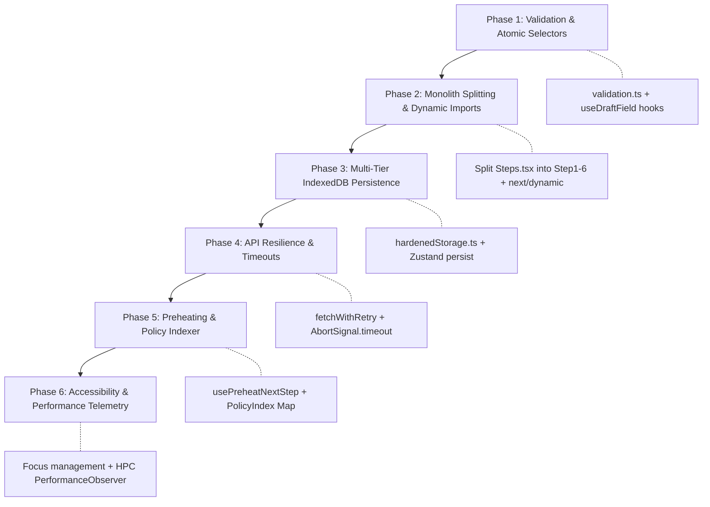

# Frontend Architecture Upgrades & Implementation Guide: Modernizing `BRE-Flow-Engine`

> **Architectural Foundations:**
> - [GitHub Engineering: From Latency to Instant — Modernizing Navigation Performance](https://github.blog/engineering/architecture-optimization/from-latency-to-instant-modernizing-github-issues-navigation-performance/)  
> - [Notion Engineering: Page Load and Navigation Times Just Got Faster](https://www.notion.com/blog/faster-page-load-navigation)  
> 
> **Target Metrics:**
> - Highest Priority Content (**HPC**) < 200 ms (Instant).
> - 50% reduction in initial load bundle size (< 80 KB critical path).
> - 0% data loss on refresh/crash via persistent multi-tier caching.
> - Keystroke re-renders isolated to active inputs (0 unnecessary step re-renders).

---

## 1. Executive Summary & Core Insights

| Principle | Source | Application to `BRE-Flow-Engine` |
| :--- | :--- | :--- |
| **Request Lifecycle Redesign** | GitHub | Replace full-page reloads and blocking API waits with **Stale-While-Revalidate (SWR)** and **Preheating**. |
| **Core vs. Deferred Bundles** | Notion | Only download the initial shell and Step 1 upfront. Defer Steps 2–6, `CoiStructuredView`, and `BankMatrix`. |
| **Hardened Client Storage** | Notion | Avoid unmanaged `localStorage` (capped at 5MB, sync blocking). Implement **quota-guarded IndexedDB** with auto-eviction. |
| **In-Memory Relationship Indexing** | Notion | Replace $O(N)$ linear scans across `bank_policy_matrix.json` and pincodes with $O(1)$ in-memory `Map` lookups. |

---

## 2. Comprehensive Gap Analysis: Missing Frontend Logics

A deep audit of the frontend repository (`app/page.tsx`, `Steps.tsx`, `useOnboardingStore.ts`, and `api.ts`) identified 7 critical missing frontend logics:

```
┌────────────────────────────────────────────────────────────────────────┐
│                        CRITICAL ARCHITECTURAL GAPS                     │
├────────────────────────────────────────────────────────────────────────┤
│ 1. Zero Persistence        → State lost on refresh; no IndexedDB hook  │
│ 2. Coarse Subscriptions    → Whole step re-renders on every keystroke  │
│ 3. Shallow Validation      → No regex check before advancing steps     │
│ 4. Monolithic Files        → Steps.tsx (1,376 LOC) & Store (1,122 LOC) │
│ 5. Network Fragility       → No timeout or retry backoff in api.ts     │
│ 6. Focus Disconnection     → Keyboard focus lost on step navigation    │
│ 7. Missing Error Isolation → Parser errors white-screen the wizard     │
└────────────────────────────────────────────────────────────────────────┘
```

---

## 3. End-to-End Upgrade Specifications

### Upgrade 1: Core vs. Deferred Bundle Architecture & Monolith Splitting
**Files:** `frontend/components/steps/Steps.tsx` (1,376 LOC) $\to$ modular sub-files; `frontend/app/page.tsx`

#### Specification:
1. Deconstruct `Steps.tsx` into dedicated, self-contained components under `frontend/components/steps/`:
   - `Step1Identity.tsx`
   - `Step2Address.tsx`
   - `Step3Occupation.tsx`
   - `Step4Banking.tsx`
   - `Step5CoApplicant.tsx`
   - `Step6Phase1Income.tsx`
2. In `app/page.tsx`, import **only Step 1** synchronously.
3. Lazily import Steps 2–6 and analytical views via `next/dynamic` with Suspense skeletons.

```tsx
// frontend/app/page.tsx
import dynamic from "next/dynamic";
import { Step1Identity } from "@/components/steps/Step1Identity"; // Core Synchronous

const Step2Address = dynamic(() => import("@/components/steps/Step2Address"), {
  loading: () => <StepLoadingSkeleton stepNumber={2} />,
});
const Step3Occupation = dynamic(() => import("@/components/steps/Step3Occupation"), {
  loading: () => <StepLoadingSkeleton stepNumber={3} />,
});
const Step4Banking = dynamic(() => import("@/components/steps/Step4Banking"), {
  loading: () => <StepLoadingSkeleton stepNumber={4} />,
});
const Step5CoApplicant = dynamic(() => import("@/components/steps/Step5CoApplicant"), {
  loading: () => <StepLoadingSkeleton stepNumber={5} />,
});
const Step6Phase1Income = dynamic(() => import("@/components/steps/Step6Phase1Income"), {
  loading: () => <StepLoadingSkeleton stepNumber={6} />,
});

// Heavy Telemetry & Review Views
const AuditCards = dynamic(() => import("@/components/AuditCards").then(m => m.AuditCards));
const DecisionPanel = dynamic(() => import("@/components/Telemetry").then(m => m.DecisionPanel));
const BankMatrix = dynamic(() => import("@/components/Telemetry").then(m => m.BankMatrix));
```

---

### Upgrade 2: Hardened Multi-Tier State Persistence & Auto-Save Recovery
**Files:** `frontend/lib/storage/hardenedStorage.ts`, `frontend/store/useOnboardingStore.ts`

#### Specification:
1. Implement a non-blocking IndexedDB persistence adapter with quota safeguards and automated 7-day TTL cleanup.
2. Store only normalized JSON (strip raw PDF blobs).
3. Connect to Zustand using `persist` middleware.
4. Provide an Auto-Save indicator and "Resume Unfinished Application" prompt on cold start.

```typescript
// frontend/lib/storage/hardenedStorage.ts
import { get, set, del } from "idb-keyval";
import type { StateStorage } from "zustand/middleware";

const STORAGE_PREFIX = "flowbre_app_";

export const hardenedIndexedDbStorage: StateStorage = {
  getItem: async (name: string): Promise<string | null> => {
    try {
      const item = await get(`${STORAGE_PREFIX}${name}`);
      if (!item) return null;
      const parsed = JSON.parse(item);
      // Check 7-day TTL expiration
      if (Date.now() - parsed.timestamp > 7 * 24 * 60 * 60 * 1000) {
        await del(`${STORAGE_PREFIX}${name}`);
        return null;
      }
      return JSON.stringify(parsed.state);
    } catch (err) {
      console.warn("[Storage] IndexedDB read error, falling back to memory:", err);
      return null;
    }
  },
  setItem: async (name: string, value: string): Promise<void> => {
    try {
      const payload = {
        timestamp: Date.now(),
        state: JSON.parse(value),
      };
      await set(`${STORAGE_PREFIX}${name}`, JSON.stringify(payload));
    } catch (err) {
      console.error("[Storage] IndexedDB write failed (quota exceeded):", err);
    }
  },
  removeItem: async (name: string): Promise<void> => {
    await del(`${STORAGE_PREFIX}${name}`);
  },
};
```

---

### Upgrade 3: Fine-Grained Atomic State Subscriptions (Anti-Re-render)
**Files:** `frontend/store/useOnboardingStore.ts`, `frontend/components/Field.tsx`

#### Specification:
1. Deprecate the coarse-grained `useField()` hook that binds to the entire `draft` object.
2. Provide atomic field selectors that only trigger re-renders when their specific slice changes:

```typescript
// frontend/store/useOnboardingStore.ts
export const useDraftField = <K extends keyof Draft>(key: K): Draft[K] =>
  useOnboardingStore((s) => s.draft[key]);

export const useSetDraftField = () =>
  useOnboardingStore((s) => s.setField);
```

```tsx
// Inside individual form components (e.g. TextInput)
function ApplicantNameInput() {
  const value = useDraftField("applicantName");
  const setField = useSetDraftField();

  return (
    <TextInput
      id="applicantName"
      label="Full Legal Name"
      value={value}
      onChange={(v) => setField("applicantName", v)}
    />
  );
}
```

---

### Upgrade 4: Client-Side Pre-Flight Step Validation & Regex Guards
**Files:** `frontend/lib/validation.ts`, `frontend/app/page.tsx`

#### Specification:
1. Upgrade `isStepCompleted()` from shallow non-empty checks to format-verified checks.
2. Add regex checks for PAN, Pincode, Email, Mobile, and Aadhaar before enabling navigation.

```typescript
// frontend/lib/validation.ts
export const VALIDATION_RULES = {
  pan: /^[A-Z]{5}[0-9]{4}[A-Z]$/,
  companyPan: /^[A-Z]{5}[0-9]{4}[A-Z]$/,
  phone: /^[6-9]\d{9}$/,
  email: /^[^\s@]+@[^\s@]+\.[^\s@]+$/,
  pincode: /^\d{6}$/,
  aadhaar: /^\d{12}$/,
};

export function validateStep(stepNum: number, draft: Draft): { isValid: boolean; errors: Record<string, string> } {
  const errors: Record<string, string> = {};

  if (stepNum === 1) {
    if (draft.entityType === "Individual") {
      if (!draft.applicantName) errors.applicantName = "Name is required.";
      if (!draft.pan || !VALIDATION_RULES.pan.test(draft.pan)) errors.pan = "Enter a valid 10-digit PAN.";
      if (!draft.phone || !VALIDATION_RULES.phone.test(draft.phone)) errors.phone = "Enter a valid 10-digit mobile number.";
      if (!draft.email || !VALIDATION_RULES.email.test(draft.email)) errors.email = "Enter a valid email address.";
      if (!draft.dob) errors.dob = "Date of birth is required.";
    } else {
      if (!draft.companyName) errors.companyName = "Company name is required.";
      if (!draft.companyPan || !VALIDATION_RULES.companyPan.test(draft.companyPan)) errors.companyPan = "Invalid Company PAN.";
      if (!draft.companyMobile || !VALIDATION_RULES.phone.test(draft.companyMobile)) errors.companyMobile = "Invalid mobile number.";
    }
  }

  if (stepNum === 2 && draft.entityType === "Individual") {
    if (!draft.pincode || !VALIDATION_RULES.pincode.test(draft.pincode)) errors.pincode = "Enter a valid 6-digit PIN code.";
    if (!draft.cityName) errors.cityName = "City is required.";
    if (!draft.stateName) errors.stateName = "State is required.";
  }

  return { isValid: Object.keys(errors).length === 0, errors };
}
```

---

### Upgrade 5: Smart Preheating & Stale-While-Revalidate (SWR)
**Files:** `frontend/hooks/usePreheatNextStep.ts`, `frontend/app/page.tsx`

#### Specification:
1. When `validateStep(currentStep, draft).isValid === true`, trigger a low-priority dynamic `import()` for the next step chunk in the background.
2. Pre-warm bank policy and FOIR calculations silently before the user clicks "Next question".

```typescript
// frontend/hooks/usePreheatNextStep.ts
import { useEffect } from "react";
import type { Draft } from "@/store/useOnboardingStore";
import { validateStep } from "@/lib/validation";

export function usePreheatNextStep(currentStep: number, draft: Draft) {
  useEffect(() => {
    const { isValid } = validateStep(currentStep, draft);
    if (!isValid) return;

    const nextStep = currentStep + 1;
    if (nextStep === 2) import("@/components/steps/Step2Address");
    if (nextStep === 3) import("@/components/steps/Step3Occupation");
    if (nextStep === 4) import("@/components/steps/Step4Banking");
    if (nextStep === 5) import("@/components/steps/Step5CoApplicant");
    if (nextStep === 6) import("@/components/steps/Step6Phase1Income");
  }, [currentStep, draft]);
}
```

---

### Upgrade 6: In-Memory Policy Indexing ($O(1)$ Lookups)
**Files:** `frontend/lib/policyIndexer.ts`, `frontend/store/useOnboardingStore.ts`

#### Specification:
1. Decouple hardcoded FOIR conditions (lines 700–750 in `useOnboardingStore.ts`) into an in-memory lookup index.
2. Initialize `Map<BankCode, BankPolicy>` at runtime for instantaneous query response.

```typescript
// frontend/lib/policyIndexer.ts
import type { BankFoirDetail } from "./types";

export class PolicyIndex {
  private static policyMap = new Map<string, (income: number, emi: number) => BankFoirDetail>();

  static register(bankCode: string, evaluator: (income: number, emi: number) => BankFoirDetail) {
    this.policyMap.set(bankCode, evaluator);
  }

  static evaluateBank(bankCode: string, income: number, emi: number): BankFoirDetail | undefined {
    const evaluator = this.policyMap.get(bankCode);
    return evaluator ? evaluator(income, emi) : undefined;
  }
}
```

---

### Upgrade 7: Network Resilience, Timeouts & Offline Interceptor
**Files:** `frontend/lib/api.ts`

#### Specification:
1. Attach a strict 15-second timeout via `AbortSignal.timeout(15000)` to all evaluate requests.
2. Add automated exponential retry (up to 2 attempts) on HTTP `502`, `503`, `504` or network dropped states.
3. Check `navigator.onLine` prior to file uploads or evaluation submissions.

```typescript
// frontend/lib/api.ts (Enhanced Resilience)
async function fetchWithRetry(url: string, options: RequestInit, retries = 2, delay = 1000): Promise<Response> {
  try {
    const controller = new AbortController();
    const timeoutId = setTimeout(() => controller.abort(), 15000); // 15s timeout
    const res = await fetch(url, { ...options, signal: options.signal || controller.signal });
    clearTimeout(timeoutId);

    if (!res.ok && res.status >= 500 && retries > 0) {
      await new Promise(r => setTimeout(r, delay));
      return fetchWithRetry(url, options, retries - 1, delay * 2);
    }
    return res;
  } catch (err) {
    if (retries > 0 && !(err instanceof DOMException && err.name === "AbortError")) {
      await new Promise(r => setTimeout(r, delay));
      return fetchWithRetry(url, options, retries - 1, delay * 2);
    }
    throw err;
  }
}
```

---

### Upgrade 8: Focus Trapping & Step Transition Flow
**Files:** `frontend/app/page.tsx`

#### Specification:
1. When step navigation occurs, automatically set focus to the first interactive field (`h2` step title or first input).
2. Announce step progression via an invisible `aria-live="polite"` element for screen readers.

```tsx
useEffect(() => {
  const container = document.getElementById("step-content-region");
  if (container) {
    const firstInput = container.querySelector<HTMLElement>("input, select, button");
    firstInput?.focus({ preventScroll: true });
  }
}, [stepId]);
```

---

### Upgrade 9: React Error Boundaries & Fallback Skeletons
**Files:** `frontend/components/ErrorBoundary.tsx`, `frontend/components/StepLoadingSkeleton.tsx`

#### Specification:
1. Wrap dynamically imported modules (`CoiStructuredView`, `BankMatrix`, `AuditCards`) in dedicated Error Boundaries.
2. If document parsing or telemetry visualization fails, show an inline retry card instead of crashing the wizard.

---

## 4. Phased Implementation Roadmap for Agents



---

## 5. Verification Checklist & Acceptance Criteria

- [ ] **Type Safety:** Running `npx tsc --noEmit` in `frontend` passes with zero errors.
- [ ] **Bundle Budget:** `Step1Identity` bundle is under 80 KB gzipped.
- [ ] **State Preservation:** Completing Steps 1–3, refreshing the browser, and returning restores all inputs, verified badges, and COI records without state loss.
- [ ] **Keystroke Performance:** Profiler confirms typing in `applicantName` only re-renders the input, not the entire step tree.
- [ ] **Pre-Flight Validation:** Entering an invalid PAN prevents advancement to Step 2 and displays an inline error message.
- [ ] **Offline Resilience:** Disconnecting network displays an offline alert banner instead of an unhandled exception.
- [ ] **Portal Mounting:** All modals (`CoiStructuredView`, `DocumentUpload`) mount directly to `document.body` via `createPortal`.
