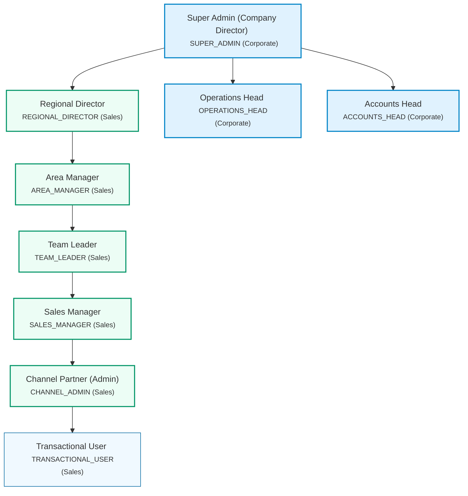

# Corporate & Sales Role Hierarchy

This document outlines the hierarchical role structure for the BRE-Flow-Engine system, detailing reporting lines, departments, responsibilities, and validation flow mapping.

## Reporting Hierarchy Diagram



## Role Details

| Role Key | Name / Label | Department | Color Key | Reports To | Subordinates (Children) |
|---|---|---|---|---|---|
| **SUPER_ADMIN** | Super Admin (Company Director) | Corporate | Indigo | *None (Root)* | REGIONAL_DIRECTOR, OPERATIONS_HEAD, ACCOUNTS_HEAD |
| **REGIONAL_DIRECTOR** | Regional Director | Sales | Emerald | SUPER_ADMIN | AREA_MANAGER |
| **OPERATIONS_HEAD** | Operations Head | Corporate | Amber | SUPER_ADMIN | *None* |
| **ACCOUNTS_HEAD** | Accounts Head | Corporate | Rose | SUPER_ADMIN | *None* |
| **AREA_MANAGER** | Area Manager | Sales | Emerald | REGIONAL_DIRECTOR | TEAM_LEADER |
| **TEAM_LEADER** | Team Leader | Sales | Emerald | AREA_MANAGER | SALES_MANAGER |
| **SALES_MANAGER** | Sales Manager | Sales | Emerald | TEAM_LEADER | CHANNEL_ADMIN |
| **CHANNEL_ADMIN** | Channel Partner (Admin) | Sales | Emerald | SALES_MANAGER | TRANSACTIONAL_USER |
| **TRANSACTIONAL_USER** | Transactional User | Sales | Sky | CHANNEL_ADMIN | *None* |

---

## Detailed Descriptions

### 👑 Super Admin (Company Director)
- **ID / Key**: `SUPER_ADMIN`
- **Department**: Corporate
- **Theme Color**: Indigo
- **Description**: Top-level corporate director. Full system permissions and oversight of all regional, operational, and accounts activities.

### 👔 Regional Director
- **ID / Key**: `REGIONAL_DIRECTOR`
- **Department**: Sales (Tier 1 Parallel Head)
- **Theme Color**: Emerald
- **Description**: Tier 1 Parallel Head of Sales. Direct supervisor of Area Managers, responsible for regional sales targets and performance.

### ⚙️ Operations Head
- **ID / Key**: `OPERATIONS_HEAD`
- **Department**: Corporate (Tier 1 Parallel Head)
- **Theme Color**: Amber
- **Description**: Tier 1 Parallel Head of Operations. Oversees platform processes, workflows, OCR configurations, and regional operations.

### 💳 Accounts Head
- **ID / Key**: `ACCOUNTS_HEAD`
- **Department**: Corporate (Tier 1 Parallel Head)
- **Theme Color**: Rose
- **Description**: Tier 1 Parallel Head of Accounts. Manages financial ledgers, disbursements, billing, and transactional audit trails.

### 🗺️ Area Manager
- **ID / Key**: `AREA_MANAGER`
- **Department**: Sales (Tier 2)
- **Theme Color**: Emerald
- **Description**: Sales Tier 2. Supervises regional Team Leaders. Coordinates localized marketing and loan origination activities.

### 👥 Team Leader
- **ID / Key**: `TEAM_LEADER`
- **Department**: Sales (Tier 3)
- **Theme Color**: Emerald
- **Description**: Sales Tier 3. Manages localized Sales Managers. Coordinates application review pipelines and queues.

### 💼 Sales Manager
- **ID / Key**: `SALES_MANAGER`
- **Department**: Sales (Tier 4)
- **Theme Color**: Emerald
- **Description**: Sales Tier 4. Direct manager of Channel Partners. Provides support and onboarding assistance for registered channels.

### 🏢 Channel Partner (Admin)
- **ID / Key**: `CHANNEL_ADMIN`
- **Department**: Sales (Tier 5)
- **Theme Color**: Emerald
- **Description**: Sales Tier 5. Channel-level administrator with full tenant permissions to configure rules, users, and submit applications.

### 📄 Transactional User
- **ID / Key**: `TRANSACTIONAL_USER`
- **Department**: Sales (Tier 6 - Leaf Node)
- **Theme Color**: Sky
- **Description**: Sales Tier 6 (Leaf node). End users of channel partners. Typically loan officers or agents submitting raw applications.

---

## Technical Representation (TypeScript Node Structure)

```typescript
export interface RoleNode {
  id: string;
  name: string;
  label: string;
  description: string;
  department: 'corporate' | 'sales';
  color: string;
  reportsTo: string | null;
  children: string[];
}

export const ROLE_NODES: Record<string, RoleNode> = {
  SUPER_ADMIN: {
    id: 'SUPER_ADMIN',
    name: 'SUPER_ADMIN',
    label: 'Super Admin (Company Director)',
    description: 'Top-level corporate director. Full system permissions and oversight of all regional, operational, and accounts activities.',
    department: 'corporate',
    color: 'indigo',
    reportsTo: null,
    children: ['REGIONAL_DIRECTOR', 'OPERATIONS_HEAD', 'ACCOUNTS_HEAD'],
  },
  REGIONAL_DIRECTOR: {
    id: 'REGIONAL_DIRECTOR',
    name: 'REGIONAL_DIRECTOR',
    label: 'Regional Director',
    description: 'Tier 1 Parallel Head of Sales. Direct supervisor of Area Managers, responsible for regional sales targets and performance.',
    department: 'sales',
    color: 'emerald',
    reportsTo: 'SUPER_ADMIN',
    children: ['AREA_MANAGER'],
  },
  OPERATIONS_HEAD: {
    id: 'OPERATIONS_HEAD',
    name: 'OPERATIONS_HEAD',
    label: 'Operations Head',
    description: 'Tier 1 Parallel Head of Operations. Oversees platform processes, workflows, OCR configurations, and regional operations.',
    department: 'corporate',
    color: 'amber',
    reportsTo: 'SUPER_ADMIN',
    children: [],
  },
  ACCOUNTS_HEAD: {
    id: 'ACCOUNTS_HEAD',
    name: 'ACCOUNTS_HEAD',
    label: 'Accounts Head',
    description: 'Tier 1 Parallel Head of Accounts. Manages financial ledgers, disbursements, billing, and transactional audit trails.',
    department: 'corporate',
    color: 'rose',
    reportsTo: 'SUPER_ADMIN',
    children: [],
  },
  AREA_MANAGER: {
    id: 'AREA_MANAGER',
    name: 'AREA_MANAGER',
    label: 'Area Manager',
    description: 'Sales Tier 2. Supervises regional Team Leaders. Coordinates localized marketing and loan origination activities.',
    department: 'sales',
    color: 'emerald',
    reportsTo: 'REGIONAL_DIRECTOR',
    children: ['TEAM_LEADER'],
  },
  TEAM_LEADER: {
    id: 'TEAM_LEADER',
    name: 'TEAM_LEADER',
    label: 'Team Leader',
    description: 'Sales Tier 3. Manages localized Sales Managers. Coordinates application review pipelines and queues.',
    department: 'sales',
    color: 'emerald',
    reportsTo: 'AREA_MANAGER',
    children: ['SALES_MANAGER'],
  },
  SALES_MANAGER: {
    id: 'SALES_MANAGER',
    name: 'SALES_MANAGER',
    label: 'Sales Manager',
    description: 'Sales Tier 4. Direct manager of Channel Partners. Provides support and onboarding assistance for registered channels.',
    department: 'sales',
    color: 'emerald',
    reportsTo: 'TEAM_LEADER',
    children: ['CHANNEL_ADMIN'],
  },
  CHANNEL_ADMIN: {
    id: 'CHANNEL_ADMIN',
    name: 'CHANNEL_ADMIN',
    label: 'Channel Partner (Admin)',
    description: 'Sales Tier 5. Channel-level administrator with full tenant permissions to configure rules, users, and submit applications.',
    department: 'sales',
    color: 'emerald',
    reportsTo: 'SALES_MANAGER',
    children: ['TRANSACTIONAL_USER'],
  },
  TRANSACTIONAL_USER: {
    id: 'TRANSACTIONAL_USER',
    name: 'TRANSACTIONAL_USER',
    label: 'Transactional User',
    description: 'Sales Tier 6 (Leaf node). End users of channel partners. Typically loan officers or agents submitting raw applications.',
    department: 'sales',
    color: 'sky',
    reportsTo: 'CHANNEL_ADMIN',
    children: [],
  },
};
```
