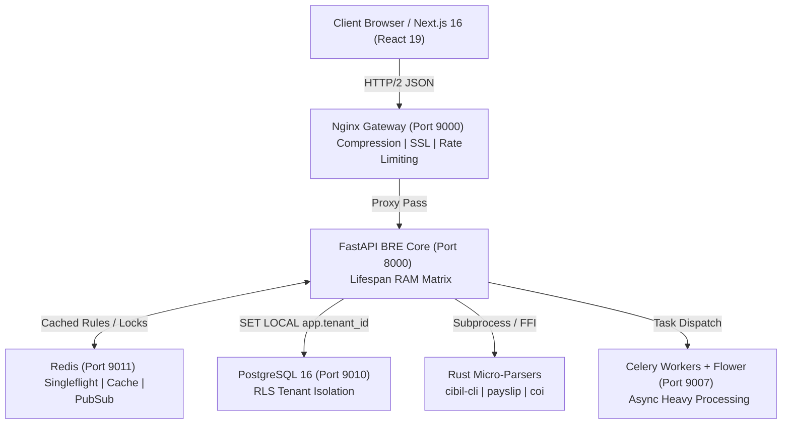
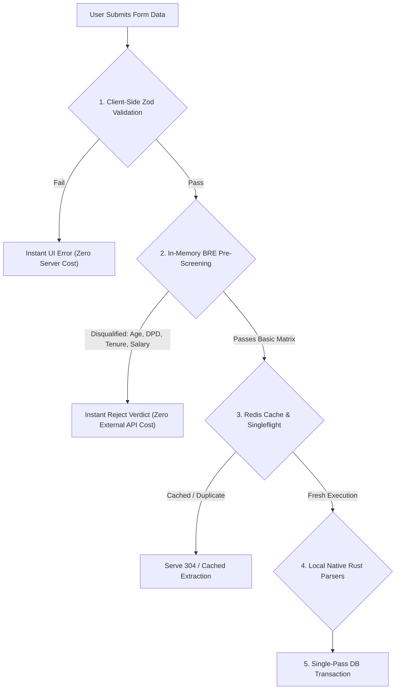
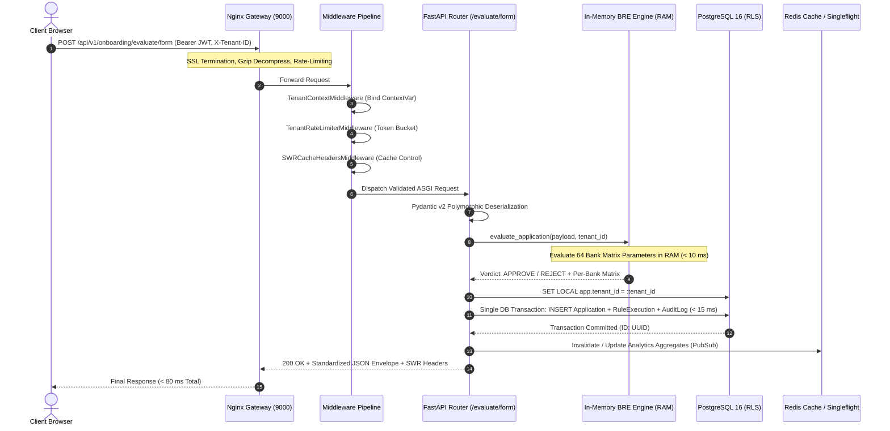
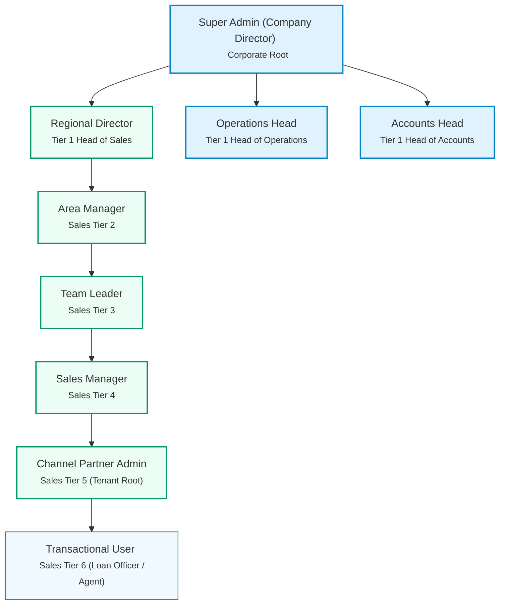

# 🌐 FlowBRE Enterprise Workflow & Technical Specification

Comprehensive specification and operational playbook for the **FlowBRE (Flow Business Rules Engine)**: Multi-Tenant Architecture, Low-Latency Evaluation Engine, Cost Optimization Rules, Frontend & Backend Principles, End-to-End API Flow, and Complete Routing Hierarchy.

---

## 1. System Architecture & Performance SLAs

FlowBRE is engineered for high-throughput, low-latency credit decisioning and loan onboarding across partner banks (**BOI, Indian Bank, IOB, BOB, BOM, HDFC, AXIS, Kotak**).



### 1.1 Performance SLAs & Latency Budgets

| Operation | SLA Budget | Scope & Optimization Strategy |
|---|---|---|
| **Simple GET / Metadata** | **< 30 ms** | Health checks (`/health`), pincode lookup, bank policy metadata served directly from RAM / Redis. |
| **In-Memory Rules Evaluation** | **< 10 ms** | Zero hot-path disk I/O; `BANK_MATRIX_RULES` evaluated in RAM against Pydantic models. |
| **CRUD Evaluation + Audit Log** | **< 80 ms** | Single async DB transaction (Application insert + `RuleExecutionModel` + `AuditLogModel`). |
| **Total End-to-End Roundtrip** | **< 100 ms** | Full network path including Nginx proxying, auth validation, and JSON serialization. |
| **Document OCR / Bureau Extraction** | **< 30 s** | Off-loaded to background worker threads / Rust binaries (`cibil-cli`, `openbharatocr`). |

### 1.2 Five-Stage Request Memory Lifecycle

```
Memory Lifetime
Request Starts
      ↓
Allocate Memory (ContextVar & Pydantic validation)
      ↓
  Use Memory (RAM matrix evaluation against compiled AST)
      ↓
Garbage Collection (Async session close & DB flush)
      ↓
Memory Released (CPython arena allocators recycled)
```

1. **Request Starts**: ASGI event loop dispatches connection to the endpoint handler.
2. **Allocate Memory**: Transient Pydantic v2 models, request contexts, and tenant ContextVars bind to the async task.
3. **Use Memory**: Python decision handlers evaluate metrics against RAM-resident rules (`BANK_MATRIX_RULES`).
4. **Garbage Collection**: Database sessions flush in single transaction; scope terminates.
5. **Memory Released**: Reference counts drop to zero, returning memory pools to CPython arenas without memory leaks.

---

## 2. Production Cost Reduction Rules (API & Server Cost Cutting)

Third-party external API calls (e.g. CIBIL bureau pull, PAN verification, Aadhaar OTP SMS, cloud OCR) cost real financial resources per invocation (₹ / call) and add server overhead. FlowBRE implements a strict **Zero-Waste Cost Optimization Architecture**.



### 2.1 Production Cost Reduction Directives

1. **Client-Side Fail-Fast Pre-Validation (Zero Network Cost)**:
   - Perform strict schema validation via Zod on the client before triggering network requests.
   - Immediate rejection on invalid PAN syntax (`[A-Z]{5}[0-9]{4}[A-Z]{1}`), phone numbers, age boundaries (< 21), or negative financial figures without pinging backend APIs.
2. **Tiered Pre-Screening Before External Paid Services (Save External API Fees)**:
   - **Never call paid third-party APIs (CIBIL bureau pull, PAN NSDL verification, Aadhaar OTP, Cloud Vision) before in-memory eligibility evaluation.**
   - If an applicant fails demographic rules (e.g. Age 19, or Cash Salary mode on Salaried), immediately generate a rejection verdict. Discontinue the pipeline and prevent downstream paid API calls.
3. **Deterministic Caching & Singleflight Deduplication (Redis + SWR Headers)**:
   - Use Redis Singleflight locks (`SET key NX EX`) to prevent stampedes and duplicate concurrent rule evaluations for the same applicant.
   - Cache static bank matrices, pincode-to-city databases, and tenant configuration in Redis with `stale-while-revalidate` HTTP cache headers.
   - Hash document payloads (SHA-256) to eliminate redundant extraction runs on identical files.
4. **Native Local Rust Micro-Parsers Over Cloud OCR (100% Cloud Savings)**:
   - Use compiled local Rust binaries (`cibil-cli`, custom pdf-scrappers, local Tesseract via `openbharatocr`) instead of cloud-managed OCR endpoints (AWS Textract, Google Document AI) to cut per-page SaaS cloud expenses.
5. **Single-Pass DB Transaction Batching (Save Database CPU)**:
   - Persist Application records, Rule Execution audit trails, and Audit Log records in a **single database transaction** (`db.flush()` + `commit`) rather than multiple round trips.
6. **Payload Minimization & Compression**:
   - Strip redundant NULL fields into polymorphic JSON (`entity_detail_json`).
   - Enable Gzip / Brotli compression on Nginx for JSON payloads exceeding 1 KB.

---

## 3. Business Rule Engine (BRE) Policy Specification

Derived from `Bank_Eligibility_Matrix_v1.xlsx` and `app/services/bre_engine.py`. Evaluated across partner banks: **BOI, Indian Bank, IOB, BOB, BOM, HDFC, AXIS, Kotak**.

### 3.1 Demographics & Entity Rules (`DEM-###`)

| Rule ID | Parameter | Operator / Logic | Threshold | Action | Status | Rejection Reason / Note |
|---|---|---|---|---|---|---|
| **DEM-101** | `age` | `<` | `min_age` (21 years across all banks) | REJECT | ✅ Active | Applicant age is below minimum requirement (21 years). |
| **DEM-102** | `age_at_last_emi_salaried` | `>` | `max_age_emi_salaried` (60–75 per bank matrix) | REJECT | ✅ Active | Age at final EMI maturity exceeds salaried limit for selected bank. |
| **DEM-103** | `age_at_last_emi_self_employed` | `>` | `max_age_emi_self_employed` (65–75 per bank) | REJECT | ✅ Active | Age at final EMI maturity exceeds self-employed limit. |
| **DEM-104** | `is_nri && !bank.allow_nri` | `==` | `true` (e.g. BOI disallows NRI) | REJECT | ✅ Active | Selected bank does not onboard NRI/PIO applicants. |
| **DEM-105** | `minimum_stay_period_nri` | `<` | `min_nri_stay_years` (BOI: 0, Others: 2 yrs) | REJECT | ✅ Active | NRI applicant does not meet minimum in-country stay. |
| **DEM-106** | `marital_status` | `==` | `"UNMARRIED"` | FLAG | 🕓 Catalogued | Informational flag used for underwriting risk weighting. |

### 3.2 Residence, Premises & Guarantor Rules (`RES-###`)

| Rule ID | Parameter | Logic Expression | Action | Status | Rejection Reason / Note |
|---|---|---|---|---|---|
| **RES-201** | `rented_house_salaried` | `property_status == "RENTED" && occupation == "SALARIED"` | FLAG | 🕓 Catalogued | Informational — standard salaried profile. |
| **RES-202** | `resi_cum_office_one_owned` | `property_status == "RESI_CUM_OFFICE_OWNED"` | PASS | 🕓 Catalogued | Owned premises satisfies collateral comfort. |
| **RES-203** | `resi_cum_office_both_rented` | `property_status == "RESI_CUM_OFFICE_RENTED"` | REQUIRE_GUARANTOR | ✅ Active | Triggers mandatory guarantor verification. |
| **RES-204** | `resi_office_separate_both_rented`| `property_status == "SEPARATE_BOTH_RENTED"` | REQUIRE_GUARANTOR | ✅ Active | Triggers guarantor check (BOB waives; BOM waives). |
| **RES-205** | `without_guarantor` | `property_status ∈ {RENTED} && !guarantor_provided && bank != BOM` | REJECT | ✅ Active | Guarantor is mandatory for this property configuration (BOM waives). |
| **RES-206** | `with_guarantor` | `guarantor_provided == true` | PASS | ✅ Active | Guarantor condition satisfied (suppresses RES-205). |

### 3.3 Salaried Employment Profile Rules (`EMP-SAL-###`)

| Rule ID | Parameter | Operator / Logic | Threshold | Action | Status | Rejection Reason / Note |
|---|---|---|---|---|---|---|
| **EMP-SAL-202** | `net_monthly_salary` | `<` | `min_salary` (₹25,000 all banks) | REJECT | ✅ Active | Monthly net salary is below minimum parameter (₹25,000). |
| **EMP-SAL-203** | `salary_payment_mode` | `==` | `"CASH"` | REJECT | ✅ Active | Cash salary mode is ineligible; direct bank credit required. |
| **EMP-SAL-204** | `minimum_work_experience_years` | `<` | `min_total_experience_years` (2.0 yrs) | REJECT | ✅ Active | Total work experience is below the bank's minimum. |
| **EMP-SAL-205** | `current_company_tenure_months` | `<` | `min_current_company_tenure_years` (0.5–2.0 yrs) | REJECT | ✅ Active | Current company tenure is below bank requirement. |
| **EMP-SAL-206** | `employer_type` | `∈` | `[GOVT, PSU, PUBLIC_LTD, PVT_LTD, FIRM]` | PASS | 🕓 Catalogued | Employer risk weighting category. |
| **EMP-SAL-207** | `no_income_proof_segment` | `== true && !bank.allow_no_income_proof` | REJECT | ✅ Active | Selected bank requires standard income proof documents. |
| **EMP-SAL-208** | `form_16_years` | `<` | `form16_years_required` (BOB: 1, Rest: 2 yrs) | REJECT | ✅ Active | Form-16 history is below requirement. |

### 3.4 Affordability & FOIR Rules (`EMP-SAL-3##`)

| Rule ID | Parameter | Condition / Logic | Action | Status | Rejection Reason / Note |
|---|---|---|---|---|---|
| **EMP-SAL-301** | `emi_income_ratio_foir` | `> bank.max_foir_ratio` | REJECT | 🕓 Catalogued | EMI-to-income ratio (FOIR) exceeds bank limit. |
| **EMP-SAL-302** | `rental_income_no_itr_not_in_bank` | `agreement && !itr_filed && !bank_reflected` | DISCOUNT_50PCT | 🕓 Catalogued | Rental income haircut applied (50% value counted). |
| **EMP-SAL-303** | `rental_income_itr_not_in_bank` | `agreement && itr_filed && !bank_reflected` | DISCOUNT_25PCT | 🕓 Catalogued | Rental income haircut applied (75% value counted). |
| **EMP-SAL-304** | `rental_income_no_itr_in_bank` | `agreement && !itr_filed && bank_reflected` | DISCOUNT_25PCT | 🕓 Catalogued | Rental income haircut applied (75% value counted). |

### 3.5 Self-Employed Applicants (`EMP-SE-###`)

| Rule ID | Parameter | Condition / Logic | Action | Status | Rejection Reason / Note |
|---|---|---|---|---|---|
| **EMP-SE-301** | `business_experience_years` | `< min_total_experience_years` (2 yrs) | REJECT | ✅ Active | Minimum 2 years of business vintage required. |
| **EMP-SE-302** | `current_itr` | `< se_min_current_itr` (₹1L–₹3L per bank) | REJECT | ✅ Active | Current-year ITR is below bank minimum. |
| **EMP-SE-303** | `previous_itr` or `combined_itr` | `< se_min_prev_itr` (BOB: `current+prev < ₹600k`) | REJECT | ✅ Active | Previous-year ITR below floor (BOB uses combined rule). |
| **EMP-SE-304** | `itr_filed` | `== false` | REJECT | ✅ Active | Active ITR filing proof is required for self-employed. |
| **EMP-SE-305** | `requested_loan_amount` | `< 100000` | REJECT | 🕓 Catalogued | Minimum loan ticket size constraint. |
| **EMP-SE-306** | `business_entity_type` | `∈ [PROPRIETORSHIP, PARTNERSHIP, PVT_LTD]` | PASS | 🕓 Catalogued | Entity routing classification. |
| **EMP-SE-307** | `business_proof` | `== false` | REJECT | ✅ Active | Valid business registration proof is mandatory. |

### 3.6 Credit Bureau (CIBIL) & DPD Parsing (`BUR-###`)

 Bureau DPD cells are normalized: `"STD"`, `"XXX"`, `""`, `"*"`, `"-"` map to `0`. Non-numeric tokens fail closed (`InvalidPayloadError` / HTTP 422).

| Rule ID | Condition / Logic | Action | Status | Rejection Reason / Note |
|---|---|---|---|---|
| **BUR-401** | `write_off_amount > 0 && !bank.allow_<type>_write_off` | REJECT | ✅ Active | `<TYPE>` write-offs are not permitted by selected bank. |
| **BUR-401B** | `write_off_type == "CC" && write_off_amount >= bank.max_cc_write_off_amount` | REJECT | ✅ Active | Credit-card write-off exceeds ceiling (BOI/IOB: ₹5k, BOM: ₹10k). |
| **BUR-401D** | `write_off_amount > 0 && write_off_type unrecognized` | REJECT | ✅ Active | Unclassified write-off (fails closed). |
| **BUR-402** | `max(dpd_history) > bank.max_dpd` | REJECT | ✅ Active | DPD history exceeds bank tolerance (<=0 banks reject DPD > 0; <90 banks reject DPD >= 90). |
| **BUR-403** | `selected_bank == "INDIAN_BANK" && max(dpd_history) > 0` | REJECT | ✅ Active | Indian Bank requires strict zero past DPD across all accounts. |
| **BUR-404** | `credit_bureau.currently_overdue == true` | REJECT | ✅ Active | Active overdue balances outstanding on credit bureau. |
| **BUR-405** | `credit_bureau.cibil_score < bank.min_cibil` | REJECT | ✅ Active | CIBIL score is below selected bank's minimum threshold (650–730). |
| **BUR-406** | `credit_bureau.cibil_pl_score < 650` | FLAG | 🕓 Catalogued | Low PL bureau score — marked for underwriting review. |
| **BUR-407** | `credit_bureau.loan_enquiry_count_last_6m > 5` | FLAG | 🕓 Catalogued | High recent loan enquiry frequency. |

### 3.7 Entity Compliance, Co-Applicants & Relationships (`ENT`, `COAPP`, `EXB`)

| Rule ID | Parameter | Condition | Action | Status | Description |
|---|---|---|---|---|---|
| **ENT-501** | `entity_type` | Valid corporate registered entity | PASS | 🕓 Catalogued | Standard entity types accepted by partner banks. |
| **ENT-502** | `huf_status` | `entity_type == "HUF" && !bank.allow_huf` | REJECT | ✅ Active | HUF entity onboarding disallowed by bank policy. |
| **COAPP-601** | `sibling_coapplicant` | `sibling_present && !bank.allow_sibling_coapplicant` | REJECT | 🕓 Catalogued | Sibling co-applicants disallowed by bank policy. |
| **COAPP-602** | `co_applicant_income` | Co-applicant income below threshold | DISCOUNT_50PCT | 🕓 Catalogued | Reduced weightage on secondary co-applicant income. |
| **EXB-701** | `existing_account` | `account_status == "ACTIVE"` | PASS | 🕓 Catalogued | Fast-track eligibility for existing bank customers. |
| **EXB-702** | `existing_car_loan` | `has_car_loan && bank ∈ {IOB, BOB}` | REJECT | ✅ Active | Selected bank disallows existing auto loans on same applicant. |

---

## 4. Frontend & Backend Engineering Principles

### 4.1 Frontend Principles (Next.js 16 App Router & React 19)

- **Sub-30ms Transitions & Navigation**:
  - Viewport `<Link prefetch>` ensures RSC payloads are on the client before clicks.
  - Deduped fetch pipelines via React 19 `cache()`.
  - SWR revalidation (`stale-while-revalidate`) for zero-waiting data presentation.
- **State Segregation**:
  - **Server State**: Managed exclusively by TanStack Query / RSC cache. Handles retries, caching, invalidation, and deduplication.
  - **Client / UI State**: Managed by Zustand with atomic subscriptions (`useStore(s => s.activeStep)`), avoiding full component tree re-renders.
  - **URL as Source of Truth**: Step navigation, search, filters, and active tabs sync to URL params (`useSearchParams()`).
- **Request Throttling & Debounce**:
  - Inputs debounced by 300ms (`useDebouncedCallback`) before dispatching API updates.
  - Window resizing and telemetry rendering throttled to 60fps.
- **Anti-Collision UI Guardrails**:
  - Flex shrink protection (`shrink-0`) on sidebar navigation.
  - Workspace container enforced with `min-w-0 flex-1` to prevent flex overflow breaks.
  - Breakpoint adaptation: Fixed left drawer active only on `>= xl` (1280px); slide-over drawer on mobile/tablet (`< xl`).
- **Client-Side PII Redaction**:
  - All console telemetry and client logging scrubbed with `redactPii()` (PAN: `AB******4F`, DOB: `****-**-15`).

### 4.2 Backend Principles (FastAPI & Async PostgreSQL)

- **Layered Clean Architecture**:
  - `routers/` → `middleware/` → `services/` → `db/models/`.
  - Zero business logic inside endpoint controllers; all scoring delegated to `bre_engine.py`.
- **Zero Hot-Path Disk I/O**:
  - Decision rules and bank matrices loaded into RAM at lifespan boot. No file-system reads during request evaluation.
- **Multi-Tenancy & Shared-Schema RLS**:
  - PostgreSQL Row-Level Security enforced on every tenant query:
    ```sql
    SET LOCAL app.current_tenant_id = :tenant_id;
    ```
  - Shared connection pool across all tenants (`pool_size=20`, `max_overflow=10`) via PgBouncer transaction pooling.
- **Fail-Closed Security & PII Redaction**:
  - Non-numeric or malformed DPD tokens reject immediately (HTTP 422).
  - Raw PAN/Aadhaar never stored in plain text; persisted exclusively as masked representations in `ApplicationModel`.
- **Single-Line Comment Standard**:
  - Every comment in the codebase must be a concise, single-line explanation of the non-obvious *why* (constraint, rule ID, bug prevention).

---

## 5. End-to-End API Flow (Request-to-Response Pipeline)



### 5.1 Step-by-Step API Execution Lifecycle

1. **Client Dispatch**: The Next.js frontend dispatches an HTTP/2 JSON request with `Authorization: Bearer <token>`, `X-Tenant-ID`, and `X-Request-ID`.
2. **Gateway Processing**: Nginx terminates SSL, applies rate limits, inspects headers, and proxies to the upstream FastAPI instance.
3. **Middleware Pipeline**:
   - `TenantContextMiddleware` extracts `tenant_id` and binds it to the async task's `ContextVar`.
   - `TenantRateLimiterMiddleware` validates request allowances against Redis tokens.
   - `SWRCacheHeadersMiddleware` attaches downstream cache directives.
4. **Request Validation**: Pydantic v2 validates discriminated union payloads (`IndividualIdentity`, `CompanyIdentity`, `HUFIdentity`) and normalizes data types.
5. **RAM Rule Evaluation**: `bre_engine_service.evaluate_application` scores the applicant against the 8-bank matrix in `< 10 ms` in RAM.
6. **RLS Database Persistence**:
   - An async connection executes `SET LOCAL app.current_tenant_id = :tenant_id`.
   - `ApplicationModel`, `RuleExecutionModel`, and `AuditLogModel` are inserted in a single atomic transaction.
7. **Document / Heavy Extraction (Async Branch)**:
   - File uploads (`/documents/*/extract`) execute outside the main CRUD loop via worker threads / Rust binaries (`cibil-cli`, `openbharatocr`).
8. **Client Envelope Return**: The API returns a standardized `OnboardingFormEvaluationResponse` with execution metrics, eligibility verdicts, and audit logs.

---

## 6. End-to-End Routing Flow

```mermaid
graph LR
    subgraph Frontend Routes (Next.js 16)
        Home["/ (Onboarding Wizard)"]
        Dash["/dashboard (Analytics)"]
        Pipe["/pipeline (Application Pipeline)"]
        Appr["/approvals (Underwriting Approvals)"]
        Assg["/assignments (Lead Allocation)"]
        Comm["/commissions (Payouts)"]
        Reg["/regional (Regional Operations)"]
        NewCh["/new-channel (Tenant Signup)"]
        Health["/health (Diagnostics)"]
    end

    subgraph Nginx Gateway (Port 9000)
        Proxy["/api/v1/* (Reverse Proxy)"]
        SSEProxy["/api/v1/notifications/events (SSE Stream)"]
    end

    subgraph Backend API Endpoints (FastAPI)
        ApiHealth["GET /api/v1/health"]
        ApiAuth["POST /api/v1/auth/login"]
        ApiEval["POST /api/v1/onboarding/evaluate"]
        ApiForm["POST /api/v1/onboarding/evaluate/form"]
        ApiCibil["POST /api/v1/onboarding/documents/cibil/extract"]
        ApiPayslip["POST /api/v1/onboarding/documents/payslip/extract"]
        ApiCoi["POST /api/v1/onboarding/documents/coi/extract"]
        ApiOcr["POST /api/v1/onboarding/documents/{type}/extract"]
        ApiOtp["POST /api/v1/onboarding/verification/otp/*"]
        ApiExport["GET /api/v1/onboarding/applications/{id}/export"]
        ApiTenants["POST /api/v1/tenants/signup"]
    end

    Home --> Proxy
    Dash --> Proxy
    NewCh --> Proxy
    Proxy --> Backend API Endpoints
    SSEProxy --> Backend API Endpoints
```

### 6.1 Unified Route Map

| Layer | Path / Route | Method | Purpose & Guard |
|---|---|---|---|
| **Frontend** | `/` | GET | 6-Step Onboarding Form Wizard (Identity → Address → Occupation → Bureau → Review). |
| **Frontend** | `/dashboard` | GET | Analytics, live rule telemetry, partner bank pass rates, SLA gauges. |
| **Frontend** | `/pipeline` | GET | Role-based lead tracking pipeline (Sales Managers / Team Leaders). |
| **Frontend** | `/approvals` | GET | Underwriting approval console (Operations Head / Regional Director). |
| **Frontend** | `/assignments` | GET | Application routing & agent assignment engine. |
| **Frontend** | `/commissions` | GET | Channel partner disbursement & ledger records (Accounts Head). |
| **Frontend** | `/regional` | GET | Regional performance hierarchy analytics. |
| **Frontend** | `/new-channel` | GET | Self-serve channel partner / tenant onboarding form. |
| **Gateway** | `/api/v1/*` | ALL | Nginx reverse proxy rewrite to backend ASGI server. |
| **Gateway** | `/api/v1/notifications/events` | GET | Long-lived SSE proxy (`proxy_buffering off`, `proxy_read_timeout 300s`). |
| **Backend** | `/api/v1/health` | GET | System health, Redis ping, database connection, RAM matrix integrity. |
| **Backend** | `/api/v1/auth/login` | POST | Authenticates tenant user, issues signed JWT with `tenant_id` claim. |
| **Backend** | `/api/v1/onboarding/evaluate` | POST | Evaluates flat application payload against RAM bank matrix (< 80 ms). |
| **Backend** | `/api/v1/onboarding/evaluate/form` | POST | Evaluates multi-step polymorphic onboarding form submission (< 80 ms). |
| **Backend** | `/api/v1/onboarding/documents/cibil/extract` | POST | Native Rust binary parsing of CIBIL PDF consumer report. |
| **Backend** | `/api/v1/onboarding/documents/payslip/extract` | POST | Extracts monthly salary, deductions, and employer info from payslip. |
| **Backend** | `/api/v1/onboarding/documents/coi/extract` | POST | Extracts Computation of Income (COI) tax schedules. |
| **Backend** | `/api/v1/onboarding/documents/{document_type}/extract` | POST | OpenBharatOCR extraction for PAN and Aadhaar identity cards. |
| **Backend** | `/api/v1/onboarding/verification/otp/send` | POST | Issues verification challenge via email / mobile. |
| **Backend** | `/api/v1/onboarding/verification/otp/verify` | POST | Verifies one-time security challenge code. |
| **Backend** | `/api/v1/onboarding/applications/{id}/export` | GET | Streams generated PDF or Excel eligibility report. |
| **Backend** | `/api/v1/tenants/signup` | POST | Provisions new channel partner tenant and root admin account. |

---

## 7. Tenant Lifecycle & Multi-Tenant Isolation

### 7.1 Lifecycle State Machine

```
signup (POST /api/v1/tenants/signup)
  └─► pending
        └─► under_review  (Super Admin action)
              ├─► approved → active  (Provisions roles, MinIO prefix, ES space)
              └─► rejected
active
  └─► suspended  (Super Admin action)
        └─► active  (Reinstate)
```

Every lifecycle transition records an entry in `tenant_status_history`. The tenant admin account is created in an inactive state and activates automatically when the tenant transitions to `active`.

### 7.2 Multi-Tenancy Architecture

- **PostgreSQL Row-Level Security (RLS)**:
  - Enforced on all tenant-scoped tables (`applications`, `rule_executions`, `audit_logs`, `tenants`).
  - Set via session variable: `SET LOCAL app.current_tenant_id = :tenant_id`.
- **JWT Tenant Claim Binding**:
  - `X-Tenant-ID` header must match the signed token payload (`payload["tenant_id"]`). Cross-tenant header tampering fails closed with HTTP 403 `TENANT_CROSS_ACCESS_VIOLATION`.
- **Password Security**:
  - `passlib[argon2]` with `memory_cost=65536, time_cost=3, parallelism=4`.

---

## 8. Role-Based Access Control (RBAC) & Hierarchy

The corporate and sales governance structure follows a strict 7-tier hierarchy:



### 8.1 Role Permission Matrix

| Role Key | Department | Level | Responsibilities | Target View |
|---|---|---|---|---|
| **SUPER_ADMIN** | Corporate | Root | System-wide oversight, tenant approval, global configuration, audit logs. | `/dashboard`, `/approvals` |
| **REGIONAL_DIRECTOR**| Sales | Tier 1 | Regional loan volume, sales manager quotas, regional escalations. | `/regional`, `/pipeline` |
| **OPERATIONS_HEAD** | Corporate | Tier 1 | Platform rules, OCR engine configurations, operational SLAs. | `/dashboard`, `/configurator` |
| **ACCOUNTS_HEAD** | Corporate | Tier 1 | Financial ledgers, disbursements, billing, channel commissions. | `/commissions` |
| **AREA_MANAGER** | Sales | Tier 2 | Regional team leader supervision, localized origination targets. | `/regional`, `/pipeline` |
| **TEAM_LEADER** | Sales | Tier 3 | Team review pipelines, application queue allocation. | `/pipeline`, `/assignments` |
| **SALES_MANAGER** | Sales | Tier 4 | Channel partner relationship management, onboarding assistance. | `/pipeline`, `/new-channel` |
| **CHANNEL_ADMIN** | Sales | Tier 5 | Tenant admin, local user creation, tenant rule configuration. | `/dashboard`, `/` |
| **TRANSACTIONAL_USER**| Sales | Tier 6 | End-user loan officer, applicant data entry, document upload. | `/` (Onboarding Form) |

---

## 9. Migration, Cutover & Execution Playbook

1. **Shared Library Integration**: Plumb logging, ContextVar tenancy context, and standard response envelopes across all modules.
2. **Database Schema & RLS Rollout**: Apply Alembic migrations for `applications`, `rule_executions`, and `audit_logs` with PostgreSQL RLS policies enabled.
3. **In-Memory RAM Matrix Validation**: Confirm `BANK_MATRIX_RULES` conformance test suite passes (`app/tests/test_bank_matrix_conformance.py`).
4. **Rust OCR & Parser Build**: Compile `cibil-cli` release binary and verify Tesseract OCR bindings.
5. **Gateway Routing Verification**: Validate Nginx proxying for `/api/v1/*` and long-lived SSE streaming on `/api/v1/notifications/events`.
6. **Pre-Commit Verification**:
   - Full test suite passes: `pytest app/tests/ -v`.
   - Latency benchmarks cleared: `< 10 ms` RAM rules eval, `< 80 ms` CRUD.
   - PII redaction verified on all logs and database models.
